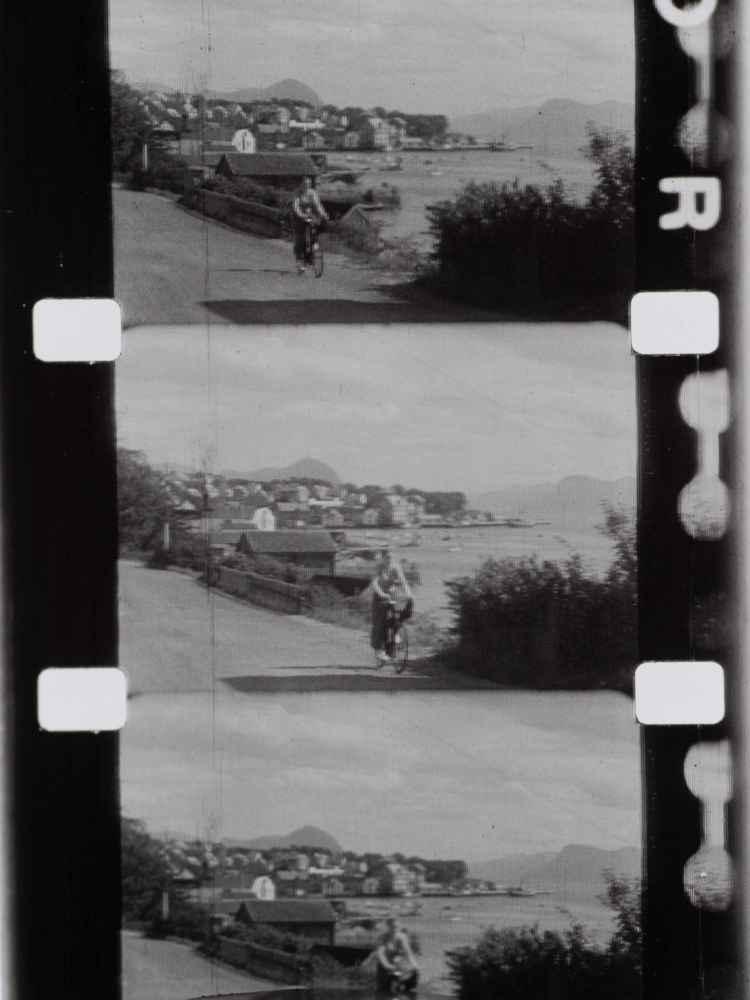
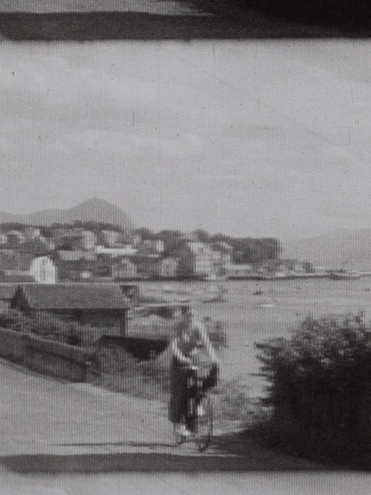

### Kodacolor lenticules

### Kodacolor sheen
<video width="100%" autoplay muted loop playsinline>
	<source src="kodacolor_sheen.mp4" type="video/mp4">
	
Your browser does not support the video format/codec.

</video>

### Kodacolor film processed by deep-dolce
<video width="100%" autoplay muted loop playsinline>
	<source src="/post/2023/08/21/video-ocr.py-and-chatgpt/kodacolor.webm" type="video/webm">
	<source src="/post/2023/08/21/video-ocr.py-and-chatgpt/kodacolor.mp4" type="video/mp4">
	
Your browser does not support the video format/codec.

</video>