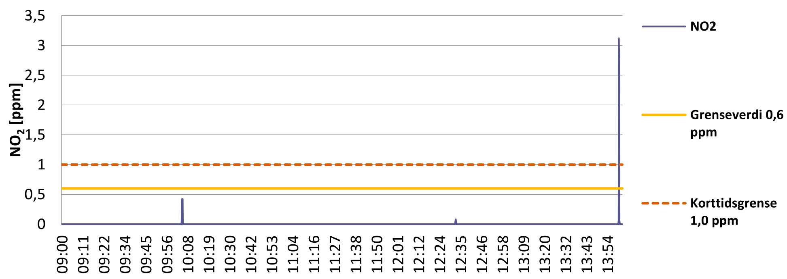

This text discusses exposure to acetic acid and nitrogen dioxide in film inspection, in the context of measurements made at the National Library of Norway in 2021.



## The nitrate inspections of 2019
In the summer of 2019, I oversaw a thorough inspection of the National Library of Norway’s nitrate film holdings. We hold around 16000 reels of nitrate film. 
Nitrate inspections are exciting, tedious, and slightly disconcerting. 
On the one hand, I was excited about what might be discovered while going through all the cans, on the other I was hoping that we would not discover a lot of new deteriorating film materials...

The previous inspection had happened seven years prior, back in 2010-2011.
The previous inspection was performed over a long stretch of time
It was before my time here, but work generated from that inspection was still going on at the time of my internship in 2012-2013.
These inspections generate a lot of follow-up work!

The 2011 inspection had only gone through slightly half of the nitrate collection - the half with the least amount of metadata. 
This was due to other half having been rehoused to new cans (and looked at) some years prior.
In 2019, however, we went through the complete holdings. 
It took us about two weeks.

## Inspection methodology
We proceeded in the same manner as the nitrate inspection of 2012 had been performed.
Meticulously going through the vault, opening every can and having a peek inside. 
We looked for obvious signs of chemical decay or other signs that something was off with the reel. 
Dust, rust, discoloration, spoking, deformities, bubbles, degassing rings, **smell** etc.
The bar for singling out a suspected deteriorating reel was intentionally low, as every suspect would be brought to me for a second check and further documentation.

In the end, I probably took a close look at something south of a thousand reels, with further notes written down for around 500 of them.
The documentation and findings in those notes are interesting (and deserve their own write-up). 
For the purposes of this text, however, it is the **number** of closely inspected reels that is important.

## The "characteristic" smell of nitrate
Anyone who has been in contact with deteriorating nitrate film will recognize its smell.
It is unpleasant, and its unpleasantness increases as the film deteriorates.
In **Restoration of motion picture film**[^1] the smell is described as "aromatic", "characteristic" and "acrid".
That characteristic smell had been one of the most essential ways of identifying and singling out bad reels during the nitrate inspection.

[^1]: Paul Read and Mark-Paul Meyer, *Restoration of Motion Picture Film* (Oxford: Butterworth Heinemann, 2000), page 258: 
    > The ==characteristic, aromatic smell of nitrate cellulose== increases. Later on the gases affect the photographic image, and the film convolutions starts to stick together and exuding almost liquid blisters. Eventually the film may set in a block and disintegrate into a little pile of brown powder and an acrid odour.

The relevant passage in **Restoration of motion picture film** reminds me of something I recently read in Derek Lowe's fascinating series: [Things I won't work with](https://www.science.org/topic/blog-category/things-i-wont-work-with).
In his description of dimethylcadmium[^2], he talks briefly about the description of smells in chemical literature:

[^2]:[Things I Won't Work With: Dimethylcadmium](https://www.science.org/content/blog-post/things-i-won-t-work-dimethylcadmium)

> I'm saddened to report that the chemical literature contains descriptions of dimethylcadmium's smell. 
Whoever provided these reports was surely exposed to far more of the vapor than common sense would allow, because common sense would tell you to stay about a half mile upwind at all times.
At any rate, its odor is variously described as "foul", "unpleasant", "metallic", "disagreeable", and (wait for it) "characteristic", which is an adjective that shows up often in the literature with regard to smells, and almost always makes a person want to punch whoever thought it was useful.
We can assume that dimethylcadmium is not easily confused with beaujolais in the blindfolded sniff test, but not much more.
So if you're working with organocadmium derivatives and smell something nasty, but nasty in a new, exciting way that you've never quite smelled before, then you can probably assume the worst.

Luckily, nitrate is not exuding dimethylcadmium! 
However, if you can smell nitrate deterioration, you are also being **exposed** to whatever gases produce that smell... 
Personally, I find the smell sweet and sickening.

## Health and safety
When talking about the dangers of nitrate, flammability tends to be the main focus.
Any secondary focus tends to be how the gasses produced by decay, further drives decay.
One of my former colleagues stopped handling nitrate film altogether due to health concerns before his retirement.
He had worked with film inspections and manual repairs since the early 90s, and had started to respond negatively to the smell of nitrate film.
This was an eye-opener for me.

Over the years, I have a spent a considerable amount of time in the nitrate vaults and have wound through a lot of nitrate reels.
However, the nitrate inspection of 2019 had put me in close contact with every single heavily deteriorated film reel in our collection.
It also meant I had spent a lot of time in the so-called "A1"-cell in our nitrate vault.
It is where we isolate all the deteriorating nitrate materials, to limit fumes in the other cells.
It holds about 350 reels of nitrate in a state of bad chemical decay (Nitrate decay stage 2+/sticky or worse [^3]).
Needless to say, my exposure was most likely quite high.

[^3]:   There are many sources for this 5 stage standard. this time I'm using the one found on filmforever.org - *The home film preservation guide: [Nitrate decomposition](https://filmforever.org/chap3.html#chap3_4)*:
    > **Stage 1:** Film has an amber discoloration with fading of the image. Faint noxious odor. Rust ring may form on inside of metal film cans.
    >
    > **Stage 2:** Emulsion becomes adhesive and the film tends to stick together during unrolling. Faint noxious odor.
    >
    > **Stage 3:** Portions of the film are soft, contain gas bubbles, and emit a noxious odor.
    >
    > **Stage 4:** Entire film is soft and welded into a single mass, the surface may be covered with viscous froth, and a strong noxious odor is given off.
    >
    > **Stage 5:** Film mass degenerates partially or entirely into a shock sensitive brownish acrid powder.

As nitrate cellulose decomposes, it produces nitric oxide (NO) and nitrogen dioxide (NO₂), which again produce nitric acid. 
These are acrid chemicals that can cause skin, eye and respiratory irritations.
The US National Park Service's [Conserve-o-gram](https://www.nps.gov/museum/publications/conserveogram/02-20.pdf)[^4] for "Handling And Shipping Cellulose Nitrate Film" gives a good overview of the dangers of handling nitrate film.

[^4]: There is a note that the "Handling And Shipping Cellulose Nitrate Film" Conserve-o-gram was updated in 2023, but I'm unable to find the revised version.

It states rather clearly that: "repeated exposure may cause eye irritation, rashes and sores on the face and skin, vertigo, nausea, headaches, swollen glands, and respiratory irritation". 
They even advise against wearing contact lenses while handling nitrate film as  "gases may concentrate and build up under your contacts causing eye injury and contact lens deterioration". 
Furthermore, the use of an appropriate respirator is advised if you notice any breathing difficulties or build-up of odor in the workspace.

However, looking at 3M's [Respirator Selection Guide](https://multimedia.3m.com/mws/media/639110O/3m-respirator-selection-guide.pdf), there are references to "ineffective sorbents" for nitrogen dioxide, nitrogen monoxide and nitric acid. 

> References to **Ineffective sorbents** or **Unknown sorbent effectiveness** indicate 3M does not make chemical cartridge respirators appropriate for these substances at this time or it is not known how effective the sorbents would be for these materials. 3M does not recommend using a chemical cartridge respirator or attempting to establish a change schedule for these chemicals.

All three chemicals thus require supplied air respirators. 
During the inspection of 2019 we wore dust masks to shield us from surprise dust clouds coming out of opened cans (an unfortunate experience in the 2012 inspection...), but nothing that shielded us effectively from the fumes.

## Measuring exposure
To put my mind at ease and make sure that we were not doing anything reckless, we got in touch with SINTEF Norlab (now Nemko Norlab) to help do gas measurements.
We were interested in doing measurements of acetic gases and measurements of nitrate fumes, in various situations, and comparing these with the recommended exposure limits. While the primary focus of this text deals with nitrate fumes, I'm also including our findings for acetic acids.

## Acetic acid
The measurements of acetic acids (C₂H₄O₂), were done in our vinegar syndrome isolation cell, which truly stinks of vinegar.
The acetic acid <acronym title="Automated Thermal Desorption Gas Chromatography Mass Spectrometry">ATD-GC/MS</acronym> measurements were made using an AirChek Essential pump using Carbograph absorbent tubes.

The Norwegian acetic acid exposure limits[^5] mirror those suggested by the EU Scientific Committee on Occupational Exposure Limits[^6] (SCOEL).

[^5]: Arbeidstilsynet's [Grunnlagsdokument for
eddiksyre (C₂H₄O₂). Kommisjonsdirektiv 2017/164/EU](https://www.arbeidstilsynet.no/contentassets/47a167d6069c43079fe87e916195d4b8/eddiksyre-grunnlagsdokument-2018.pdf)

[^6]: [Recommendation from the Scientific
Committee on Occupational Exposure
Limits for acetic acid. SCOEL/SUM/98
June 2012](https://echa.europa.eu/documents/10162/35144386/078_acetic_acid_oel_en.pdf/eab976a5-1458-b48c-1a01-63d5c27792b3?t=1691407239227)

There are usually two given exposure limits for chemicals: 
the "8-hour <acronym title="time-weighted average">TWA</acronym>" refers to the average level of a hazardous substance in the air that a worker is exposed to during a typical 8-hour workday. 
The <acronym title="short-term exposure limit">STEL</acronym> is the maximum concentration of a hazardous substance that workers can be exposed to for a short period, typically 15 minutes, without harmful effects.

For acetic acid, these are the relevant limits:

- 8-hour TWA: 10 ppm (25 mg/m^3^)
- 15-minute STEL: 20 ppm (50 mg/m^3^)

The acetic acid measurements in the vinegar syndrome isolation cell, showed concentrations of 96 µg/m^3^ (0.039 ppm) with a 10-15% margin of error. 
This is way below any of the limits, which we assume means we can handle film with vinegar syndrome without worry.
Of course, you should take the usual precautions if you feel any ill-effects regardless!

### Ventilation issues
In a weird stroke of luck(?), the ventilation system in the vault failed on the first day of measurements.
While a failure of ventilation in summer is not good, it gave us two sets of measurements: one with the ventilation circulating the air as usual, and one where the air was not being replaced.

The concentrations measured with no ventilation system operating were much higher: 176 µg/m^3^ (0.071 ppm)
Though the ventilation was only down for half a day, the concentrations managed to almost double!
Due to how these measurements were made, we do not have a graph showing the rate of increase for acetic acids.
I'm going to assume that the gases would continue to accumulate to very high levels relatively quickly.

## Nitrogen dioxide
We spent a few days doing measurements of NO₂ in different locations and situations using a [Dräger X-am 5000](https://www.draeger.com/no_no/Products/X-am-5000).
The Dräger is a different type of device than the AirChek, as it provides continuous logging and can be worn.
We did measurements while working **with** nitrate materials and while working **in** the nitrate vault.
In addition to this, we also placed the sensor by itself in some vault cells to measure NO₂ levels over time.
To correlate the measurements with activities, we wrote timestamped logs of what we were doing in the measurement periods.

The Norwegian NO₂ exposure limits[^7] are again following the EU SCOEL limits[^8]:

[^7]: Arbeidstilsynet's [Grunnlagsdokument for nitrogendioksid (NO₂). Kommisjonsdirektiv 2017/164/EU](https://www.arbeidstilsynet.no/contentassets/d6ab3a365a414113b10597bfe4f16321/nitrogendioksid-grunnlagsdokument-2018.pdf)
[^8]: [Recommendation from the Scientific Committee on Occupational Exposure Limits for Nitrogen Dioxide. SCOEL/SUM/53 June 2014](https://echa.europa.eu/documents/10162/35144386/046_nitrogen_dioxide_oel_en.pdf/cc6a3a75-49ae-0749-c08e-90d513ad8e90?t=1691407227472)
- 8-hour TWA: 0,5 ppm (0.96 mg/m^3^) 
- 15-minute STEL: 1 ppm (1.91 mg/m^3^)

The report contains various graphs of different test periods. 
The yellow line shows the Norwegian 8-hour TWA limit (it's an older slightly higher limit of 0.6 ppm), while the red stippled line shows the STEL of 1 ppm.
The purple line shows the NO₂ measurements.

### Ambient nitrogen dioxide levels in A1 nitrate cell
Graph 1 shows the ambient NO₂ levels in the A1-cell in the nitrate vault (with the ventilation system running). The cell reeks of decaying nitrate.

The ambient levels are just below 0.2 ppm at chest height[^9], which means it should be safe to carry out work in the cell. In cells only holding "healthy" nitrate materials, we found no measurable levels of NO₂. Good! 

[^9]: NO₂ is heavier than air, so concentrations towards the floor will most likely be higher.

### Working in the A1 nitrate cell
Graph 2 shows my exposure while doing some quick work in the A1-cell that holds all the deteriorated nitrate reels. 

I wore the device on my chest and entered the cell right after 16:26. 
You can see how the exposure increases to the ambient cell level of 0.2 ppm NO₂ the moment I enter the cell.
Right before 16:31 I successfully located the reel I was looking for and had a peek inside its can.
This resulted in a considerable spike in measured NO₂ levels.
While the exposure is short, 2.5 ppm is more than double the STEL value.
Not good.

### Doing inspection/manual repairs on nitrate
Graph 3 shows measurements of working with decomposing nitrate reels at an inspection table with ventilation running.

The measurement ran for almost a full workday for simplicity's sake, but not all the day was spent hunched over nitrate reels. 
We are using flexible fume extractor arms, as close as possible to the inspection tables while working with anything that produces fumes (decomposing nitrate, vinegary acetate, isopropyl alcohol, perc, etc.).

The results are good, with no sudden spikes above the exposure limits for the entire workday. 
The small spike at 10:00 indicates that a film can was opened and inspection of a decomposing reel of nitrate began.

There is a much bigger spike of 3.1 ppm around 14:00, but this is an artificial measurement.
It is the result of sticking the sensor into a bucket holding badly decomposing nitrate clippings.

Graph 4 is another day of working with nitrate film:

Again the work was carried out with the fume extractor close to the inspection tables, with good results.
From 9:00 until 11:00 inspection and repairs were done on "healthy" reels of nitrate film.
From 11:00 until 12:40 work is carried out on decomposing nitrate.
The Dräger does not pick up anything in this entire period, meaning the extractor hood does a good job!

However, at 12:55 work on a heavily decomposed nitrate reel begins.
This registers on the measurements, with some spikes, but still well within the exposure limits.
At 13:56 another artificial spike can be observed.
This time the device was brought almost into contact with the heavily decomposed reel.
It produces a much higher spike, but it is still not above the 1 ppm STEL.

It seems you can safely work with decomposing nitrate as long as you are using proper ventilation.

### Ambient nitrogen dioxide levels in A1 nitrate cell (with malfunctioning ventilation)
Graph 5 shows values in the A1 cell during the day when the ventilation system malfunctioned.

On the day of this measurement, the ventilation system stopped working repeatedly.
It first stopped recycling air around 08:30, before starting again at 10:10.
It then sort of worked for an hour, before it stopped functioning again at 11:00 until 14:10.
You can see clearly how the NO₂ builds up rather quickly in the cell.

It took only around 3 hours for the concentrations to reach the STEL value.
If left unchecked for days, the values would probably have kept on increasing to a point where it would be immediately unhealthy to just enter the cell in question...
With functioning ventilation, it took about an hour for the concentrations to return to the normal ambient values from graph 1.

However, some values were actually removed from graph 5 to make it scale better...
At 08:27 right after I entered the cell and before I put the sensor down on a shelf, I opened a can containing some badly deteriorated nitrate. 
This resulted in a spike of 6.3 PPM of NO₂(!), a dose much higher than the STEL...
This was not an artificial measurement, like the spike in graph 3, but what can happen if you open film cans lacking ventilation holes, where the gas has been allowed to build up some pressure.

## Key takeaways
Proper ventilation is crucial. 
Our measurements clearly showed that functioning ventilation systems significantly reduce exposure to harmful gases.
When ventilation failed, NO₂ levels quickly rose to dangerous levels.
Taking steps to move nitrate to ventilated cans, or create ventilation holes, seems beneficial.

Regular monitoring of NO₂ in storage is important.
Our measurements revealed potentially dangerous situations that weren't apparent without monitoring equipment.

Fume extractors are effective for NO₂. 
Using flexible fume extractor arms during closer inspection and manual repair work kept NO₂ levels well within safe limits, even when working with decomposing nitrate film.

Short-term exposure to NO₂ can be significant.
Opening cans of deteriorating nitrate film can lead to brief but intense exposures to NO₂, potentially exceeding safe limits. 
There is a correlation between high spikes of NO₂ and the opening of film cans.
Cans without ventilation holes, where the gas has been allowed to build up, more so.
In general, it seems to be a bad idea to open mystery cans of nitrate film, without either wearing an appropriate respirator or having the can under a closed fume hood.

Acetic acid levels from vinegar syndrome were well below safety limits in our storage conditions. While unpleasant, concentrations of acetic acid seem unlikely to reach concerning levels, unless you work under really extreme conditions.

## Conclusion 

I should probably conclude this by stating that I'm not a chemist, but I found the measurements worrying.
The report led to us to become more aware of the risks involved with handling decomposing nitrates, and made us implement stricter procedures for handling nitrate materials.
It also led to us increasing the ventilation degree of the nitrate vault.
The ambient levels in the A1 cell are most likely somewhat lower than 0.2 ppm after the change.

Perhaps, I'm being too alarmist.
Reading the Norwegian/EU recommendation documents, the concentrations encountered are not **that** extreme.
Our averages for those days were probably within the 8-hour TWA (and we did not work full 8-hour days).
On the other hand, I have no doubt that I was exposed to concentrations of NO₂ over the exposure limits during the 2019 nitrate inspection.
I not only looked closely at all the decomposing reels identified that year, but also the 170 decomposing reels identified in 2012.

Furthermore, we have only measured NO₂, that is not the only chemical exuded from decomposing nitrate.
There are most likely other nasty gases in those cans...
I encountered a host of other less familiar, but equally nasty smells.

The measurements have left me wondering how to do the next nitrate inspection...
The visual part of the inspection seems fine, but smelling your way through the vaults seems reckless. 

### Future vault inspections?
Here are some potential approaches for future mass inspections:

1. Spread the inspection over a longer period to lower the average exposure per day.
2. Move all nitrate to cans with ventilation holes, or punch ventilation holes in existing metal cans.
3. Use fume extractors if available. (Most likely unfeasible due to the impractical logistics of bulk moving material out of the vaults for inspection)
4. Employ simple solutions like table or floor fans to mitigate exposure.
5. Consider using full air-supplied masks and a sensor device like the Dräger as an electronic "nose".

Our measurements show that while 8-hour TWA is generally not a concern with proper ventilation, it's the sudden spikes of high exposure above the STEL that are problematic. 
Use caution when opening cans of unknown condition!

These days I'm mostly working with odorless digital files, but if anyone has made any thoughts on this, I'd be excited to hear from you 🙂

<!-- Spreading the inspection over a longer period, could lower the average exposure per day.
However, our measurements show that 8-hour TWA is not where the danger lies.
Ambient levels are generally low - unless you work in a vault without functioning ventilation.
It seems to be the sudden spikes of high exposure above the STEL that is problematic.

Moving all nitrate to cans with ventilation holes, or punching ventilation holes in the metal cans, would most likely reduce such exposure to some degree.
We also know fume extractors are effective for the fumes in question, but the logistics of moving material out of the vaults to a second location for a mass inspection seems utterly impractical to me.
Perhaps something as simple as using a table or floor fan, would mitigate exposure? 
A more advanced solution could be to use full air supplied masks and a sensor device like the Dräger as an electronic "nose"...

Gjør om lenker til fotnoter

### The nitrate vault cells

> As was stated in various parts of section one, the decomposition of cellulose (nitrate) bases produces nitrogen dioxide and nitric acid, these being gases which accelerate the degradation of materials; as occurs with the acetic acid produced by the degradation of acetates.
Both for reasons of conservation and for fundamental reasons of the health and safety of personnel, all these gases have to be removed – as quickly as possible – and replaced with clean air. 
H. Schou states that, in warehouses of inflammable materials, the air must be completely renovated a minimum of four times a day. FIAF TC - FILM PRESERVATION 2004.pdf s. 233-234

> Except when done under freezing conditions, ventilation is fundamental in celluloid warehouses. 
The gases produced by decomposition can be toxic and, if they accumulate in enclosed premises, could reach the point of being explosive. FIAF TC - FILM PRESERVATION 2004.pdf s. 287

> Celluloid decomposition begins as soon as it is manufactured.
The fragmentation of some N-O bonds in the nitro groups, gives rise to breakage in the molecular chains producing nitrous oxides which, on combining with the moisture, go on to produce nitric acid, which acts a catalyst precipitating and accelerating the decomposition process. FIAF TC - FILM PRESERVATION 2004.pdf s. 24

> As was stated in various parts of section one, the decomposition of cellulose (nitrate) bases produces nitrogen dioxide and nitric acid, these being gases which accelerate the degradation of materials; as occurs with the acetic acid produced by the degradation of acetates.
Both for reasons of conservation and for fundamental reasons of the health and safety of personnel, all these gases have to be removed – as quickly as possible – and replaced with clean air. 
H. Schou states that, in warehouses of inflammable materials, the air must be completely renovated a minimum of four times a day. FIAF TC - FILM PRESERVATION 2004.pdf s. 233-234

 -->