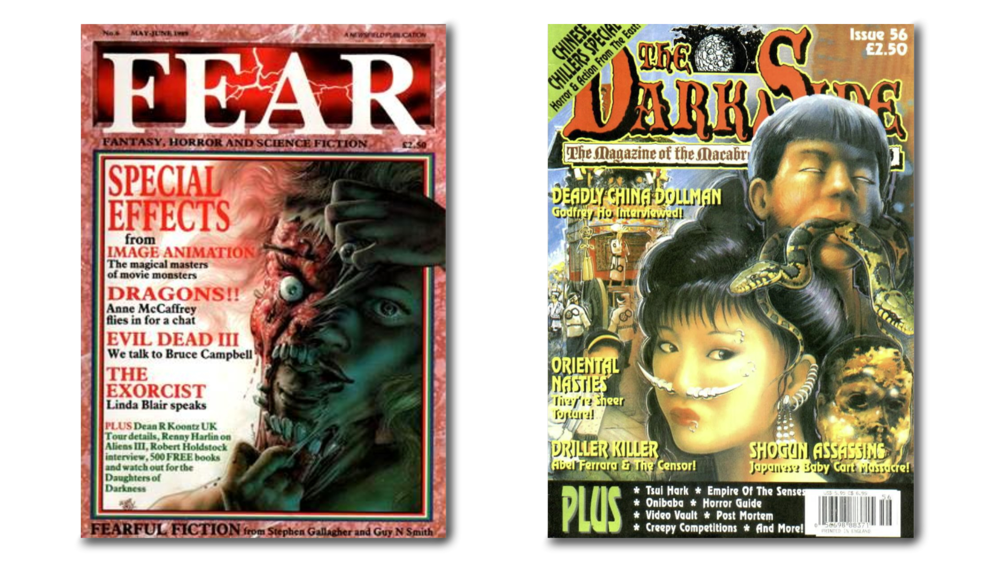
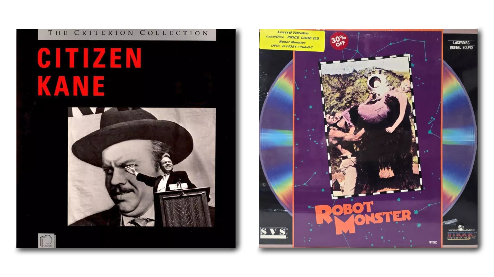

## 2025 introduction

Way back in 2014, I finally handed in my long-overdue master's thesis at the University of Amsterdam for the [Preservation and Presentation of the moving image program](https://www.uva.nl/shared-content/programmas/en/dual-masters/preservation-and-presentation-of-the-moving-image/preservation-presentation-of-the-moving-image.html).
The text was twice as long as it should be and was far more theoretical than I had initially planned for.
However, I was pleased about the result in the end, and I think I still am.
The text is about many things, but consumption and collection theory in the context of file sharing is the primary topic.

While not stated as clearly as it probably should have been, I spend a lot of words examining what, I believe, is a false digital/analog dichotomy.
I believe I demonstrate that it's more a case of same/same, but with different types of tangibility.
This belief has informed my thinking about the digital/analog ever since.
Perhaps my dropped chapter, that attempted to drag **Discourse networks 1800/1900** into the mix, would have enabled me to state those thoughts more clearly, but such is life.

The UvA scripties page, which used to host it, seems to have undergone some changes, and I can no longer find the thesis there.
I recently rediscovered the original OpenOffice document containing the paper, and figured I could make it available again.
Remembering how much I struggled to get the formatting right (I should have learned LaTeX!), making a markdown version seemed like the natural next step.

I've made a few minor changes in this 2025 version: I've lightly anonymized the torrent tracker in the case study as "Tracker X". I've moved the footnotes to sidenotes for increased legibility and changed the internal link structure ("see discussion on page X" doesn't make much sense online). Furthermore, I've also added some new images to help break up the text a bit, and fixed some typos and language here and there.

A final note: I recently learned that **dresden** passed away last year. He was one of the core users I extended thanks to in the original preface. He was a pillar to the *Tracker X* community (if you can be such a thing). I remember him as a generous, helpful, and all-round funny guy.
I only ever knew him online, but I was really saddened to hear of his passing.
A compilation of music by his band [Burning Love Jumpsuit](https://nyahhrecords.bandcamp.com/album/burning-love-jumpsuit-hell-bank-note-1993-1995) was recently released by Nyahh Records, and will be a nice companion soundtrack for the following text.

---

# Collecting the immaterial: A theoretical assessment of collection in a virtual environment

## 0. Preface

I began working on this project more than a year ago, and it has been a long road. And while it has been anything but smooth sailing getting here, and the project has unfolded in directions I did not expect initially, I am quite satisfied with the end result. This paper could not have been completed without the help of my patient supervisor Marijke de Valck, the friendly cooperation of *Tracker X's* staff, and Kristin Bakken. Furthermore, I would like to extend thanks to **theNomad**, **dresden**, **ShadyGuy**, **rde**, **darioargento**, **FulciLives**, **hostyle**, and everyone else that has helped me finish this project.



## 1. Introduction

Film enthusiasts have been collecting film since the very birth of the medium, more than a hundred years ago. When compared to the more classic collectibles such as books, paintings, pottery, and other more established art objects, this still makes film collection a rather young practice. **Widespread** collection of films is even younger, considering that the privilege of **owning** a film was something reserved for the upper echelon of cinephiles, up until the release of the home video. Actual **film** (35, 16, 8 millimeter film) was, of course, collected before the advent of home video, but the high price of both film and specialized equipment, kept it from turning into a mainstream practice. Home video not only turned film into a commodity everyone **could** collect; it was specifically marketed as such – "Why rent when you can own?" (Klinger 2001:134).

The introduction of film to the living room marked a radical change in viewing practices and habits, and has been the subject of countless books and articles. Where television studies traditionally had been concerned with the dynamics of group-viewing and the context of viewing, film studies have focused on "textual interpretations" (Dinsmore 1998:315). The introduction of home video helped bridge this gap between the fields of television and film studies. The implications the commodification of film has had on collection, has also been explored, but in a much smaller degree than that of viewing practices.

The home video has kept developing, through VHS, Betamax, LaserDisc, VCD, DVD to the contemporary Blu-ray Disc. However, in more recent years, film distribution has begun to develop in seemingly new directions – film is now available **online**. With the proliferation of services such as Netflix, Hulu, HBO GO, YouTube, Vimeo and so forth, everyone with computer-access can browse and watch films from vast online catalogues. What is interesting here though, is that these new distribution platforms are not a continuation of the video shop, but rather of the video **rental** shop. These services do not sell digital film copies, but rather give **temporary access** to digital copies. Indeed, Netflix began as a company renting out DVD's by mail. This difference might seem subtle, but is in fact quite radical, if we realize that these new and rapidly growing distribution platforms, do not offer the audience a way of acquiring a personal copy. In other words, film does not seem to be collectible in the traditional sense in this new context.

The distribution of music seems to roughly have followed the same kind of development, with streaming services such as Spotify, WiMP, Last.fm and Grooveshark steadily gaining ground. Music distribution has had an intermediary step between classic physical media and digital streaming though, where users have been allowed to download copies. ITunes is a service that offers its users to buy and download a digital personal copy. ITunes does however, as most of these services, only offer files with embedded DRM technology (Digital rights management). As Allen-Robertson states, somewhat crassly: "Anything you’ve bought from iTunes or Xbox Arcade, for example, you don’t own and you never will. Access to it can be removed at any time, the content itself can change – it’s fundamentally different to buying a CD" (University of Cambridge 2013). (See also Allen-Robertson 2013:167).

However, in roughly the same time span as the development of official and authorized platforms, we can trace the rise of **alternative**, underground distribution platforms. Perhaps most importantly is the rise of peer-to-peer file sharing networks (abbreviated "p2p"), that allow users to connect to, and share digital content between each other with relative ease. Most of these networks have operated in legally unregulated or legal grey-areas, and most continue to operate even if their activity has been deemed illegal. From proto-p2p Usenet in the 80s, the rise (and fall) of **Napster**, **Grokster**, **Kazaa** and **Morpheus** in the late 90s and early 2000s, to Direct Connect "hubs", **eMule**/**eDonkey** and **BitTorrent** "trackers" to name a few (Allen-Robertson 2013:7). What is important here is that these illegal networks seem to offer films in collectible, although digital, formats.

The new digital context of media raises quite a few questions when it comes to collection, perhaps foremost, can the acquisition of digital files even be counted as collecting? I believe it is reasonable to assume the transition from physical to virtual, has had implications for how people collect film. The very concept of an **immaterial** or **virtual** collection, is rather abstract.

In this thesis, I will examine the activity of film collection's transition from the physical to the virtual realm. To do so, I will establish a model that can be used to discern the nature of collection. I am basing this model primarily on two theoretical models of **consumption**: Grant McCracken's model of consumption presented in **Culture and Consumption** (1988), and Jean Baudrillard's theory of consumer society, presented in **The System of Objects** (2005). These two works have much in common and complements each other very well. My primary source of the two has been McCracken, as his theory comes in a slightly more applicable format than Baudrillard's. I want to understand what collection is in general, before I go on to evaluating collection in the digital realm. I do this so that I can discern whether collection is still the same, or whether it has developed in new directions in these new virtual environments.


On this basis, I will establish a theoretical framework that allows me to discuss the following questions: What kind of meaning is related to collections? How is this meaning transferred and manipulated? I will go on to relate these questions to my case study.

My case study is *Tracker X*, a torrent tracker concerned with obscure, weird, bad, or, in general, "trash cinema." The reason my choice of case-study fell on this particular site, has to do with the community's concern with trash cinema, or more specifically, "paracinema" (see [5.2 The subculture of paracinema](#52-the-subculture-of-paracinema)) makes it clear that it shares much with certain communities of VHS collectors. Indeed, the site is home to several thousand copies based on original VHS sources provided by VHS collectors among its members. While **personal** collection **online** seems to be a generally unexplored topic, collection in the physical world has been given much attention. In the case of film collection, the bulk of work done on the topic seems to have been done on, exactly, the **collectors of VHS tapes**. This makes *Tracker X* a particularly interesting case study for assessing collection's transition from a physical to a virtual environment.

This is also the reason for why I use several sources that discuss what are now deemed to be rather outdated formats, such as LaserDiscs and VHS. Moreover, the physical nature of these more traditional forms of collection, make them a great counterpart to the radically different and digital realm of *Tracker X*. If the transition from physical to virtual, has caused changes to the activity of collection, these should be made obvious, by comparing these two realms. Indeed, the structure of the torrent tracker enables me to push my theoretical model to its limits to see whether it holds up.

I believe this inquiry into collection online provides a valuable new perspective to not only the field of collection, but also the fields of participatory fan culture, and the field of preservation and presentation of film. First of all, this thesis examines a particular subculture, that in recent years has begun a transition from the physical to the virtual realm. By establishing a model of collection, from within the larger system of consumption, we can investigate this subculture and its activities from an entirely new angle, at a very interesting point in its existence. The transition to the digital realm will continue, whether *Tracker X's* users like it or not, as the original VHS copies, that are so highly cherished will gradually disappear due to the wear and tear of time. In the end, all that will be left is the tracker and its references back to source material of a bygone age.

Furthermore, by examining how this particular subculture utilize the torrent platform to its own ends, we can also look at the **platform** from a new angle. Where it has been the norm to examine such platforms on a more **functional** level, our subcultural perspective allows us to discern **cultural** aspects of features, that at a first glance might seem like entirely practical or technical parts of the distribution platform.

Finally, the thesis allows us to examine how an online community have managed to build, preserve and distribute a subcultural **countercanon** of (para-)cinematic history. It is an immense undertaking, where a dedicated community – united through shared passion, social media and the torrent protocol – continue to valorize, debate and construct their own alternative to the mainstream cinema that they deem **trivial**.

## 2. Consumption, collection, and meaning

### 2.1. Consumption

One of the key tenets in this thesis is that collection is a specific type of consumption. Central to this statement is the definition of "consumption" and its mechanics. "Consumption" is a fairly general term, and Grant McCracken's definition of it, for example, makes this clear by being extremely broad: "the processes by which consumer goods and services are created, bought, and used" (McCracken 1988:xi). Russell Belk agrees with McCracken, and suggests that consuming involves "individuals acquiring, possessing, using, and disposing of valued things," but adds that how these are acquired, used and possessed differs wildly (Belk 1995:65). Belk and McCracken's attempt at defining "consumption", illustrates both the generality and the multifaceted nature of the concept. It is clear that consumption is not a single thing, but rather a conglomerate of different activities and mechanics.

While Baudrillard only reluctantly attempts to define the concept in his final chapter of **The System of Objects**, he comes at the problem from a completely different angle (Baudrillard 2005:217). In typical fashion, he attempts to define "consumption", not by explaining what it "is", but rather by looking at what it "is not".

> Consumption is not a material practice, nor is it a phenomenology of 'affluence'. It is not defined by the nourishment we take in, nor by the clothes we clothe ourselves with, nor by the car we use, nor by the oral and visual matter of the images and messages we receive. It is defined, rather, by the organization of all these things into a signifying fabric: consumption is **the virtual totality of all objects and messages ready-constituted as a more or less coherent discourse**. If it has any meaning at all, consumption means **an activity consisting of the systematic manipulation of signs**.
> (Baudrillard 2005:218)

For Baudrillard, the activities outlined in Belk's and McCracken's definitions are the "**preconditions"** for consumption (Baudrillard 2005:218). His definition of it points to consumption being something taking place in **parallel** to the "mechanism for satisfying needs" (2005:217). The manipulations of the objects "themselves" are not of interest to Baudrillard, but rather the manipulation of the signs and meanings **associated** with the object. In this way, Baudrillard points to the core of the issue of consumption – what are the **motivations** for consumption; **why** do people consume; and, to what **end** do they consume? I am tempted to say that consumption indeed **is** a "mechanism for satisfying needs", but that these needs are of a completely different nature than the basic, **physical** ones denounced by Baudrillard – we are dealing with more **abstract** needs. Baudrillard elaborates on this idea in **For a Critique of the Political Economy of the Sign** (1981) and states:

> An object is not an object of consumption unless it is released from its psychic determinations as **symbol**; from its functional determinations as **instrument**; from its commercial determinations as **product**; and is thus **liberated as a sign** to be recaptured by the formal logic of fashion, i. e. by the logic of differentiation.
> (Baudrillard 1981:67)

In fact, this is a view McCracken shares, although he expresses it somewhat differently. Where Baudrillard talks about the symbolic and the sign value of objects, McCracken talks about the (cultural) **meaning** of objects. Where Baudrillard finds the "manipulation of signs" to be what constitutes consumption, it could be argued that consumption is the "manipulation of meaning" for McCracken. If there is one thing they definitely agree about however, it is the importance of the notion that objects can carry **meaning**.

### 2.2. Culture and meaning

The idea of goods as carriers of meaning is a fairly well established idea according to McCracken. However, McCracken also states that meaning **flows** and is in permanent transit – this is what gives goods their communicative power (McCracken 1988:71). In fact, his model of consumption, is actually a model of the **movement** and **manufacture** of meaning. With this model, he **equals** consumption with culture – they are mutually dependent entities. The significance of goods is not only that they **have** meaning, but that they **transfer** meaning. Goods play an integral part in the flow of meaning between the "culturally constituted world" and the consumer.

McCracken's model proposes that there are three locations of meaning: the culturally constituted world, the consumer goods and the individual consumer. In addition to the meaning locations, we find two moments of meaning transfer: world-to-good and good-to-individual (McCracken 1988:72). McCracken compares culture to a "lens" and a "blueprint", and elaborates that it determines how we see and understand the world around us, as well as how we fashion and shape the world through effort.

McCracken establishes two further concepts to describe this meaning: cultural **categories** and cultural **principles**. The cultural categories describe how culture divides the world into separate parts. In this system of distinction, every phenomenon and aspect of the world can be understood, in terms of what it is and what it is not. Some examples of categories are class, gender, age, or status. What falls outside any such categorization, is as a result **without meaning** and thus not a part of the culturally constituted world – it is unintelligible. It should be noted, that cultural categories are not set in stone, and are subject to constant change and reevaluation.

What is particularly interesting to note about the cultural categories, is that they "have no substantial presence in the world they organize. **The categories** are the scaffolding on which the world is hung, but they stand invisible to all those who live in the world" (McCracken 1988:74). However, human **practice** substantiates them. Following the schematics of culture, the categories are continually acted out, so as to construct a world **consistent** with our views and beliefs. A primary way these categories are substantiated, is through **goods**.

")

Goods are concrete expressions, or reifications, of the ubiquitous and invisible culture and its categories. Goods are "a vital, visible record of cultural meaning that is otherwise intangible" (McCracken 1988:74). However, goods are not only **expressions** of these categories, in a way, they are also (indexical) **proof** of them. McCracken points out that there are several studies demonstrating "that the order of goods is modeled on the order of culture" (ibid.).

The other aspect of cultural meaning is the cultural principles. Where the categories are the result of cultural segmentation of the world, the principles are "the ideas with which this segmentation is performed" (McCracken 1988:76). You could say that the principles are what allow cultural phenomena to be distinguished from each other. McCracken argues that cultural categories and principles are mutually presupposing, and that goods therefore can't express one without the other (ibid.). When a good demonstrates the difference between two categories, it does so by "encoding" part of the principle that marks the two categories as distinct.

> Thus the clothing that shows a discrimination between men and women or between high classes and low also shows something of the nature of difference that is supposed to exist in these categories. It communicates the supposed "delicacies" of women and the supposed "strength" of the men, the supposed "refinement" of a high class and the supposed "vulgarity" of a lower one.
> (McCracken 1988:76)

This is what McCracken uses to ground his statement of meaning as something originally located in the culturally constituted world. Now, with this **theoretical** **core** established, we go on to consider what actually constitutes **collection**. I have stated that I believe collection to be a specific **form** of consumption, so a good place to start is to attempt to define these specifics. While being a "sub-category", so to speak, of consumption, there is still a border between "mere" consumption and collection.

### 2.3. Collection and function

At the beginning of this chapter, I referred to Belk's definition of consumption. He continues his discussion of the subject by stating that we also **dispose** of goods, and that we generally do this once goods lose their value or become **obsolete** – both physically and symbolically. In the case of collection, however, **obsolescence** works differently, as obsolete goods – goods that have been removed from their original or intended use – "may appeal to collectors even more strongly **because** of their obsolescence. Thus collecting differs from most other forms of consumption in being relatively immune from fashion obsolescence" (Belk 1995:66, my emphasis).

In other words, what Belk is implicating, is that the collector cares little about the **functionality** of goods. The value of the collected object – **the collectible** – is not defined by its use-value, but perhaps rather in its **lack** thereof. This is a view shared by Baudrillard, who essentially describes collection as a system of "non-function," and he defines the collectible as an object having "minimal function and maximal meaning" (Baudrillard 2005:75,86). He argues that goods have two functions: to be put to use and to be possessed. Once a good is "completely abstracted from its use, **it** becomes part of a collection" (Baudrillard 2005:92).

Baudrillard touches on some very central concepts here, perhaps primarily that of **value**, and **what** is valued in the collectible. He elaborates: "an object no longer defined by its function is defined by the subject" (Baudrillard 2005:92). In other words, once an object is no longer defined by what it is (the object itself), it is defined **externally**, by a subject. Once a good is no longer defined by its function, neither is its value. We can also look at this from a different angle – an object's value can be either **utilitarian** or **cultural**.

Furthermore, collectibles seem to have **two** primary values – that which is established among the collecting community and that which is established by its owner. While both types of value are subjective in essence, there is something like a consensus about an object's value among the members of a collector community. On the other hand, you have the personal value, that only matters to the collector himself. Baudrillard also observes a related, but curious, collector phenomenon that illustrates the twofold nature of collector value – namely, the fact that objects **missing** from a collection, also are the collection's most valuable. "The object attains exceptional value only by virtue of its absence" (Baudrillard 2005:99). This is of course the case for both collector communities and individual collectors, but the observation highlights the subjective value of collectibles very well. An object that has low value in a community, might have high value for an individual collector who's missing the object from **his** collection.

This leads us to another peculiarity of collection – **its focus on acquisition and building of sets**. The acquisition of objects, or rather the **continued** acquisition of objects, is central to the process of collection (Belk 1995:66). The kind of objects acquired is subject to a set of **selection criteria**, that "distinguishes what is and what is not appropriate for inclusion in the collection" (Belk 1995:66). Furthermore, the objects in a collection are **singular** and **unique**. While the objects in a collection will have things **in common** with the other objects in the collection, they should not be **identical**. This is an important distinction, as it is what essentially marks the difference between collection and hoarding.


To illustrate, we can look to an odd example from the world of VHS collection. In 2009, after repeatedly coming across VHS copies of the film **Jerry Maguire** (Cameron Crowe, 1996), the found-footage group "**Everything Is Terrible**", set out to acquire as many copies of the film as possible (Chicago Tribune 2012). If their current hoard of As of 2025-03-13 they have reached over 35649 copies! Go read up on it over [here](https://www.jerrymaguirepyramid.com/) were in some way distinguishable from each other, their **Maguire Watch** initiative could be regarded as some sort of collection (Everything Is Terrible 2014). However, as their copies seem to be virtually identical, we can deem this to be an instance of what Belk calls mere acquisitiveness, "in which the items acquired are neither regarded as a set nor retained and possessed as such" (Belk 1995:67)

Baudrillard puts this very eloquently in his musings on the odd blend of singularity and seriality we find in collections, and states that collecting is "qualitative in its essence and quantitative in its practice" (Baudrillard 2005:94). Drawing from this, it is clear that a set – or a collection – is a series of unique objects **complimenting** each other.

### 2.4. Sets, the Diderot unity and effect

This mechanism of complementation that McCracken identifies, is named after Denis Diderot, due to a phenomenon described in Diderot's essay **Regrets on Parting with My Old Dressing Gown** (McCracken 1988:118-119). McCracken explains, that in the essay, Diderot describes how he receives a new, expensive dressing gown and suddenly realizes that his other goods seem cheap in comparison to it. Diderot finds himself in a spiral of continual displacement and "upgrading" of his goods, in an attempt to bring everything "up to par" with the dressing gown and to re-establish a sort of unity between his goods.

The Diderot effect and unity is essentially a cultural phenomenon that stems from how consumers crave "cultural consistency" in their lives and among their possessions. The effect is entirely integral to McCracken's model of meaning transfer. The effect can work in two markedly different ways, as described by McCracken: "It can constrain the consumer to stay within his or her existing patterns of consumption. But, in a second mode, it can force the consumer to transform these patterns of consumption beyond all recognition" (McCracken 1988:118). To understand how the effect works, we have to look at **why** goods can appear to "go together" and complement each other. McCracken's explanation for this is threefold and has to do with: "(1) the nature of the meaning contained in things, (2) the way in which this meaning enters into things, and (3) the manner in which the meaning of things is communicated by the 'object code'" (McCracken 1988:120).


As I've explained earlier, goods are created after the blueprint provided by cultural categories. McCracken states that the meaning of goods "stems from their place in a system of goods and the relationship of this system to a system of cultural categories". He illustrates this by looking at watches: "The Rolex is associated with particular cultural categories of class, sex, age, and occasion because of the overall correspondence between the system of watches and the system of cultural categories" (McCracken 1988:120). This correspondence between the different product categories and cultural categories are keys in the process of complementation.

> All product categories are organized in order to correspond to the same set of cultural categories. This means, perforce, that all product categories must also correspond to one another. It is therefore possible to take each product category and line it up with every other product category, so that their internal distinctions exist in parallel. When this is done, the structural equivalent of a brand in one category becomes evident in all others.
> (McCracken 1988:120)

With such a system, we can attempt to match a system of **movies** to a system of **music**. In this way, we can attempt to discern what genre of movie "goes" with what genre of music. We could, for example, discover that horror films and black metal music, go together. What we really discover here though, is that the two genres "occupy the same relative position in the product category" and thus carry similar and comparable meaning (ibid.). Put somewhat bluntly, the meaning of goods comes from their coordinates in this conceptual "grid" that we are calling categories, and whether goods complement each other can be assessed quite "matter-of-factly" by comparing their "grid positions". This is also an insight that is shared by Baudrillard (Baudrillard 2005:209).

The final aspect we need to look at to understand product complements and unities, has to do with how goods **communicate** meaning. More specifically, it has to do with how McCracken argues that language and material culture seem to "differ in their communicative ends" (McCracken 1988:68-69). In his study of clothing and how people "decode" their meaning, McCracken observed that clothing seemed to lack "combinatorial freedom and generative potential," traits that are inherent to language (ibid.).

In other words, it appears that goods communicate meaning most effectively when their meanings **complement** each other. An isolated good, or a selection of goods that have separate or opposing meanings, communicate their meaning less effectively.

> In other words, the symbolic properties of material culture are such that things must mean together if they are to mean at all. Product complements create the associations that supply the companion products for any particular good that help make its meaning good. The nature of product communication is therefore another factor that encourages things to go together.
> (McCracken 1988:121)

I see traces of Baudrillard's summary of collecting as "qualitative in its essence and quantitative in its practice" here. Baudrillard follows this statement up by suggesting, in his elegant rhetoric, that the attraction of collecting is one of "an intimate series […] combined with a serial intimacy" (Baudrillard 2005:94). A collection consists of a series of objects holding unique meanings, that the collector is intimate with. On the other hand, the sum of these is an intimate series. The objects mean one thing by themselves, and another when they "mean together", to return to McCracken.

While the Diderot effect is not unique or limited to collectors, it is quite obvious that it plays an integral role in the activity of collection. I believe sets, like other unities of goods, reflect **cultural categories**. If we agree with McCracken's argument that goods do not communicate like language, and that goods therefore "must mean together if they are to mean at all", collection is essentially the elaborate process of **constructing cultural meaning** (McCracken 1988:121). Following this line of reasoning, the building of a set is a continual process of refining, adjusting and strengthening of cultural meaning. Collections communicate meaning, and it would seem that it is their exact goal to do so.

### 2.5. Value and meaning

We can return to Baudrillard's view of collection as a system of non-function and his musings on their value, and attempt to unify the ideas. This idea is central to Belk as well, who states that one of the things that sets collection apart from consumption, is that "the things compromising a collection are removed from ordinary use" (Belk 1995:66). He suggests that this may be the case from the start, as in the case of art objects, or "by virtue of being taken out of use," as in the case of stamps or coins removed from circulation, or silver spoons no longer used as cutlery, to name some examples (ibid.).

> There is also another sense in which collecting is non-utilitarian. Collecting is highly involving passionate consumption rather than an uninvolving form of consumption like buying canned peas […]. As a result collectors tend to feel attached to their collections in ways that may seem irrational if viewed in terms of the normal functions of the things collected.
> (Belk 1995:66)

As previously mentioned, Baudrillard agrees that a collectible is an object lacking function, but also states that it has particularly strong meanings attached to it. Indeed, "robbing" an object of its intended functionality, would seem to leave it with its cultural meaning alone. Put differently, we could say that turning an object into a collectible makes it a purely **communicative** object. Following this, it is reasonable to assume that the collectible's **value** stems solely from its ability to communicate meaning. Value and meaning are inextricably linked in the case of the collectible, as it seems to be lacking ordinary **use-value**.

However, the fact that collection seems to be a means of communicating cultural meaning is still **not** the only thing that sets it apart from consumption. As I've explained earlier, regarding consumption as a cultural communicative phenomenon, is the core of McCracken's **Culture and Consumption**. The distinction between the two has to do with how the collectible is **purely** communicative. The collectible's primary and **sole** purpose is that of holding meaning. While the ordinary consumer good holds meaning as well, this is only one of its two functions – the emphasis on the good being meaningful, is not as strong.

With this in mind, we can return to Baudrillard's statement that goods have "two functions – to be put to use and to be possessed" (Baudrillard 2005:92). The quality that allows an object to be "possessed" seems to be that of holding and communicating meaning. This allows us to rephrase his statement somewhat, and I suggest that objects have two functions – to be **useful** and to be **meaningful**. Put this way, the collectible stands out, as it is only meaningful, and thus an object made solely for **possession**. It must be noted here, that this would be the case of an **idealized** collectible. In the real world, we seldom encounter purely meaningful objects, or, on the opposite extreme, purely **practical** objects. The real world is more nuanced than that of theory.

## 3. Displaced meaning

> Memories of the cities in which I found so many things: Riga, Naples, Munich, Danzig, Moscow, Florence, Basel, Paris; memories of Rosenthal's sumptous rooms in Munich, of the Danzig Stockturm where the late Hans Rhaue was domiciled, of Süssengut's musty book cellar in North Berlin; memories of the rooms where these books had been housed, of my student's den in Munich, of my room in Bern, of the solitude of Iseltwald on the Lake of Brienz, and finally of my boyhood room, the former location of only four or five of the several thousand volumes that are piled up around me.
> (Benjamin 1969:67)

### 3.1. Unsatiable needs

[Having linked the collectible's value with the collectible's meaning][(#25-value-and-meaning), we return to our earlier discussion of value and **lack**. Belk points out that collections are seldom completed, they continue to grow or develop as long as the collector has any interest in it – or, in other words – **collects** (Belk 1995:66). Baudrillard goes further, and questions whether collections are even **meant** to be completed. He suggests that "madness begins once a collection is deemed complete and thus ceases to center around its absent term" (Baudrillard 2005:99). The idea of **lack** playing a central and, perhaps more importantly, a **positive** role for collections is interesting. In fact, it is actually explored by McCracken in his discussion of "displaced meaning".

While I have not discussed the two instruments of meaning transfer proposed by McCracken yet – the systems of advertisement and fashion – it must be noted that both of these systems exist (at least in part) to make consumers want to buy things. Essentially, these systems create **needs**. However, whether these created needs can actually be **satisfied** is a different story. Actually, both McCracken and Baudrillard seem to share the view that they can't. In fact, Baudrillard concludes his **System of Objects** by pointing out, that if consumption was a process of "absorption or devouring," you would eventually reach some sort of saturation point – a point where you would be satisfied and could stop consuming. However, he states, that point is never reached, "people simply want to consume more and more" (Baudrillard 2005:223).

> The systematic and limitless process of consumption arises from the disappointed demand for totality that underlies the project of life. In their ideality sign-objects are all equivalent and may multiply infinitely; indeed, they **must multiply** in order at every moment to make up for a reality that is absent. Consumption is irrepressible, in the last reckoning, because it is founded upon a **lack**.
> (Baudrillard 2005:224)

McCracken quite simply states that "we can never reach a 'sufficiency' of goods and declare 'I have enough'", since the mechanics of consumption are built to enlarge our needs continuously (McCracken 1988:194). While McCracken seems to agree that this behavior is not at all positive, he also points out that focusing on this aspect of consumption, is missing the point somewhat. What I am referring to, is that Baudrillard has failed to identify what **role** consumption – or collection – plays in the face of this looming disillusionment. I believe the clue to understanding this role lies with the fact that collections do not seem to be meant for completion.

### 3.2. Displaced meaning

Displaced meaning, is a peculiar category of cultural meaning introduced by McCracken. Displaced meaning is meaning that "has deliberately been removed from the daily life of a community and relocated in a distant cultural domain" (McCracken 1988:104). What is interesting here, is **why** meaning is removed from daily life. Baudrillard is actually quite close to the solution in his denunciation of consumption as "idealized" and "founded upon a lack" (ibid.).

McCracken states that there is a gap between the "real" and the "ideal," and that it is one of the most difficult problems a culture has to deal with (McCracken 1988:105). The essential problem is that ideals are insubstantial per definition. We simply can't have the ideal, as it always surpasses reality. The ideal is perfect, but unobtainable. Put somewhat pointedly, the problem is that **we can't have what we want**. If you face the problem with "naïve optimism," you will eventually have to face the fact that the gap between real and ideal is a "permanent feature of social life" (ibid.). If you, on the other hand, face the problem by cynical acceptance of the gap, you must lead your life "without larger goals and hope" (ibid.) There is no obvious solution to this problem.

However, there are **strategies** you can utilize to **avoid** the depressing fates of McCracken's quote. One such, is the **displacement** of the ideals that we cherish the most. The general idea of displacement, seems to be the harnessing of the ideals' insubstantial nature, and utilizing it in a positive way. You displace the insubstantial **ideals** in a location where you **imagine** that the ideal actually **has** substance. In this way, you establish a reason for why the ideal is insubstantial in the here and now, while at the same time creating an illusion where it appears that the aforementioned gap can be closed. As long as our ideals **seem** achievable, it does not matter that we never actually **reach** them.

I would suggest that it is not the **ideals** that we are substantiating here, but rather the **gap** between them and us. The illusion works by making the **distance** we have to cross to reach our ideal known to us. In other words: by giving the gap substance, the steps needed to close it become apparent to us. An ideal that lacks substance or is unlikely to have substance in our world, can be validated or proven to exist, if it is believed to exist **somewhere else**. If the ideal is believed to exist somewhere else, "the gap between the real and the ideal can be put down to particular, local difficulties" (McCracken 1988:106). McCracken continues, "the strategy of displaced meaning contends with the discrepancy between the real and the ideal by the clever expedient of removing the ideal from the fray" (ibid.).

To understand this process better, we can examine the nature of the locations we displace meanings to. The ideals cause problems when they are in the "here and now", so a successful displacement relocates the ideal in **time** and **space** (McCracken 1988:108). A common location for displacement in **time**, is a "golden age" in the historical past. According to McCracken, golden ages tend to be reassuringly documented historical periods, that we have imposed with our own – largely fictional – beliefs. However, we can also displace our unfulfilled ideals to a "golden future."

The future is an excellent and versatile refuge for ideals, considering how it is **undocumented**. It lacks the historical record that could contradict our utopian beliefs of what it might hold (McCracken 1988:107). McCracken suggests that this unconstrained nature of the future might play an important role when we consider why people choose to displace something to the future or the past.

Where the future offers a clean slate, the golden past "can give credibility to cultural ideals by 'demonstrating' that these ideals were once extant" (McCracken 1988:107). The proof that the golden past provides, is, as I've suggested earlier, that of **substance**. The difference between the two locations can be summed up by stating that the past offers the **authority** of substance, while the future is **unrestrained** by substance. McCracken suggests that there might be reason to believe that the more implausible an ideal is, the more likely it is that it is displaced to the future (McCracken 1988:107).

As mentioned, we can also displace ideals in space – the process and mechanics being very similar to that of displacement in time. In essence, it comes down to pointing at a society, group or geographical location today, where we imagine that life is lived according to our ideals. Of course, the location has to be distant enough, for it to be challenging to find data that disprove, go against or otherwise shatter our imagined conception of it. Again, we see the rationale that when something has substance **elsewhere**, it proves that it can have substance **here**.

> Industrial societies tend toward a certain fondness for pastoral societies. Pastoral societies look forward to the opportunities for perfection that development will bring. Similarly, traditional societies admire modern ones, and they, in turn, return the compliment. Somewhere on the spatial continuum there is always a perfect "other" in terms of which locally unobtainable ideals can be cast.
> (McCracken 1988:107)

The usage of the strategy of displacement is not limited to cultures and large communities, it is also utilized on a smaller scale by **individuals**. As McCracken points out: "Like cultures, individuals display a characteristic refusal to attribute the failure of ideals to the ideals themselves" (McCracken 1988:108). The mechanics are the same, but the locations differ. Rather than grand historical golden ages, individuals can find refuge for their ideals in their personal past. Personal "golden ages" so to speak, could be childhood, or periods "in which life conformed to their fondest expectations or noblest ideals" (McCracken 1988:108). On a larger scale, the future is also a suitable location for displacement for individuals.

> What kind of future is will prove a satisfactory location for ideals is often specified by convention. Conventional locations include "when I get married...," "when I finally have my degree...," when opportunity comes aknockin'...." these desirable futures are collective inventions and subject to changing fashion.
> (McCracken 1988:108)

When **your own** future and past are unable to provide a suitable location for displacement, you turn to the lives of others. In other words, we look to others for proof that their ideals have been realized. As McCracken points out, the fact that we do this becomes very apparent when we take the "Hollywood 'star system'" and other cults of personality into question (McCracken 1988:109). We assume that others have realized, and are living, the lives that we want for ourselves. If we look at my later discussion of trickle-down theory and the appropriation of fashion to establish social status, we can see how displacement is one of the driving forces of consumption (see discussion on [fashion](#43-fashion)). More importantly, this allows us to examine what role **goods** play for displacement.

While displacing ideals indeed appears to be able to protect our cherished ideals from contradiction, the strategy makes little sense if we in the process lose **access** to the ideals we want to protect. At the beginning of my chapter on McCracken's model of meaning transfer, I suggested that goods provide substance for culture, and it is exactly this which allows goods to serve as "bridges" to displaced meaning (McCracken 1988:109).

To be able to serve as a bridge, a good will have to be able to bring the displaced meaning into the here and now, while at the same time not compromising its immunity to contradiction. The function of the bridge is thus somewhat contradictory, as it should provide access to meaning, while at the same time not undoing the displacement (e.g., **not** being in the here and now). Goods are well suited to this due to the way they are linked to culture. While goods provide substance to culture, we need to remember that the good and culture are not the **same**. As I've explained earlier, the world of goods mirrors that of culture and is modeled after it – the good **is** not culture, it **stands in** for culture. The good is inextricably linked to culture, while it at the same time remains external to it.

> Goods serve so well [as bridges] because they succeed in making abstract and disembodied meaning extant, plausible, possessable, and, above all, concrete. They represent displaced meaning by serving as synecdoches of this meaning. They represent this meaning by reproducing its value and scarcity through their own. Finally, they represent this meaning by creating a series of almost infinitely expandable locations through finely articulated diversity.
> (McCracken 1988:115)

McCracken explains that goods can serve as bridges both before and after they are purchased. The former process is the least complicated of the two, as it counteracts the displacement far less than the latter. The **coveted** good essentially works as a bridge by having its purchase anticipated. Unlike the displaced meaning, the anticipated good is within reach, and thus **can** be acquired.

By reflecting on the eventual possession of a coveted object, the individual is allowed to "reflect on the possession of an entire way of life". "The [good] becomes the 'objective correlative' of this diverse package of displaced meaning" (McCracken 1988:110). McCracken illustrates this quite poignantly by looking to **Citizen Kane** (Orson Welles, 1941), and in the process provides us with an example of using goods to access meaning displaced in the past:

> The tragedy of **Citizen Kane** follows from the fact that its protagonist has lost touch not only with his past but also with the bridge that allowed him to gain access to his past. A popular interpretation of the movie finds a "anti-materialistic" message in the movie. Poor, misguided Kane seeks happiness in things, in a pathology of consumption. But the real nature of Kane's difficulty is not that he seeks happiness in things. The displacement strategy moves all of us to similar attempts. The real nature of his difficulty is that he is unable to determine in which of his possessions this happiness is really (or apparently) resident.
> (McCracken 1988:111)

The coveted good can in many cases also be purchased and not only anticipated, but this does not **necessarily** mean that it stops functioning as a bridge.

It could seem like the bridge is intended to be as inaccessible as the displaced meaning (but with substance), at least this makes their functionality as bridges easier to maintain. As a result, goods that are well beyond an individual's buying power are often chosen as bridges to displaced meaning. It is **supposed** to be **difficult** to acquire, and this makes the actual purchase of such a bridge, "almost always an exceptional purchase" (McCracken 1988:111). If the coveted good functions as a bridge by providing something substantial that can be anticipated, it would perhaps seem reasonable to believe that the purchased object somehow worked differently. This is not the case – the "exceptional purchase" works the exact same way.

While the good has become the "objective correlative" of the displaced meaning, the consumer is aware that the good is only a part of the ideal – a tiny piece of an idealized whole. The existence of the **part**, "proves" not only that the **whole** exists, but also "of the individual's ability to lay claim on it". "The good is purchased in anticipation of a much larger package of goods, attitudes, and circumstances of which it is a piece" (McCracken 1988:111). In most cases, the purchase of a good does not violate the displacement. This is due to the fact that the good does not summon the "entire system of which it is a part" (ibid.). The individual has not bought the **entire bridge**, but rather a **part** of it.

> Indeed the purchase has a quality of rehearsal to it. It is consumption in training. The individual clearly understands the that he or she is not laying claim to the whole parcel of displaced meaning that has been transported to another time and place, but merely a small, anticipatory part of it.
> (McCracken 1988:111-112)

However, if the purchase of such a bridge were to bring the actual displaced ideal into the here and now, you can always discredit the good as a bridge. You can simply transfer the function of bridge to another object, that is not already in your possession, and return to anticipating its future purchase or acquisition. In this way, the displaced meaning can stay displaced (McCracken 1988:112). Another solution for keeping displaced meaning displaced after purchase, is to quite simply **avoid** using the bridge. In this way, it can remain idealized and untarnished by empirical trial.

If you purchase an object that has represented "what my life will be like some day," that object now actually **is** a part of your life, and the displaced ideal is no longer so displaced. As McCracken states, "it is now an incipient part of the "here and now" and to this extent vulnerable to contradiction" (McCracken 1988:112). Indeed, you run a risk by purchasing your bridges, and McCracken illustrates this by looking at lottery winners who unexpectedly find themselves having the purchasing power to buy anything they have ever wanted. The result is that "one's displaced meaning is no longer safely out of reach" (McCracken 1988:112).

As explained, great wealth complicates the strategy of displacing meaning significantly, but McCracken suggests that there is one strategy to get around it, namely, **to collect**. This is of course of particular interest to us, and is, in fact, the only time McCracken discusses collection in **Culture and Consumption**. McCracken actually gives a short definition of collection here, and describes it as "to buy what is scarce and rare" (McCracken 1988:113). For McCracken, collectibles are of interest because they have "their own special scarcity" (ibid.). What McCracken refers to here, is the fact that the difficulty of acquiring a collectible does not stem from it being merely economically **expensive**, but the fact that they are actually **rare** in some regard. You need more than "mere" wealth to acquire collectibles.

### 3.3. Collection, rarity and displaced meaning

I believe this is a good point to attempt to provide a working definition of **collection**. I find Belk's definition to be both concise and elegant.

> Collecting is the process of actively, selectively, and passionately acquiring and possessing things removed from ordinary use and perceived as a part of a set of non-identical objects or experiences.
> (Belk 1995:67)

Indeed, I agree with all these aspects, but we should also take note of the one-sentence description provided by McCracken, namely that collection is "to buy what is scarce and rare", and that collectibles have their "own special scarcity" (McCracken 1988:113). That collectibles are rare is not listed in Belk's definition. Considering that collectors often seem to hunt for such valued rarities, this might seem odd. To understand the role rarity plays in collection, we need to examine **why** the rare object is sequestered to begin with. To do so, we have to return to one of the concepts that I **have** examined earlier, namely the **value** of objects.

In my discussion of [value](#25-value-and-meaning), I essentially concluded that the value of objects stems from one of two things – their **functionality** or their **meaning**. Furthermore, I concluded that collectibles are valued solely by the meanings they hold, seeing that collectibles are actively removed from their intended use. However, having brought up the concept of **displaced** meaning, we now have **two different kinds** of meaning to consider. The real question, and perhaps the crux of my definition of collection, is what kind of meaning the collectible holds. **I contend that the collector is concerned with displaced meaning alone. Collectibles and collections are, in other words, bridges to ideals**.

This provides us with some very interesting possibilities and answers. First of all, the rarity is not sought after because it is rare per se. The rarity is sought after because it holds meaning – more importantly, **displaced** meaning. The fact that rarities so often are sought after and deemed to be of extraordinary value, is because they are such ideal locations to displace meaning to. McCrackens view is simplistic and can be turned on its head, rarities **are** sought after, but only because they provide more of a **challenge** to acquire than non-rare collectibles. Collectors **do** "buy what is scarce and rare", but this is not the defining feature of collection, the real defining feature of collection is its concern with displaced meaning.

On the basis of this assumption, I would therefore like to suggest my own modified definition of collection:

> Collecting is the process of actively, selectively, and passionately acquiring and possessing things removed from ordinary use and perceived as a part of a set of non-identical objects or experiences, **so that they can act as bridges to displaced meaning**.

Indeed, I believe many of Belk's other defining features of collection and other collector phenomena can be traced back to this trait. The seemingly irrational passion of collectors, the non-functionality of the collected objects, the obsession with unique objects and sets, and the fact that collections are not meant to be completed – I believe all of this can be traced back to how collectibles serve as bridges to displaced meaning.

In my earlier discussions of [sets, Diderot unities and value](#24-sets-the-diderot-unity-and-effect), I suggested that the collectibles are purely communicative objects and that collection, as a result, is a purely communicative effort – that collection is the elaborate construction of cultural meaning. With displaced meaning in mind, it is obvious that this statement must be revised somewhat. Rather than constructing cultural meaning, collectors are constructing elaborate **bridges** to displaced ideals.

### 3.4. Uniqueness as ideal

We should consider my discussion of the very finite 72 film DPP-list, in my [later discussion of **divestment rituals**](#64-divestment-rituals). While the 72 films of the set can be acquired, this does not mean that the collector is "done" collecting, or that collection can *end*. Instead, he will find *new* locations – sets – to displace ideals to. A good example of this, would be the **"Video Nasties 2"** list that was published by the fanzine **The Dark Side**, as an unofficial extension to the original DPP-list (Bryce 2001). The 78 movies on this list was not officially banned, but disappeared from the video market as a result of the prosecution of the other films. This example, is a perfect illustration of how sets keep getting expanded through curation and the creation of *related* sets. The concept of "the complete" or "finished collection", is an ideal in **itself**. Collection is most definitely a "total idealised practice" as Baudrillard suggests (Baudrillard 2005:223). The **ideals of collection** are what drives us to **keep** collecting – to keep adding, upgrading and seeking new missing pieces.

> The serial nature of the most mundane of everyday objects, as of the most transcendent of rarities, is what nourishes the relationship of ownership and the possibility of passionate play: without seriality no such play would be conceivable, hence no possession – and hence, too, properly speaking, no object. A truly unique, absolute object, an object such that it has no antecedents and is in no way dispersed in some series or other – such an object is unthinkable.
> (Baudrillard 2005:100)

While collections and collectibles act as protectors of many different ideals, I believe there are two **core** ideals that all forms of collection are seeking to protect, and that the activity is based upon. The first of these ideals is identified by Baudrillard in the quote above – the ideal of "uniqueness".

Belk suggests that one of the things most collectors seek is the "chance to stand out," or rather, to be seen as unique, by owning rare, valued or otherwise unique possessions (Belk 1995:88). Belk seems to suggest that the reason collectors are concerned with these two ideals in particular, comes from the collector's yearning to become, or be seen as, a unique individual – perhaps more correctly, to be seen as **an individual** in general. Furthermore, Belk suggests that collectors tend to specialize their collection habits over time, focusing on rarer and more esoteric or unavailable items so that they can distinguish themselves from **other collectors** too (ibid.).

This is of course particularly interesting to us because we now immediately recognize the mechanisms of McCracken's model of meaning transfer. The transfer of meaning from good-to-consumer – or rather – from ideal-to-collector. Indeed, we can see how the collector attempts to place himself in a position aligned with the unique objects on the aforementioned category "grid system," so that he can be seen as holding comparable meanings himself. What is a rare object, if not something seemingly **unique** – the "objective correlative" of this cherished ideal?

Indeed, this helps explain a curious phenomenon I noted earlier in the paper – how the most valuable object in a set, seems to be the ones **missing** from the collection. The moment collectors become aware of these assumed unique objects, they begin anticipating their future purchase or acquisition. The problem arises once the object **is** acquired and added to the collection. The collection is, as I have established, **serial** in nature. The problem becomes apparent, if we look back to Baudrillard's statement regarding the unique object being an **illusion**. The moment something enters a collection, and thus becomes part of a series, the object no longer is unique.

This is a curious paradox, as it also means the ideal has been brought into the collector's here and now and has become prone to contradiction. As a result, the ideal has to be displaced to yet another safe location. In the collector's case, that would mean a different assumed unique collectible that remains unacquired and is currently **outside** of the collection.

### 3.5. The collection as ideal

However, if the collection itself **negates** the very ideals it seeks to **protect**, this could actually seem to be an argument **against** collections being a successful strategy of displacing meaning. This is not the case though because "the collection" – or rather "**the completed collection**" – quite elegantly, is an ideal in **itself**. The unique object does **not** lose its function as a bridge when it gets added to the collection because the collector is not seeking single unique objects to begin with – the collector is seeking the unique **collection**. In other words, the two core ideals of collection as an activity is that of "uniqueness" and that of "the collection".

As I stated in my discussion of displaced ideals, the consumer using goods to access displaced meaning is aware that the good is only **part** of the ideal – a tiny piece of an idealized whole. The existence of the **part** "proves," not only that the **whole** exists, but also the individual's ability to lay claim on it. The idealized whole is of course, the collection. The collector might not be unique **yet**, but "will" be once the collection is complete. The individual collectibles all "prove" that the collection **can** be, and is gradually **being**, completed. The collection's (impossible) day of completion, having been displaced to the **future**.

With this in mind, we can see how collection can turn into a self-sustaining and -propelling activity, were collection becomes a goal in itself – collection for collection's sake. Walter Benjamin's oft cited essay on collection, **Unpacking My Library** (1967), is a great example of this. Benjamin seems to use his collection as a bridge to his own past, but it is worth noticing that in most cases this seems to be a **past of collection**. It could seem like his enjoyment primarily comes from reminiscing how he managed to track down and get hold of the various books in his library. For Benjamin, acquisition and collection has become ideals in themselves.

In his discussion of rarity, Belk also looks at book collectors, as he cites the book **The Anatomy of Bibliomania** (Holbrook Jackson 1989). The quote in question is particularly interesting to us, as it brings our key concepts of **rarity** and **non-function** together.

> If the book be rare, then it is fair, fine, absolute, and perfect; [collectors] burn like fire, they dote upon it, rave for it, and are ready to mope and fret themselves if they may not have it. Nothing so familiar in these days, and in past times, as for a bibliomane to sacrifice all for a piece of scarcity; and though it be a dunce's album, and have never a wise thought to its pages, neither good writing, nor good seeming, an empty piece, but only rarity, it will have twenty bidders in an instance.
> (Jackson 1989:540)

I believe these quotes illustrate what I've been trying to state in this chapter very effectively. Namely, how having meaning stands in contrast to having function; and that having meaning is the only thing that matters in the case of the collectible. Furthermore, it also illustrates how objects holding, or capable of holding, the **displaced ideal** of uniqueness, attain exceptional value.

However, even though these core ideals are held in particularly high regard and seem central to collection, it still does not mean they necessarily are the **main** ideals **sought by the collectors**. I would not assume that most collectors would say they find their collections valuable **solely** because of their collectibles' uniqueness. While a collector of **film noir**, for example, probably takes great satisfaction in his unique holdings, his interest, and love for (idealized) "film noir", "the good film", or what he perceives to be a "golden age" of film production of some sort, might be what he cites as the main driving force behind his collection. However, this still does not mean that the core ideals are **unimportant** to him. While the core ideals might not always be the apparent main goals for collectors, they are **still** valued due to how they act as **facilitators** for the displacement of other ideals. They are an integral part in the very mechanics of displacing meaning. Without also striving for the core ideals, the aforementioned collector of film noir, would struggle to protect the ideals he **primarily** seeks.

### 3.6. Competition

Before we move on, we have to once more return to the paradox of collection seemingly negating the very ideals it seeks to protect. I've tried to explain how the ideal of "the collection" comes into play here, but there are also other factors that matter. If the serial nature of the collection contradicted the ideal of uniqueness held in the collectible to such a degree that it was **fully** "negated", so to speak, the ideal of "the complete collection" is an insufficient explanation of how collecting can protect ideals. The explanation includes (at least) two other mechanics – **other collectors** (and their jealousy/competition) and the fact that there are strategies in place that limits the negation.

The first thing we need to remember is that the collection, while serial in nature, still consists of non-identical objects. The collection does have many similar or **complementing** items, but no **identical** ones (see [discussion of hoarding and **Jerry Maguire**](#23-collection-and-function)). What this means though, is that the object retains some of its uniqueness within the closed confines of the collection – it is a unique piece **within** the closed entity of the set. The paradoxical and fleeting nature of collectibles' and collection's uniqueness is indeed a defining feature of the collector-phenomena.

In addition, collections seldom consist of objects that are of interest to no one but the collector himself. Indeed, Belk suggests that collection is a sphere of competition more often than not, in part due to how collection is a much narrower sphere of competition than general consumption (Belk 1995:68).

If collection is an activity where that takes place to guard the ideals of uniqueness and to make the collectors unique themselves, we can easily see how this can turn competitive. I find it ironic that an activity people partake in to **stand out**, so rarely is defined by people actually collecting things no one else collects, i.e., **standing out**. It could seem like the themes of collections tend not to be unique. If someone actually collects something unique, someone else will begin collecting the same thing, as it is a smaller sphere of competition – in other words, a sphere where it is easier to stand out (ibid.).

I believe competition also plays a role when it comes to preserving the ideals of uniqueness, as it actually seems to **reinvest** owned items with uniqueness. As explained in discussion of ["the collection" as an ideal](#35-the-collection-as-ideal), the serial nature of the set negates the ideal of uniqueness in the collectible being added to it, to some extent. However, if we turn this process on its head, we realize that the object being added to a set, moves the object in question **out of reach for other collectors**. Looking back at the mechanics of displaced meaning, we know that this means that the object becomes a suitable location for displaced meaning. This reiterates the object's uniqueness for others, and turns it into a target of longing. Baudrillard has also identified competitiveness as an important aspect of collection: "The joy of possession in its most profound form now derives from the value that objects can have for others and from the fact of depriving them thereof" (Baudrillard 2005:105).

While Baudrillard uses this as a springboard to discuss the controversial Freudian concepts of "anal-sadistic impulses" and "castration anxiety" that according to him are inherent in collectors, I still believe he is on to something important. As long as others crave and deem your object as unique, it **is** unique in some sense. It has to be; otherwise the other collectors wouldn't want it. Furthermore, as long as they do not own it, this **is** something that makes your collection stand out and provides it with a context where it actually is unique to some extent. In Baudrillard's discussion of the importance uniqueness has for the collector, he retells a story about a book collector. This anecdote relates the role of competition or, rather, jealousy, to that of uniqueness.

> This account of things is buttressed by another story told by Maurice Rheims. A bibliophile specializing in unique copies learns one day that a New York bookseller is offering a book that is identical to one of his prize possessions. He rushes to New York, acquires the book, summons a lawyer, has the offending second copy burnt before him and elicits an affidavit substantiating this act of destruction. Once he is back home, he inserts this legal document in his copy, now once again unique, and goes to bed happy. Should we conclude that in this case the series has been abolished? Not at all. It only seems so, because the collector’s original copy was in fact invested with the value of all virtual copies, and by destroying the rival copy the book collector was merely reinstituting the perfection of a compromised symbol.
> (Baudrillard 2005:99)

What is interesting here is Baudrillard's observation that the destruction of the other copy **does not** "abolish the series". The series is still there, the legal document proves that. However, what the destruction does accomplish, is to remove the possibility of **another collector acquiring a copy**.

This also helps explain why it is so hard for collectors to part with pieces of their collection. First of all, parting with a previously owned collectible, makes the collection's **incompleteness** painfully apparent. While sequestered objects are intended to fill imagined holes in collections, parting with a previously owned object leaves a collection with a very real and **actual** hole. The object you parted with furthermore becomes "obviously" unique, as you now **lack** it and you already have a place for it in your collection. Parting with collectibles is utterly detrimental to the strategy of displacing meaning.

### 3.7. Displaced meaning and non-functionality

There are also **strategies** that you can utilize to keep bridges from becoming useless after acquisition. I briefly mentioned such a strategy in my discussion of the mechanics of displaced meaning, namely, the strategy of **avoidance** (McCracken 1988:112). The strategy is rather simple, and essentially comes down to avoiding using the bridge after it has been acquired. In this way, you have the bridge safely stored in your possession and within reach, but don't risk its destruction by **actually trying to access** the ideal.

We can quickly see that this is a strategy that is actually utilized by collectors. There are many examples, one such can be found in John Bloom's study of American baseball card collectors. In this article, he finds it striking how few collectors actually "looked at or enjoyed their cards after they bought them".

> Collectors were more likely to have their cards stored away in a closet, on a shelf, or even in a safety deposit box, than out in the open where they could look at or admire them. As cards were not used in any tangible way, even collectors who complained about greed could only articulate the value of their cards in terms of exchange.
> (Bloom 2002:81)

Bloom does not attempt to offer any explanation for why this seems to be the case. However, the core of his argument seems to be that the collectors of baseball cards are collecting primarily for nostalgic reasons. Bloom observes that the collectors of baseball cards in his study are primarily white, middle-class men, who share "a common nostalgia for a white patriarchal symbolic order" (Bloom 2002:86). He also writes that, "by associating baseball with a stable and coherent past, collectors articulated **cultural ideals** that establish whiteness as a 'norm' central to the symbolic order that they were protecting" (Bloom 2002:84, my emphasis).

I find Bloom's study to be particularly interesting because he so **explicitly** identifies collection as a means of protecting ideals and that the value of the collectibles is completely dependent on the symbolic qualities they hold. Bloom rightfully realizes that collectibles seem to lack use value. He essentially identifies collection as an activity concerned with displaced meaning, but lacks the theoretical concepts to express it. When he discovers that collectors do not seem to use their collections even though they passionately keep building them, he finds this behavior anomalous. Utilizing our model of collection however, this behavior can not only be explained, it is also to be expected.

While the collectors themselves were struggling to articulate the value of their stowed-away collections, this does not mean they find their collections to be worthless. Quite on the contrary! I believe collectors would be gravely affected if anything were to happen to their stowed-away collections. When we take the strategy of avoidance into account, we realize that the collections are not used for two reasons: because they do not **have** to be used, and, secondly, because using them puts the collection at **risk**.

As I have stressed repeatedly, the collection does not have **use** value. It is indeed defined by its non-functionality. However, the strategy of avoidance also illustrates how this non-functionality is **twofold**. I previously linked the collectible's non-functionality with how it is an object valued for its meaning and function as a bridge alone. It now also becomes clear how the collectible being used or having use-value actually **jeopardizes** this meaning. Acquiring bridges secures **future access** to it. Having it stowed away not only mean that it is within your reach, but also that it does not lose its valued function as a bridge.

I think the greatest example of non-function and avoidance, can be found in Kate Egan's interview of John, a collector of rare VHS tapes:

> […] Aside from the previously mentioned **Hitchhike**, the most valuable video in John's collection is a  "VRA" is referring to the British "Video Recordings Act", that imposed regulation on the home video market in the UK, and resulted in ban of a wide selection of – mostly violent – movies. The pre-VRA copies of these banned or censored movies, are uncut, rare and highly sought-after by collectors (Egan 2007:1-2). copy of the 1960s exploitation title **Mark of the Devil**. Although he will not lend out his original version of **Hitchhike** (only agreeing to make copies for others to borrow), the sacredness with which he treats his version of **Mark of the Devil** reaches new heights – to the extent that he has never watched it, will never watch it, but would would never part with it.
> (Kate Egan 2007:168)

At the end of the spectrum of utility and meaning, an object becomes so meaningful that it not only **is** not used, but actually **cannot** be used. This begs the question though: what **does** John do with his copy of **Mark of the Devil**? I believe I have identified what lies at the core of the phenomenon of collection and what drives the activity, I have not, however, explained **how** people actually collect. To do this we need to return the model of meaning transfer I discussed in the first chapter and propose some changes.

## 4. Collection and meaning transfer

With a working definition of collection in place, we can finally return to the model of **meaning transfer** that I discussed in [chapter 2](#2-consumption-collection-and-meaning). If collection is a form of consumption, the displaced meaning held by **collectibles** should also "flow" and be transferable, like the meaning of **goods**. Consumer goods are such an integral part to McCracken's model, because they are the **vessel** that allows meaning to transfer from world to consumer. However, for this meaning to be transferable, there needs to be some sort of mechanism or process that "dislodges" the meaning from the world and into this vessel, and later from vessel to collector. McCracken highlights two such instruments, or rather, institutions, of transferring meaning from **world** to **good**: **advertising** and **fashion**.

### 4.1. Advertising

The essential mechanism of advertising is the creation of **likeness**, or, more correctly, the creation of the previously discussed **Diderot unities**. The advertiser attempts to place the advertised good in a rhetorical context (that is already established as meaningful) and suggests that it "belongs" there (McCracken 1988:77-79). When such a unity is successfully established, the two items assume some of the other's meaning. Additionally, if a viewer owns parts of the goods in an advertised rhetorical context and perceives this unity, the advertiser has successfully created a feeling of **lack** in the viewer. In turn he craves the advertised good, so that he can re-establish the shattered cultural harmony of his goods. The advertiser sells the idea of a unity as much as the idea of the advertised good.

> World and good must be seen to enjoy a special harmony. They must be seen to "go together." When this sameness is glimpsed, through one or many exposures to the stimuli, the process of transfer has taken place. Meaning has shifted from the culturally constituted world to the consumer good. This good now "stands for" cultural meaning of which it previously was innocent.
> (McCracken 1988:79)

For example, establishing a watch as an exclusive luxury item, can be done by having it appear in the context of **other** exclusive luxury items. If the watch is advertised as worn by a certain celebrity that is wearing certain clothes, driving a certain car, being in a certain geographical location; the watch would then assume meanings held by this context. It needs to be noted that this message also has to be decoded by its target audience – it is the audience that decides which meanings are transferred. What this means, is that goods can take on unintended meanings or even change meaning over time, as the message ultimately is open-ended. For example, the celebrity in question could get involved in scandals, the luxury car could become known for being insecure or notoriously unreliable etc.

If we look back at McCracken's Rolex-example I used in my discussion of **Diderot Unities**, this unity is suggested through the **suggested category correspondence**. As consumers, we are continuously viewing and evaluating advertisements, and in this way, McCracken suggests, we are being constantly **instructed** in "both the correspondences between product categories and the unities that issue from them" (McCracken 1988:120). We "know" which goods that are supposed to go together.

Text, headlines or narration are also common in ads, and are usually there to "make explicit what is already implicit in the image" (McCracken 1988:79). They instruct and direct the viewer/reader's attention to the aspects of the advertising that is supposed to be meaningful. Advertising can only **suggest** meaning, and its success has to do with how well it **limits** the possible readings (ibid.).

> Through advertising, old and new goods are constantly giving up old meanings and taking on new ones. As active participants in this process, we are kept informed of the present state and stock of cultural meaning that exists in consumer goods. To this extent, advertising serves as a lexicon of current cultural meanings.
> (McCracken 1988:79)

As I have demonstrated, collectors seem to use collectibles to protect displaced meaning, rather than to assess cultural meaning in general. In this case rather than **transferring** meaning from the world to the good, the instruments of meaning transfer would demonstrate that the displaced ideal can be **accessed** through the good. Where the system of advertising attempts to suggest that a good **holds** meaning, the mechanics at work in the case of the collectible only suggests that the collectible can function as a **bridge**.

To understand what sort of instruments of meaning transfer collection is subject to, we first need to understand **when** collection takes place. At the beginning of my discussion of collection as a system of non-function, I quoted Belk suggesting that items removed from "original or intended use" – obsolete goods – may appeal to collectors strongly **because** of their obsolescence (Belk 1995:66). It could seem that collectibles originally are goods, that are transformed into collectibles by being stripped of their intended use. Collection is thus a sort of "willful obsolescence", where you purposefully use consumer goods in "wrong" ways. What becomes clear though, is that for something to be utilized in an unintended way – in the case of the collectible, we could be tempted to say **non-utilize** – it must have an established **intended** use to **begin** with.

> This social specification of collecting-area boundaries and the collector's selection of this area of collecting then create the liminal border across which the empowered (priestly) collector brings objects into the collection, and in so doing **decommoditizes, singularizes, and sacralizes them**[...]. This is not to suggest that collecting-area subcultures do not have their own social definitions of authenticity and genuineness, especially – though not solely – in the West. But **the phenomenon of singularizing objects through collecting them** vividly shows how aura, which has never been inherent in the object, can in the twentieth century attach to mass-produced commodities as well as unique works of art.
> (Belk 1995:62, my emphasis)

Indeed, it could seem like the collectible is a **transformed consumer good**. The tool of transformation is the suggestion of uniqueness, and the result is that the commodity is removed from the realm of consumption. If this is the case, then the collectible must have been a consumer good **first**. This transformation of good to collectible, is a secondary process, that takes place **after** the consumer good has had its meaning established – that is, after the good has had its meaning established **through** the system of advertisement.

### 4.2. The "instant collectible"

Interestingly, Belk touches upon this transformative decommodification in his discussion of the phenomenon that is the "instant collectible". The instant collectible is an object **intended** for non-use and collection, and Belk muses over the role it plays in relation to collection and consumption. Belk refers to a set of ads for firms selling prefabricated sets of plates, crystal chess-pieces and other types of bric-à-brac. The advertisements are suggesting, according to Belk, that these pieces: are "lovingly created;" that they "reek of authenticity;" will "lend any would-be collector's home a touch of enviable class" and anyone buying them "will become a serious connoisseur by simply completing a reservation application" (Belk 1995:59-60). However mundane, this assortment of bric-à-brac forces us to seriously reconsider our view of collection as a system of non-functionality and purposeful obsolescence. How does our transformation from good-to-collectible take place, when the **intended** **use** of an item is **non-use** and **collection**?

We could deem the instant collectible to belong to the realm of mere consumption, but this seems reasonable when we consider the implications of doing so. Many of the most popular and largest types of collection are indeed riddled by such instant collectibles. Stamp collecting is among these forms of collection, even though it did not use to be. Where the trading of uncancelled stamps at one point was outlawed in the United States and Canada, their governments now market and sell "new albums, commemorative stamps, and first day covers" specifically to collectors (Belk 1995:56). The same goes for the aforementioned baseball card collectors, who as Bloom points out, routinely purchase so-called "factory sets." These sets are essentially full, pre-sorted sets of new cards that can be bought straight from the baseball card-companies (Bloom 2002:70-71).

Indeed, instant collectibles seem to be a common feature of many forms of collection. It is also the phenomenon that allows us to turn our focus towards film collection again. Film collection is also a form of collection where the instant collectible is a prominent element, something which becomes very apparent once we look at Barbara Klinger's article **The Contemporary Cinephile: Film Collecting in the Post-Video Era** (2001). In this article she suggests that films are **marketed** as collectables, and backs this up by looking at a selection of ads suggesting that **new** releases would be "the perfect additions to your home video collection" (Klinger 2001:135). Furthermore, this is also the case of **anniversary** reissues of **older** films, that the ads now hails as "classics" or "masterpieces that belong in every video collection" (ibid.).

> There are yet more focused appeals to this audience in the form of film reissues referred to as **'special collector's editions'**. Pioneered by 'The Criterion Collection' in 1984, special collector's editions reproduce films in their original widescreen formats (if appropriate) and provide accompanying background material about various stages of production. Once available on laserdisc, special collector's editions are now sold on video as well. For example, the 1996 big-screen re-release of **Vertigo** (1958) was quickly followed by collector's editions on both video and laserdisc. These video editions signal the growth of this market beyond laserdisc player owners into a larger sector of the viewing public.
> (Klinger 2001:135-136, my emphasis)

The article is somewhat dated, with LaserDiscs still being considered relevant. The "post-video era" referred to in the title of the essay, does not refer to the coming of digital distribution and the like, but rather to disc media such as DVD and LD. However, the coming of film's instant collectible – the "collector's edition" – is identified here. Perhaps more importantly, we need to realize that if anything, the "instant collectible" is **marketable**.

With collection being a sort of secondary process to consumption, we could argue that the collector is "immune" to advertisement in a way. The fact that collectors actively turn goods obsolete, would indicate that collectors simply do not care for the instructions provided by advertisement. Belk observes that the advertisement of such instant collectibles, consequently, employs a rather bizarre, circular logic: "The appeal to greed in their advertising is complex: buy this plate now while it is still a commodity, because later it will become a singular 'collectible' whose very singularity will make it into a higher-priced commodity" (Belk 1995:63). Of course, we can see that "later" in this case, could be once it is added to the collection, or when other collectors "realize" that **their** collections are lacking it. The instant collectible almost seems like a "preemptive" purchase, where the collector attempts to secure a **possible future** bridge to displaced meaning. Another interesting thing we should take note of here, is how the collectible can revert back to the state of commodity.

Indeed, and I believe this is the crux of our assessment of the instant collectible, we need to realize that the instant collectible **can** be used as a bridge to displaced meaning. Of course, the open and easy access to it on the commercial market might negate its **effectiveness** as a bridge to some extent. In many ways, the instant collectible is an odd amalgam of consumer good and collectible. It is a hybrid of sorts, that illustrates the transformation from commodity to collectible. I will suggest that the instant collectible definitely is an important part of the **activity** of collection, but that it might not (yet) be part of the more **theoretical** collection that I am discussing here. As a result, I do not believe the collectible in general is subject to the mechanics of advertising. Collectors seem to **actively ignore** its instructions. I do not believe it is the fact that something is advertised as a "collector's edition" that turns something into a collectible, but rather some other subsequent instruction.

### 4.3. Fashion

The other proposed instrument of transferring meaning from world to good, is the system of **fashion**. McCracken states that the fashion system transfers meaning in three different ways, the first of these, is that of suggesting likeness between new styles and established ones. The process is remarkably similar to that of advertising. In fact, the actual mechanics are the same, but the **motivation** for doing so is different.

However, the fashion system can also transfer meaning to goods by inventing entirely **new** meanings. McCracken operates with a model of **hierarchical social status**, where you essentially climb in status by **imitating** and **appropriating** the symbols utilized by people from higher social classes (McCracken 1988:94). This continuous appropriation of status markers leads to an "inflation" of these symbols, so to speak, which again force the people being imitated to innovate new ways of distinguishing themselves.

McCracken is essentially using a revised version of Georg Simmel's trickle-down theory (1904), describing fashion change. The primary differences between Simmel and McCracken's model is that McCracken's social classes are far more general than Simmel's; that it includes differences such as those established "by sex, age, and ethnicity"; and, that the movement of meaning is in fact an **upward** movement, instead of a **downward** "trickle" (McCracken 1988:95, 102-103).

McCracken states that certain individuals – so-called "opinion leaders" – serve as sources of meaning by those of "lesser standing". These are individuals who are highly regarded "by virtue of birth, beauty, celebrity, or accomplishment" (McCracken 1988:80). By being forced to innovate meaning in order to cement their social standing, these opinion leaders become a source of new cultural meanings. How this is an **upward** movement is somewhat subtle, but has to do with how the movement is **instigated** from the **bottom** of the chain, rather than at the top. The innovation happens at the top, but it is a reaction to the appropriation happening lower down in the hierarchy. McCracken calls it a "chase and flight" pattern (McCracken 1988:94). While the fashion system engages both in the transfer and creation of cultural meaning, it is also a force of **reform**.

Similarly to high standing opinion leaders, the reformers create new meanings by "reinventing" themselves. However, where the opinion leaders do so within the established conventions to be able to stay at "the top", the reformers do so by actively going against cultural conventions and categories. McCracken lists the previously marginalized groups of hippies, punks (breaking the categories of age and status) and gays (breaking the categories of gender), as examples of reformers (McCracken 1988:81). In a way you could say that the reformers are suppliers of new meaning, as a result of attempting to carve out a place for themselves in culture. For example, the punks had to innovate to be able to remain **outside** of convention.

This meaning is then assessed by two more groups of people: product designers and journalists. The journalists act as observers of innovation, and work as a sort of cultural "gatekeepers". It is the journalists that deem the aforementioned innovation to be important or trivial - "what is fad and what is fashion, what is ephemeral and what will endure" (McCracken 1988:82). The journalistic assessment of fashion and innovation is essentially that of cultural **categorization**.

It should be noted that this concept of a "journalist elite" acting as cultural gatekeepers, has been criticized and appears somewhat dated today. One of the critics is Henry Jenkins, who argues that with the rise of the internet and (social) networks, the border between user and professional is being blurred. Jenkins argues that the role of the professional gatekeepers is overstated, and that this power of evaluation is dispersed. As he states: "each member potentially assumes the role of grassroots intermediary, contributing to a collective process which evaluates and ranks cultural goods and thus speeds or retards their circulation" (Jenkins et al. 2008:61).

I find this critique to be very reasonable, but at the same time I do not believe it has implications for McCracken's proposed **mechanics** of meaning transfer. We should rather accept that McCracken's journalists are only one group among many that perform this evaluation. While actual journalists probably still are important in this process of evaluation, people probably listen to them for certain kinds of evaluations, and again do not have to agree with them. The reality of meaning evaluation is probably far less hierarchically structured, as basically **anyone with an audience** can fulfill this role of cultural gatekeeper – it is, as Jenkins put it, a **collective** effort (Jenkins et al. 2008:61).

Following this journalistic assessment of value, designers attempt to invest this meaning into consumer goods (McCracken 1988:82). The designer's goal is similar to that of the advertiser, but he cannot juxtapose the product into a constructed meaningful context to give it meaning. Instead the designer has to shape the object in such a way that the meaning is "self-contained" in the object – the good must display its supposed meaning "in its new physical properties" (1988:82). Lacking the rhetoric of the advertisement, this new meaning must be self-evident to its audience. This means the audience must have **prior** knowledge of the new meaning, in order to be able to perceive it.

> In short, the designer relies on the journalist at the beginning and then again at the very end of the meaning-transfer process. The journalist supplies new meaning to the designer as well as to the recipient of the designer's work.
> (McCracken 1988:82)

We can quickly apply the same logic we used to rule out advertisement as relevant for collection, to rule out the **design aspects** of the fashion system. Where the meaning transfer of meaning in the system of advertisement is performed by ad-agencies, the **product designer** and **journalist** perform a similar role in the system of fashion according to McCracken (McCracken 1988:82). The designer is as previously explained, infusing objects with meaning, by making that meaning apparent in the very design of new objects. "New" is the keyword here, and it becomes clear once again, how this process is entirely irrelevant for collection. The collector refuses to accept the **instructions** provided by either advertiser or designer.

Of course, as the advertiser, the designer does play a part in the creation of the instant collectibles. This becomes very obvious once we look at Kate Egan's discussion of how re-releases of previously banned horror movies in the UK were marketed. The topic of Egan's book is specifically the so-called "Video Nasty" moral panic in the UK, that lead to strict regulation and censorship of home video after the passing of the Video Recordings Act in 1984. When the laws were loosened once again in 2002, many of the original nasties and other related films received re-releases on DVD. Interestingly, the cover art of some of these re-releases was anachronistically primitive and violent. One example is the re-release of **I Spit on Your Grave** (Meir Zarchi, 1978), which came "complete with mock-official symbols, previously banned logos and the film's original video nasty era sleeve image" (Egan 2007:199). Egan notes how this made the re-release seem particularly eye-catching and distinct, when placed next to the sleeker, minimalist design of contemporary DVDs (ibid.).

> As well as acting as stamps of authenticity and as a shorthand for a past era, these exploitation-inspired techniques therefore appear to imbue this marketing material with a striking quality of retro-primitiveness, which appears to draw on a sense of, in Raphael Samuel's terms, 'nostalgia for a simpler life'.
> (Egan 2007:199)

When we consider that the original VHS release of **I Spit on Your Grave** has become a much sought-after cult collectible, their choice of an anachronistically primitive sleeve design becomes obvious. It is designed to look like a collectible. We can see how this instant collectible could be transformed into a "real" collectible, by a collector acquiring it as a substitute or cheaper alternative to the original VHS (which is hard to acquire both due to high price and rarity). This does still not mean that it is the designer that transforms something into a collectible. Its **substitute** nature indicates that the meaning-transfer, or rather, the mechanism that has made the film into a suitable location for displaced meaning, has happened at an **earlier** instance.

The fashion system also emphasizes innovation through McCracken's revised trickle-down theory, where people appropriate the styles of people above them in a hierarchical social order. As explained earlier, they do this to stand out as unique individuals. This could seem congruous with my proposed goals of collection, but this is not the case. While collectors build unique collections to stand out in similar fashion, collectors do **not** seem to replace their collections with newer more **fashionable** types of collections once other people begin collecting the same things. Indeed, Belk has noted that collection is relatively **immune** to fashion obsolescence (Belk 1995:66). Rather than to innovate and build new collection, the collector collects **more**. The collector keeps expanding and upgrading his collection, and acquires rarer collectibles.

Indeed, as I suggested in my discussion of competition, others collecting the same type of objects as yourself actually **legitimizes** your collection and heightens its value. This appropriation is simply not a bad thing for the collector, while it is detrimental to the fashionista. Furthermore, we need to realize that the collector is not doing this to stand out **per se**, but to protect the ideal of uniqueness and other ideals he cherishes. I do not believe people appropriate the collections of others to climb in social status, but rather **because they share the same ideals as them**.

We need to pause here and ask ourselves whether it's still reasonable to talk about a system of fashion, when we have deemed most aspects of its system to be irrelevant. Collection **has** competition **and** social hierarchies, but it does not seem to follow the "chase and flight" pattern of fashion. Furthermore, the meaning transfer of collection finds the product designer superfluous. So, instead of trying to "shoehorn" the system of fashion to fit the case of collection, I am proposing an alternative model of the movement of meaning, that uses alternative instruments of meaning-transfer. The first of these, is the **system of curation**.

### 4.4. The System of Curation

Before we begin looking at the instruments of meaning transfer, I would like to assess one more thing that has become apparent, the issue of culture vs. **subculture**. I have stated that collector's tend to operate in communities, or rather, closed, smaller enclaves with their own rules and etiquette. Considering this, and collection's seeming opposition to the meaning-instruction of mainstream society and culture, I believe **subculture** might be a more fitting term to use here. While still being part of culture, culture is after all all-encompassing, I believe every collector community has their own principles and categories. For this reason, I want to suggest that meaning's original location in the case of collection, is that of the **subculturally** constituted world. I will return to this notion of subculture at the end of this chapter.

I believe the mechanics of McCracken's **journalism** are relevant for collection. I mentioned earlier how McCracken pointed out that the journalist determines "what is fad and what is fashion, what is ephemeral and what will endure" (McCracken 1988:82). Collection's curious **resistance** to fashion trends, allows us to rephrase this quote somewhat. In the system of curation, it is the **curator**, rather than the journalist, that performs the meaning transfer – and thus determines "what is fashion and what will endure". In other words, the curator takes a stance **against** fashion, or, perhaps, rather innovation.


If we return to the design of the video nasty re-releases, we begin to understand how the meaning-transfer works in the case of the collectible. As I suggested, the re-releases were designed to look like collectibles – the highly valued original VHS tapes. However, we need to identify the **specific aspects** of the collectible they are trying to imitate. I believe they are attempting to pass the new product off as a **unique historical** artifact. As Egan notes in regard to the re-releases of Vipco is interesting here, due to the fact that their catalogue, at the time of the VRA being passed, included several of the 72 films that ended up being *explicitly* banned and removed from stores by the police. The 72 movies in question, are the ones that were found on the so-called DPP-list (Director of Public Prosecutions), and that had been deemed liable for prosecution (Kate Egan 2000:135,190). Furthermore, it was the only of the original nasty-distributors that had remained operational and could re-issue their own films.

> What is apparent here […] is the mutual dependence of nasty title and distribution company. That while appending of the Vipco signature to an advertisement for a nasty title allows for an immediate gateway into the title's British past, allowing it to be **promoted as a historically meaningful artefact**, Vipco clearly needs to harness the legacy of the nasties in order to consolidate their historical image and status within the British video market.
> (Egan 2007:190-191)

What Vipco attempts to achieve with its old-fashioned covers is to demonstrate its lack of innovation in an attempt to mark itself off as distinctively un-fashionable, or in other words as a collectible. The curator is the actor that determines what is "un-fashion" and thus have passed the test of time.

I should again stress that I agree very much with Jenkin's critique of the journalist role as being too hierarchical. My proposed curator is, as I suggested in the case of the journalist, essentially anyone with an audience. In many cases the ones performing this role are the collector community or individual collectors **themselves**, as is noted by Kim Bjarkman in his article on video collectors (more specifically, the subculture of people collecting recorded/"taped" television). Bjarkman means to have identified several different "positions", so to speak, that is assumed by collectors (Bjarkman 2004:221). Among these is the "curator," however, Bjarkman's usage of the term "curator" differs slightly from mine here, as his curator is more the traditional caretaker of a collection, than an appraiser of value/meaning. Instead, we should focus on his "chronicler."

> Media fandoms work toward this common end to the extent that members feel they have a "shared culture" to defend and preserve. By treating culturally derided texts as collectibles, fans attach value where dominant society may assign none, seeking legitimacy for texts dismissed as trivial, trashy, bizarre, or altogether forgettable by mainstream audiences.
> (Bjarkman 2004:225)

Bjarkman's chronicler is somewhat of a hobby historian that reassess the cultural and historical value of TV shows. He essentially determines what is "fashion and what is collectible", as I suggested earlier. Bjarkman points out that some of the TV-show collectors of his study chronicle the things that they care for. They do so by not only "writing fan fiction, fanzines, and newsletters", but also by chronicling "broadcast history with television-themed web sites and meticulous episode guides" (Bjarkman 2004:225). The creation of these episode guides is particularly interesting to us:

> Episode guide authors and compilers take the role of television chronicler-historian very seriously, publishing guides not only electronically [...] but in magazines and bound volumes. Alan Morton's (1997) self-published **The Complete Directory to Science Fiction, Fantasy and Horror Television Series**, for example, contains 336 episode guides spanning fifty years. Morton a longtime trading acquaintance of [one of Bjarkman's study subjects], has spent years researching his guides in libraries and archives across the United States and United Kingdom. Designed as reference tools, his guides provide episode titles, synopses, air dates, cast and guest cast lists, and – with the collector in mind – lines to check off each episode as it is acquired.
> (Bjarkman 2004:225)

We can easily see how these check-lists are **proposed sets**. What the curator seems to be doing, is to suggest the existence of sets or that films **belong to sets**. In the same way the system of advertisement "serves us as a lexicon of current cultural meanings", the system of curation serves us as a lexicon of available **sets** (McCracken 1988:79). The curator informs you of what you can collect – what is **unique** and why it belongs in **your** collection. Indeed, we find another example of such a curated set, if we return to the Egan's video nasty collectors and their concern for the DPP-list of video nasties:

> Crucially, the VRA gave "nasty" collectors a "principle of organization" and a key criterion value for their collections. For not only did the existence of the video nasties list act as a "shopping guide" for collectors who wanted to obtain a full set of video nasties, but it also established the primacy and importance of obtaining "original" prerecord versions of particular precertificate titles.
> (Egan 2007:158)

The mechanism of contextualization seen in the system of advertising and fashion, is also central to that of curation. The most obvious example where the Diderot effect comes into play, would be the movie reviewer comparing one movie to another, thus providing it with a context. A movie that is suggested as being similar to a collected movie, might end up being included in the collection. Again, as in the systems of advertising and fashion, the process is ultimately open-ended, as the collector will have to decode the curator's instruction. In the end, it is the collector that decides whether to accept the object as a collectible worthy of being granted entry to his collection.

A curious side-note here, is that this indicates that collection is something that happens after consumption, in a different way than what I've previously discussed. Not every object reviewed is deemed worthy, so for the collection to be able to grow the collector has to do extensive **browsing**. The collector carries out a rigorous screening process. If this is the case, it would seem reasonable to assume that the film collector is a heavy consumer of film, and does so to discover the singular pieces his collection could be missing. Indeed, it would be reasonable to believe that collectors in general are heavy consumers. Collection belongs to the realm of **affluence**, and you can't collect without also consuming. In this way we can see the collectible, as a somewhat refined consumable – a consumable for the gourmet consumer. This is something Baudrillard might be on to, when he, in his discussion of antique collectors, states that "the only people who can regress in time are those who can afford it" (Baudrillard 2005:163).

This little diversion leads us back to my brief discussion of competition and status, in my denouncement of the fashion system's influence on collection. Collection seems to lack the "chase and flight" pattern found in fashion. I have already illustrated how competition reinvests owned objects with uniqueness. This mechanism of **investment**, can actually be described by the other system of meaning-transfer that I am proposing for this collection. This other system is older and was according to McCracken "displaced by fashion, but not entirely supplanted" (McCracken 1988:41). The system I am talking about here is the **system of patina**.

### 4.5. The System of Patina

The system is a remnant from the early days of consumer society, at a time when more rigid social hierarchies were the order of the day. It was a system that allowed high-standing individuals to distinguish themselves from low-standing ones through their goods. McCracken states that the system of patina today has dwindled to a state where it is "used by the very rich alone" (McCracken 1988:31). However, I believe the patina system is still very much in use, but in smaller subcultures, rather than in society as a whole. As I just suggested, collection is, if perhaps not an activity for the "very rich alone", at least an activity belonging to the realm of **affluence**.

"Patina" is a somewhat abstract concept, that describes a quality that, according to McCracken, attaches itself to physical objects over time. It **is** the wear, tear and other signs of **age** that accumulates on the surface of objects as time passes. As McCracken states, "furniture, plate, cutlery, buildings, portraiture, jewelry, clothing, and other objects of human manufacture undergo a gradual movement away from their original pristine condition" (McCracken 1988:32). Indeed, patina represents the opposite of the quality of "newness" that can be bestowed upon **pristine** objects. McCracken suggests that this is a physical property of material culture that is treated as **symbolic** property. In western, societies, he states, this "**surface** that accumulates on objects has been given a symbolic significance and exploited to social purpose" (McCracken 1988:32, my emphasis).

This "social purpose" is to signify **status**. What makes patina different from fashion in this regard though, is that it is not used to **claim** status, but rather to **authenticate** it (McCracken 1988:32). The need for a system to authenticate status came into being due to the need to distinguish between **new** and **old** wealth, and the relative ease with which status symbols could be forged. McCracken exemplifies the use of patina with a case from the sixteenth century, where a noble family used silver plates to claim status.

As he notes, perfectly **new** silver plates, lacking any patina, could also demonstrate high status due to their high value. However, plates with patina also signify a special **type** of wealth. Patina demonstrates that the plate's status symbolism has "foundation," that the family's claim to status was not unjustified (McCracken 1988:32). We can see that patina signifies time, and that the silverware in itself signify wealth. If we look back to our discussion of the Diderot effect and the "grid" of categories, we can see that the family's ownership of such old silverware is an attempt to align themselves with the meanings of **old wealth**. "The presence of patina reassured an observer that the plate had been a possession of the family for several generations and that the family was, therefore, no newcomer to its present social standing" (ibid.).

We can immediately take note of a couple of things here, first of all, the apparent lack of an **actor** performing the meaning transfer. The system of patina lacks the ad-agency, journalist, designer, or curator of the other systems, instead it seems to be the **passing of time** that allows meaning to "build up" on the object so to speak. Although this is a **general** aspect of **all** kinds of goods, this does not mean that this accumulation is **wanted** or sought after for **all kinds** of goods. In the case of fashionable clothing, for example, the passing of time only negates its worth as a **fashion** object. Things valued for their newness, only accumulate unwanted meaning and dust. This also illustrates very well my suggestion of collection being something taking place after consumption. The decommodifying transformation I've mentioned earlier, is a gradual process that takes place in parallel with the passing of time and the accumulation of meaning. A commodity is turned into a collectible by the mere passing of time.

The system of patina also brings up another important concept, namely, **authenticity**. Baudrillard is interesting here, as he links authenticity to the concept of **uniqueness** in his discussion of antiques:

> The demand for authenticity […] is reflected in an obsession with certainty – specifically, certainty as to the origin, date, author and signature of a work. The mere fact that a particular object has belonged to a famous or powerful individual may confer value on it. The fascination of handicraft derives from an object's having passed through the hands of someone, the marks of whose labor are still inscribed thereupon: we are fascinated by what has been **created**, and is therefore unique, because the **moment** of creation cannot be reproduced.
> (Baudrillard 2005:81)

Following Baudrillard's logic would imply that **every** object is seemingly unique. I don't fully agree with this observation, as it is somewhat counter-intuitive to my hypothesis that a concern with uniqueness is what defines collection. Baudrillard seems to indicate that this is a defining trait of consumption. However, the relative **importance** of uniqueness, is probably a distinguishing factor between mere consumption and collection. It is not reasonable to assume that the consumer's concern for uniquity can be equaled with the obsessive – almost compulsive – concern the collector has for the ideal.

If we return to Baudrillard's quote, it is obvious that **inauthenticity** could jeopardize an object's function as a bridge to displaced meaning. The collector needs to be certain that his collectibles are real, for him to be sure that they are **unique**. A collector might very well collect **fakes**, but he still needs to **know** whether his collectibles are what he thinks they are. Uncertainty is the ultimate negation of uniqueness.

"Authenticity" is the keyword here, and it is what allows us to recognize that the systems of curation and patina operates in **tandem**. In my proposed system of curation, I suggested that collection is an activity that does not **follow** the fashion system, in fact, it also stands in direct **opposition** to it. My proposed curator is the actor deeming things to be ephemeral (fashion) or lasting (collectible). The **fashion object's** primary valued meaning, is that of **novelty**, as I demonstrated in my discussion of its innovative nature [earlier in this chapter](#43-fashion) (McCracken 1988:14).

The collectible's value, on the other hand, is somewhat more complicated. While I am tempted to suggest that the collectible's value stems from holding the quality of "historicalness" that Baudrillard proposes, I believe the term "unfashion," that I utilized earlier, is more precise. Historicalness would limit collection to dealing with antiques alone. The difference is subtle, but what matters here is not whether the object is **old** necessarily, but rather that it is not **new**. Patina authenticates the collectible's removal from use and non-function.

It is interesting how the patina system's mechanism of verification – or, rather, authentication – works oppositely on fashion and collection. The **lack** of patina authenticates an object as **fashionable**, while the **having** of patina authenticates an object as **collectable**. The two concepts are on opposite ends of a scale. The more patina an object accrues, the more its novelty is negated. Once an object has accumulated enough patina to cease being an object of fashion, it can become a collectible.

We need to realize that the time-spans we operate with here can be rather short, as they are determined by how long it takes for something to become unfashionable and taken out of normal use. This sets my proposed collection specific system of patina, apart from McCracken's. The patina in McCracken's system is accumulated over **generations** and **hundreds** of years, but then again he uses it to describe a hugely different a system of status, namely, that of old – **pre-fashion –** European nobility. In one of his examples, he lists the Elizabethan-era "five generation rule", that describes the amount of time required to "accumulate sufficient honor and standing to be regarded as fully gentle" (McCracken 1988:38). The patina in the system I am proposing here, is more of a "patina-light," so to speak.

This is also why I will revise McCracken's statement that "patina accrues only on objects of financial value" (McCracken 1988:35). In our case I will suggest that "patina accrues only on objects of **collector value**". Collector value, stems from its ability to function as a bridge to displaced meaning, even though the patina system is one of the instruments of meaning transfer that conveys this functionality to the collectible in the first place. However, we can see how patina strengthens this functionality over time, as the object is becoming an increasingly authentic collectable object. There are few limits on what kind of objects that are able to hold this functionality of course, as it all comes down to where people decide to displace their ideals.

McCracken likens patina to that of the symbolic **icon** – a sign that reproduces some of the qualities of the thing it signifies. As he suggests, "patina serves as an icon to the extent that the patina of the object reproduces the duration of the family's claim to status" (McCracken 1988:37). In the case of collection, it reproduces the duration of an **object's** non-use, the duration of how an object has been **unfashionable**, and the duration an object has been **collectable**, or **in** a collection.

It is obvious that such a system allows for social **competition**, indeed, McCracken suggests that the system was originally utilized because it allows for easy status **regulation** (McCracken 1988:34). Competition takes a curious form in such a system however, with its users being able to utilize several distinct strategies to demonstrate their own status, and to detect **imposters**. McCracken cites three reasons for why the patina system proved so successful at distinguishing class, and why it had advantages over the attempted "sumptuary legislation" of the times (McCracken 1988:35).

The **first** of these three advantageous traits of a patina system, is that it establishes "a category of status symbolism that is immediately detectable by all. On first sighting, before entering into social interaction, the observer is able to use patina for the purposes of status assessment and make his or her own determination of legitimacy or fraudulence" (McCracken 1988:35). We can see how this could function in a community of collectors. Of course, what constitutes patina will differ from subculture to subculture, and not every collector might even use the system, but it **does** offer a framework for the distinguishing of status when it is used. It allows the collectors to immediately recognize who owns the most authentic collectibles and collection, and, as a result, who is the most authentic or venerated collector.

The **second** highlighted advantage of using a patina system however, is that it incorporates the positive traits of the so-called "invisible ink" strategy, without suffering from its limitations. This is a strategy where social groups makes certain and very specialized knowledge "the most telling signs of belonging" (McCracken 1988:34). The knowledge in question often takes the form of specialized **tastes**, where the group favor particular "songs, poems, plays, dances, wines, decorum, clothing, and so on" (ibid.).

As he notes the strategy in itself, while still being in use, has the disadvantage of requiring an "extremely well-organized, close-knit social world, with a stable group of participants" to function (ibid.). Patina's status symbolism, on the other hand, "is often better known and understood by those with long-standing claims to status than those without" (ibid.).

> Patina works as a hidden code **immediately intelligible** to those of genuine standing and well concealed from all but the most sophisticated pretenders. But best of all, this strategy has a **universality** that the "invisible ink" strategy does not. Even in porous, rapidly changing, and anonymous worlds of status, the patina strategy continues to serve its discriminating purpose.
> (McCracken 1988:35, my emphasis)

The **third**, and final, advantage that makes the system of patina so valuable, comes from how it allows status some mobility. Patina has some degree of fluidity, and McCracken illustrates this once again with a discussion of noble families.

> When a family undergoes a loss of financial resources it is forced eventually to sell some of its patina objects for their cash value. The real tragedy of this action (and the real difficulty of the decision) stems from the fact that it is not just the objects that are lost but their very considerable status value as well. The once high-standing family is in this way systematically dispossessed of the objects that help legitimate its status claims
> (McCracken 1988:35)

However, this example forces us to stop and reconsider his system at this point. Does this final trait actually apply to this system in a collection context? What is implied here is that patina can be and, indeed, is **lost**, when it changes hands. What McCracken seems to be indicating, is that the patina accrues only as long as it is held by the same owner. This does make sense for the authentication of long-standing wealth, and we can illustrate this with an example. Take a dent on a silver plate in the hands of a noble family, the dent is a reference to their past ownership of it, because they can retell the story of how it was dented. A statement such as "my great-grandfather dented this plate," shows that your family owned the plate two generations back, thus demonstrating that your family also had the wealth to **afford** such a plate two generations back. We can see why selling the plate would make it lose its patina, or at least lessen its value. It is no longer a reference to **your** status.

However, collectibles change hands all the time, but they do not seem to necessarily lose their value as a collectible at the point of exchange. I suggested earlier, that this process has less to do with the duration of a family's wealth, but rather with how long something has been **unfashionable** and **non-functional**. Where McCracken's patina is primarily intended to authenticate the status of the **owner**, the patina system that I am proposing, is primarily intended for the authentication of the **collectible itself**. It is being authenticated as a proper collectible, so to speak. The status of the collector can be authenticated as well, but this is merely a by-product of him owning authentic collectibles.

However, this forces us to examine McCracken's, statement that "patina is, first of all, a **physical property** and only then a symbolic property of things. This is what gives it a 'real' connection to the thing it signifies" (McCracken 1988:36, my emphasis). "Physicality" is the keyword in both of these statements, and is actually one of the most central problems of this thesis. However, McCracken's suggestion that patina is a physical property is quite problematic, and to demonstrate why, I will have to demonstrate how my proposed systems of curation and patina works in **practice**.

### 4.6. Curation and patina in practice

We return to Egan and her inquiry into the video nasty phenomenon. Her discussion of some of the video nasty-associated fanzines and fans, actually exemplifies both the system of **curation** and the system of **patina**. I find her observations regarding particular video nasty-fanzines, to be particularly revealing in this case. Egan is leaning on a study of  The rave scene of Thornton's, was a contemporary development of the video nasty subculture. Both originated in roughly the same period and location (Thornton 1995). that demonstrates the importance of the "subcultural consumer press", and its role as subcultural commentators, mediators, leaders and originators (Egan 2007:105; Thornton 1995). These roles essentially summarize the role of my curator and curation system.

In the late 1980s and early 1990s in the UK, ex-rental copies of video nasties – acquired before the Video Recordings Act came into force – began to reappear in a sort of underground, second-hand market (Egan 2007:105). As the market began to take form, Egan notes, **mediating publications** came to be necessary, "if 'definition' was to be given to the video nasties' subcultural potential and interested parties were to come together to form a new second-hand collecting community" (ibid.).

Egan lists two primary fanzines appearing in this period – **Fear** and, its spiritual successor, **The Dark Side** (ibid.). We can see why these two fanzines came into being, as they provide the necessary channel of curation for a young collector subculture. Their primary role is of course to establish a **canon** of sorts, they provide an instruction to the available sets that can be collected. Indeed, this brings us back to Bjarkman's **chroniclers** and the checklists produced by them.



The trade lists circulated by Bjarkman's TV collectors are often meticulously researched, and tend to offer accounts of TV history that are "strikingly different" to what is offered through more official channels (Bjarkman 2004:225-226). The chroniclers reassess television history and pass their own judgments on what should "be immortalized or condemned to obscurity" (ibid.). "Collectors," Bjarkman states, "build **countercanons** to rival the 'classic' television canon, often conferring great value on failed series that were denied a chance to develop or find an audience" (ibid., my emphasis).

Indeed, the countercanons of Bjarkman's chroniclers further strengthen my argument, that collection takes place in subcultures (or countercultures). The subcultures, at least those of collection, lack the instructions of culture's advertising and fashion, and in this way the need for curation arises. Egan continues, and makes an interesting observation relating this system back to the criterion of **uniqueness**:

> [...] What **The Dark Side** therefore appears to be encouraging is the setting up of distinctions between different kinds of horror fans – between the teenage horror crowd who are frivolous, clueless and mainstream horror-focused, and the serious enthusiasts who are prepared to work hard for their interest, live on the edge and 'keep … the faith' (to coin a 2001 **Dark Side** editorial). In turn, these distinctions appear to have been established not only to promote the uniqueness of **The Dark Side**, but also to give some indication to readers (and would-be collectors) as to what they should oppose and what they should value.
> (Egan 2007:107)

How this system of curation works in tandem with the system of patina, becomes very apparent when we examine how **The Dark Side**, attempts to distinguish itself from its American, "prozine" competition (*Fangoria*).

Egan notes a curious exchange, between **The Dark Side's** editor and a letter-writer that accuses the editors of catering to servile youngsters – **subcultural outsiders** – by covering films the letter-writer deems too mainstream. **The Dark Side** retorts that they "rarely touch upon the **Friday the 13th** (Sean S. Cunningham, 1980) and **Nightmare on Elm Street** (Wes Craven, 1984) films and steer clear of lengthy set reports from new horror movies, preferring to concentrate on interesting obscurities" (Egan 2007:107). While the editor does not refer to **Fangoria** explicitly, it is, according to Egan, made clear **implicitly**. The editor uses, what Egan calls, a form of cultural shorthand. She notes how the regular readers of **The Dark Side**, would be able to interpret the editors statement as "a call to oppose **Fangoria** (and its connotations of the new and vacuous) and embrace the obscure, old and authentic films that **The Dark Side** champions and discusses" (ibid.).

> Thus, while **Fangoria** is presented as a commercially-orientated publication, existing in the pockets of Hollywood producers and mainstream horror films and attracting teenage readers looking for the newest horror movies, **The Dark Side** clearly presents itself as encouraging the patronage of readers with deep-rooted knowledge of bizarre and marginal films, and the seriousness required to engage with the task of hunting down 'interesting obscurities', of the kind exemplified, at this time, by the defunct video nasties.
> (Egan 2007:107)

The "cultural shorthand" that is identified by Egan here, is essentially a description of the refined taste we associate with the "invisible ink" strategy. Indeed, the cultural shorthand is established both by the aforementioned curation of the video nasties provided by **The Dark Side** (among other curators), and extensive knowledge of the collectibles **themselves**. In other words, knowledge of the patina system is being operated within the particular subculture.

**The Dark Side** name-drops movies that are believed to be commercial, fashionable, and infantile, by the community in question. You will fail to see this outing, if you are lumping the Jason/Freddy films in the same category as the video nasties. You will be identified as an impostor, or, rather, an inauthentic fan/collector, if you lack the refined taste of the community. Indeed, the movies with the (invisible) negative connotations here, are immediately identified as such by the insiders of the community, as they recognize that they lack the **patina** of the video nasties. In another example, correspondents sending letters to **The Dark Side** and **Fear** are outed as "tourists," due to their lack of knowledge about original precertification running times of particular video nasties:

> […] Regular reader requests for lists of running times and cuts to particular video versions are frequently refused in both publications, and the implicit impression given is that such readers are time-wasters or curious 'tourists', who have not take the time to accumulate this knowledge gradually, or who display a lack of personal investments in the nasties phenomenon, or who indicate an unwillingness to take risks and involve themselves with This is referring to the purchasing of said banned and illegal videos.
> (Egan 2007:116)

Egan comments further on **The Dark Side** and its mediator role, more specifically, how its classified section and letter correspondence section are a means for collectors to get in touch with each other. She remarks, quite poignantly, that **The Dark Side** is not just a **mediator** of such dialogue, but often **takes part** in it too, through its editor Allan Bryce (Egan 2007:108-109). This dual role of editor/curator and fellow fan, is, according to Egan, "a common subcultural phenomenon and can contribute greatly to the relevance and appeal of any subcultural consumer publication" (ibid.). Thornton notes:

> **Aficionados** who become the writers, editors and photographers of the subcultural consumer press have at one time or another been participants in subcultures and still espouse versions and variations of underground ideology. There is a fraternity of interests between the staff **and** readers of these magazines, not only because they are of the same sex, but because they share subcultural capital investments.
> (Thornton 1995:153)

This example shows how the curator differs from the advertising and fashion agents. This is something I hinted at in my earlier description of **who** the curators are. The subcultural nature of collection, means that the actors of meaning transfer most likely are insiders themselves. My suggestion that collection is used as a strategy to stand out as unique, makes doubly sense now that we consider how subcultures operate with an "us" and "them" point of view. This is a view where the insiders are unique, due to their opposition to, and "fundamental exclusion of the 'other' – the corporate, the commercial, the inauthentic" (Egan 2007:112).

Indeed, this notion of the curator being an insider, makes Jenkins' criticism of McCracken's hierarchical view of journalism, ring even more true in the case of collection.

> It is therefore this **collapsing of hierarchies** between reader and editor that most markedly promotes this sense of closeness, fraternity and solidarity, and it is this closeness and fraternity, over geographical distance, which is often identified as being central to fan cultures. In addition, this idea of an advisory collective between 'real', 'true' and 'serious' collectors (whether editors or readers) yet again conveys the idea that the magazine is promoting an authentic grassroots culture where all are welcome, as long as their interests are never commercial.
> (Egan 2007:110, my emphasis)

While Egan's fanzines and Bjarkman's trade lists provide excellent examples of my systems of curation and patina in use, these types of media today are strikingly anachronistic. They are as outdated as Klinger's description of LaserDisc as a new and exciting video format! **The Dark Side**, for example, which was still operational when Egan's book was published in 2007, ceased its publication two years later. It is reasonable to assume that most of these activities have gone online since then. The curation of the fanzine and trade list now takes place on fan-web portals, blogs, forums or other kinds of social media. Indeed, a year after going defunct, **The Dark Side** reappeared as an online magazine (The Dark Side 2014). The **systems of meaning transfers** that are used by these new online platforms, however, have not changed in any noteworthy ways. The systems of curation and patina, still function in the same way. Even though discussion platforms have transitioned to an online presence, they are still just means of communication (although vastly more effective such).

## 5. The case of the collectible on *Tracker X*

> It would appear as though you have stumbled upon the magical homepage of *Tracker X*, home of the finest (ahem) rare, obscure and of course trashy horror, martial arts, gore, exploitation and action flicks. Disencumber your weary body of the travails of your long journey across the seven seas of the Internets, find a nice leather chair and prepare to watch your childhood heroes in C-grade porn featuring something illegal in the USA.
> (Tracker X 2014)

I will now apply the theory that I have established to the case study of the torrent tracker *Tracker X*. As I stated in the introduction of this thesis, the coming of online movie distribution channels, such as YouTube, Netflix and torrent trackers, has made the movie into something fleeting and **immaterial**, much like the ephemeral TV-transmissions that Bjarkman's collectors record on tape. The case study of *Tracker X* illustrates how not only the means of **curation** has moved online, but also the **collectible** **itself**.

To apply my theory however, I need to first describe what *Tracker X* actually **is** in some technical detail. When this has been done, I will relate this case study to the various theoretical concepts that I have introduced so far. I will begin by discussing what **subculture** *Tracker X* is an expression of, and which countercanons it operates with. We are doing this to identify the source of the meaning that is transferred. As a result of identifying the subcultural source of meaning and countercanons, we can thus establish which **sets** the site and its users are concerned with. This allows us to investigate **how** *Tracker X* has come to be concerned with the particular sets in question. In other words, we will have to look into how **curation** takes place in this digital context.

A discussion of the curation of collectibles, will eventually lead us to a discussion of the nature of the **collectible**. To understand what is being collected by movie collectors, I will look into the role played by "physicality" in collection, by introducing the film-related concepts of "textuality" and "materiality." The introduction of these two concepts will allow us to assess and reconsider the mechanics of patina in relation to the **virtual** nature of *Tracker X*. As will be demonstrated, the way *Tracker X* keeps track of its torrents and users, helps establish a peculiar **extended** materiality for contained files.

### 5.1. Tracker X

As mentioned in the introduction **BitTorrent** is an online file-sharing protocol. I will not go in too much technical detail here, but the basic concept of the BitTorrent (abbreviated as "torrent," from hereon) protocol is that it is a semi-decentralized way of uploading and downloading files. On a classic, centralized network, a person uploads the file he wants to share to a server. If someone wants to download this file, they connect to this centralized server and download it from the server's hard drives. All data-traffic thus passes through a centralized node. The BitTorrent protocol allows files to be shared in a different way, as it essentially allows the uploader and downloader to exchange files **directly** between each other. This is what is usually referred to as a peer to peer network (abbreviated p2p) (Allen-Robertson 2013:96).

However, what makes torrent networks stand out, is that they allow multiple people to share the **same** files. This speeds up downloads, as the downloader can download different parts of the files from different uploaders at the same time. Instead of being reliant on the single centralized server's storage capacity and bandwidth, the load is shared among a "swarm" of computers. The individual computer's storage capacity and bandwidth is usually dwarfed by bigger server structures, but the capacity of the **swarm** is virtually limitless. A node in this swarm that shares a file is called a "seed;" and a downloader, or an individual holding a **partial** file, is referred to as a "leecher." The act of uploading and downloading files on such a network is, as a result, referred to as "seeding" and "leeching" respectively (Allen-Robertson 2013:97).

However, for this network to work, there needs to be some sort of mechanism that keeps track of which peers hold which parts of what files. While there are technologies that allow the nodes of the network do this work themselves (networks utilizing DHT, for example), most traditional torrent networks do this by having a **torrent tracker** (Allen-Robertson 2013:97,118-119). The tracker quite simply "keeps track" of the location of files, pieces of files and nodes in the swarm. It is essentially what allows the users of the torrent network to connect to each other. This is also, why I suggested that torrent networks are semi-centralized. While no files are stored on or passes through any centralized server, the network still needs some sort of "glue" to hold it all together.

If you want to add a file to the torrent network, you create a tiny descriptor file – the **torrent file**. This file instructs the network of the existence of the file you want to share, its size, the amount of smaller pieces it can be divided into, how to share it, and what torrent tracker it uses. Acquiring these tiny torrent files is essentially how you access the network and the files shared on it. Once fed into your torrent software of choice, the torrent file will supply your computer with the list of available peers and you can start downloading and uploading.

In other words, how to access these torrent **networks**, essentially boils down to how you acquire these small torrent **files**. These files are usually shared on web pages, that index and make these torrent files – and thus implicitly the files on the network – searchable. As a side-note, I should mention that this structure is also what have allowed many of these pages to share copyrighted material in a legal grey-area. As the sites themselves do not hold any illegally shared material on **their** servers, they claim not to share illegal files (Allen-Robertson 2013:109-110). As they only host the tiny torrent descriptor files, their role is more comparable to that of a phone catalog of **where** to acquire illegal copies. However, the legality of the matter – although interesting – is not what interests me here.

These sites usually come in two varieties, **open** and **closed**. As they usually are hosted by the same people that host the tracker **server**, these torrent indexes are usually referred to as torrent trackers, too. When I use the term "torrent tracker," I am, unless specified differently, referring to this larger entity of tracker web page **and** tracker server. The protocol in itself is not that interesting, but these web pages **are**. Trackers usually contain far more than just indexed torrent files, but also extensive forums for discussion, chat rooms, blogs or wikis, for example.

"Public trackers" are open, and allow anyone to create torrent files using their tracker server, and upload their torrent-files for indexing. Arguably the most famous of these open trackers is **The Pirate Bay**. On the other hand, you have "private trackers," were you have to register on a site to be allowed to use their tracker server and to upload files for indexing (ibid.). *Tracker X* is one such site. Interestingly, where **The Pirate Bay** basically allows any type of file to be shared (movies, e-books, pictures, software etc.), *Tracker X* puts very stringent limits on what their users are allowed to share. Let's take a look at *Tracker X's* "mission statement":

> Tracker X has a very selective taste for movies. It might be hard to understand what is safe to upload here at first, but we hope that you will eventually get a feeling for the types of films that we want to see uploaded here at Tracker X.
> If you didn't know, the general idea of Tracker X is that we will have all bad, shoved aside, and generally unknown films that nobody else has. The founder of *Tracker X*. original idea was a place for "hilariously bad" movies, but (partially since that would be even harder to define) the rules have been broadened to include generally rare low-budget and foreign movies.
> (Tracker X 2013)

The two topmost entries on the list of content that are specifically **unsafe** to upload are:

> **Popular films**: If you're unsure of what we consider "popular", simply browse through the torrents or the Customs & Excise forum. If it's easy to find elsewhere and won major awards, it's probably not suitable. There are exceptions so don't come with the argument that "oh but this famous Jackie Chan movie was uploaded, so my famous movie should be allowed too" or you'll be virtually kicked in the nuts.
> (Tracker X 2014)

The list of unsafe content is quite extensive, notifying the users of *Tracker X's* that, new releases, TV series, anime, porn, real violence/mondo, mixtapes, live event footage, miniseries, and standup, should **not** be shared on the site. Some of these categories are not unsafe per se, but have to be cleared by staff members in the "Customs & Excise" forum before being uploaded. The categories in question are porn, real violence/mondo, live event footage and mixtapes. Hardcore and softcore porn actually have their own upload categories on the site, with thousands of titles available. The screening rules seems to be in place to assure that a movie being uploaded fulfills the criteria of mentioned in the mission statement and the rules in place to assure the site's "integrity." While e.g. the German, 1996 porn-remake of **E.T. the Extra-Terrestrial** (Steven Spielberg, 1982),  **Extra Terrestrian: Die Ausserirdische** (Ildiko Entinger, 1996) (Tracker X 2007). It takes place in the Victorian era for some reason., it usually **is not**.

### 5.2. The subculture of Paracinema

We can already see traces of the social structures we found when we discussed the video nasty fanzines and subculture (see [1.5.6. Curation and patina in practice](#46-curation-and-patina-in-practice)). Indeed, just as the video nasty subculture operates with a point of view where the commercially minded, uneducated masses stand in opposition to the true, authentic video nasty-connoisseur, the *Tracker X* mission statement also denounces everything new and popular.

Indeed, if we read a bit further down in the forum post including the site's mission statement, we find a list of movies that "have been deemed unsafe and keep coming up in discussion," that have been "shot down [...] three or more times" already, and that "are not and will never be safe" (Tracker X 2014). Indeed, the very same films deemed commercial, fashionable and infantile by **The Dark Side** make an appearance here – namely, the "Jason/Freddy" films. However, where the video nasty subculture is based around The exact 72 films of the DPP-list if you are a purist. and a very specific period of UK video distribution history, *Tracker X's* scope seems far more general. As noted in the mission statement, the tracker is concerned with "bad, shoved aside, and generally unknown films that nobody else has" (Tracker X 2013).

It should come as no shock, that you can find a wide range of video nasties on *Tracker X*, considering the 114650 different torrent files that can be found on the page as of writing (Tracker X 2014). Most of the nasties fulfill the criteria of *Tracker X's* mission statement; they are relatively rare, obscure, odd or bad. This taste for questionable and hard-to-find material, lets us identify what cinematic subculture *Tracker X* is an expression of. namely, the one identified by Jeffrey Sconce in his article **"Trashing" the academy: taste, excess and an emerging politics of cinematic style** (1995) – the subculture of **paracinema**.

> Taken together, the diverse body of films celebrated by these various fanzines and books might best be termed 'paracinema'. As a most elastic textual category, paracinema would include entries from such seemingly disparate subgenres as 'badfilm', splatterpunk, 'mondo' films, sword and sandal epics, Elvis flicks, government hygiene films, Japanese monster movies, beach-party musicals, and just about every other historical manifestation of exploitation cinema from juvenile delinquency documentaries to soft-core pornography. Paracinema is thus less a distinct group of films than a particular reading protocol, a counter-aesthetic turned subcultural sensibility devoted to all manner of cultural detritus. In short, the explicit manifesto of paracinematic culture is to valorize all forms of cinematic 'trash', whether such films have been either explicitly rejected or simply ignored by legitimate film culture. In doing so, paracinema represents the most developed and dedicated of cinephilic subcultures ever to worship at 'the temple of schlock'.
> (Sconce 1995:372)

The paracinematic "reading protocol" proposed here by Sconce, does indeed seem to fit the tastes of *Tracker X* and its mission statement. A quick search on *Tracker X* would reveal examples of all the types of film Sconce lists here to illustrate paracinema. Sconce continues:

> The caustic rhetoric of paracinema suggests a pitched battle between a guerrilla band of cult film viewers and an elite cadre of would-be cinematic tastemakers. Certainly, the paracinematic audience likes to see itself as a disruptive force in the cultural and intellectual marketplace. As a short subject, this audience would be more inclined to watch a bootlegged McDonald's training film than **Man with a Movie Camera**, although, significantly, many in the paracinematic community would no doubt be familiar with this more respectable member of the avant-garde canon.
> (Sconce 1995:372)

As expected, a search for "McDonald's," returns a 1972 McDonald’s training film, ripped from VHS. As the uploader states in the torrent description page:

> Welcome to 1972, where hippies, free love, and rock and roll reign above all. Well, all but this training film! This McDonald’s training film would not be so funny if it weren’t real! […] This film is understandably horrible quality. The video is shaky, and the sound is fuzzy, but that’s part of the charm. The acting is campy at best, but hey, there’s a killer theme song! I recommend this to anybody who loves cheesy old videos, and why not, it’s free!
> (Tracker X 2008)

The "McDonald’s" search also returns two documentaries on the McDonald's concern. In addition, we find a straight-to-DVD horror film called **Hot Blood Sundae** (John Darbonne, 2008) that according to the uploader's description was directed by the cinematographer of "low-level Playboy TV segments" such as "The Girls of McDonald’s" (Tracker X 2010). A more general search for "training video," returns bootlegged training videos for two **different** fast-food chains; several training videos for the police, among them the **Law Enforcement Guide to Satanic Cults** (1994); various fitness tapes; a toilet training tape; a self-hypnosis tape; and an instruction video from the Recording Industry Association of America. – the notorious organization of anti-pirates – that teaches you how to spot bootleg CDs(!). It should perhaps not come as a surprise that a search for "**The Man With the Movie Camera**" (Dziga Vertov, 1929), gives us no results.

I believe it is fairly apparent that *Tracker X* is an expression of the paracinematic subculture. However, if we return to the rules and the lists of unsafe films, it becomes obvious that the particular countercanon that *Tracker X* operates with, has some idiosyncrasies in relation to the more general countercanon of paracinema. Interestingly, on the list of movies that "are not and will never be safe", a couple of the original video nasties appear. The movies in question are **Cannibal Ferox** (Umberto Lenzi, 1981), **Cannibal Holocaust** (Ruggero Deodato, 1980), **The Mountain of the Cannibal God** (Sergio Martino, 1978) and **Faces of Death** (John Alan Schwartz, 1978). Actually, the entire video nasty subculture, or "reading protocol," could be fit under the larger umbrella of paracinema.

### 5.3. Curation on Tracker X

In our examination of Egan's fanzines, we noted that the subcultures need curators to invest objects with meaning. In collection-specific circles, this is to invest something with collectability, or in other words, to show how it can act as a location for displaced meaning. In the case of the institution *Tracker X* as a whole, curation demonstrates why something is a **unique** complement to their paracinematic set, why it has a spot in their collection. I would suggest that one of the ideals that is being protected on *Tracker X* as a whole, is that of "the alternative film" – namely, **paracinema**.

The paracinematic films that were deemed **unsafe** on *Tracker X* all display "real violence towards living creatures"(Tracker X 2014). The three cannibal films contain violence towards animals, as was the norm in the Italian genre of cannibal movies; while **Faces of Death**, on the other hand, is an expression of the more lurid aspects of the mondo documentary genre and contain real violence towards both animals and people. Indeed, as previously noted, the mondo genre is specifically noted in the rules because of these things, and has to be declared safe by staff on an individual basis in the forums. While the objectionable nature of these movies are quite obvious, we should stop and take note of this ruling. What are these rules, if not some attempt to establish a canon and apply some ethical judgment in doing so?

The curators take a clear stand towards this kind of material, which seems wise for two reasons. First, it prevents the site from gliding down a slippery slope toward material that are increasingly objectionable. Secondly, and perhaps most decisive here, that it prevents the site from losing its original paracinematic scope. The increasingly objectionable material, I am referring to here, are for instance, war crime footage and similar snuff-like material. This is material that falls outside of the curated set of **paracinema**. The previously discussed video nasties, fall prey to this rule, and are consequently disallowed.

Indeed, we can see how the previously mentioned individual judgment of pornographic movies as safe or unsafe, also can be related to a similar effort of preventing such a possible slippery-slope of changing focus. The curators of *Tracker X* vets individual porn movies, to make sure that the movies still fit **within the paracinematic set**. As the mission statement suggests, the founder's "original idea was a place for "hilariously bad" movies, but (partially since that would be even harder to define) the rules have been broadened to include generally rare low-budget and foreign movies". What is not made apparent here though, is how this "broadening" of scope has taken place. As I mentioned in the introduction of *Tracker X*, torrent trackers are entities that contains far more than just a technical tracking server for the BitTorrent protocol, they are also **social platforms**, performing the same mediating and curating role as the fanzines of Egan. We need to realize that *Tracker X's* curation is the result of a collaborative effort.

The mission statement quoted above can be found on a moderator post in the "Customs and Excise" **forums** of *Tracker X*. On this particular forum, the discussion is completely dedicated to the discussion of **whether films belong or do not belong** on *Tracker X*. It is essentially the place, where it is decided which movies are **collectible**. These social media platforms, with special emphasis on the forum, is essentially where *Tracker X's* curation takes place.

The issue of real violence (towards animals in particular) has been a hotly debated topic in the forums since the tracker was born back in 2007. While some users find the addition of movies with real violence to be loathsome, there are others who have argued that *Tracker X* is the only place where these movies truly **belong**. Over the last few years, the latter group has managed to get the blessing for uploading certain paracinematic films, even though they featured unwanted content, such as animal violence. A good illustration of such curation in action, is the debate that surrounded the movie **I Drink Your Blood** (David E. Durston, 1970), and its resulting approval on the page in 2012.

The movie in question is a 1970s horror movie about rabies infected, satanist-hippies, (very!) loosely based on the **Manson Family** – in other words, a truly paracinematic film. The movie reached some notoriety as part of a drive-in double feature alongside the movie **I Eat Your Skin** (Del Tenney, 1964), which has been available on the site since 2007 (Tracker X 2007). However, seeing as the movie contains violence towards animals, it has been uploaded to and removed from the site several times over the years. The user "ehoyle" finally made an assessment of the movie in the "Customs and Excise" forums, where he, through meticulous research of the film, attempted to demonstrate why the film deserved to be on *Tracker X* after all. "ehoyle" believes the strong paracinematic qualities of the movie outweighs its supposed unethical aspects.

> Okay, I know this one has been deleted in the past for being unsafe due to animal cruelty, but I'm kinda surprised that no one has ever made a case for it. With what seems to be a (bit of) loosening of the animal cruelty rules here, I'm gonna try and make that case and hopefully bring this gem to [Tracker X] where it so rightfully belongs. The only ruling I can find in the forums was made over three years ago right here [link to an older discussion], and it's not much of a case.
> First off, the rip I'd like to upload is my own, done specifically for this site. It's not some 700mb rip found off some public tracker or Emule. It's a 1.46gb x264 w/ extras (a 30 minute making of feature with director David Durston, another interview with star Bhaskar, audio commentary track w/ Durston and Bhaskar, deleted scenes, trailer, etc.). There are a couple 700mb rips on TPB (one is unseeded atm), another 700mb rip on KG with a couple seeders, and the full Grindhouse disc (7+ gb, and which this rip is taken from) is over on THC (no rips there that I could find). I don't have a PTP acct, so I'm not sure if this available there or not.
> (Tracker X 2012)

Not only is "ehoyle" stating that the film "rightfully belongs" on *Tracker X* (due to its place in the paracinematic set), he also stresses that the copy he can provide of it is of higher technical quality than what is found on public trackers. That it contains interesting extras, and, perhaps most importantly, that the copy he holds is so **unique** that it would stand out among copies of the movie that is available on *PTP* (PassThePopcorn) is a larger, private, general purpose film tracker. *KG* (Karagarga) is a tracker that is similar to *Tracker X* in the sense that it is interested in the rare and obscure, but that is primarily concerned with arthouse cinema. *THC* (The Horror Charnel) is a tracker for paracinema and horror, that also allows "mainstream" films, such as the Freddy and Jason movies. Emule is a different p2p protocol predating BitTorrent.

What follows is a dissection of the movie and the unpleasant scenes in question, covering the "The Chicken scene," "Rat Hunt/Rat BBQ,"" The Dog shooting" and finally the "Dead goat." According to "ehoyle's" research, the animals in question (sans the chicken) were not killed for the making of the movie, and thus ehoyle suggested that this should not be held against it. He continues by listing various scenes of "excess," to borrow a term from Sconce, that in his opinion makes the film belong on *Tracker X*, before he concludes: "I mean really, this movie just about epitomizes what this tracker is all about, and I hope the mods here will finally give this one a safe ruling" (Sconce 1995:386 ; Tracker X 2012)

After facing some initial resentment, his post led to the movie being declared safe. A moderator chipped in:

> I can think of absolutely no reason to keep this unsafe except, hey, it's what staff were doing with it years ago, might as well stick with it because it's tradition. **One** chicken died for this movie 42 years ago, so we can't allow it here. I love everyone here, from the bottom of my heart, but holy shit we are ridiculous sometimes.
> (Tracker X 2012)

The case of **I Drink Your Blood** is very interesting, as it not only shows how the countercanon of *Tracker X* is up for debate and in constant development, it also shows us **how** it happens. **This process of assessment and reassessment is the system of curation at work**.

We can see "ehoyle's" continued curation through his attempts of demonstrating the collector value of the film, in the description he added to the torrent when uploading it. As "ehoyle" states: "Finally safe at [Tracker X]!"

> What can I say about this movie? Sick, twisted, nasty, vile, wrong-headed, offensive...pretty much any negative adjective you can think of, this movie covers it. It's not some great piece of cinematic art, it's pure trash that KNOWS it's pure trash and revels in it. And it's a perfect fit for this site. I don't think I can give it any higher praise than that
> (Tracker X 2012)

With his long initial forum post, "ehoyle" is curating **I Drink Your Blood**. He is demonstrating why it is an authentic collectible, and thus why it belongs to the set. The administrators of the tracker still does not like to be associated with real violence, however, and this kind of material is still generally ruled unsafe. However, the case of **I Drink Your Blood** illustrates very well, the collaborative nature of the site and how an argument can win through. Some pieces of the set and collection are so integral to the set that they are allowed, despite their unethical nature.

Furthermore, **I Drink Your Blood's** assessment by various users in the forums, is a good illustration that the suggested "collapsing of hierarchies," that define subcultural communities, also takes place on *Tracker X* (Egan 2007:110). Where this "hierarchical collapse" took place between the reader and editor in the case of the fanzine, it takes place between user and staff in the case of *Tracker X*. The lines between appraiser, collector, and **distributor** even (both the staff of *Tracker X* and the uploader), are utterly blurred. Every actor in the process being "insiders," as every part of the process takes place inside the confines of the torrent tracker! However, they are not just "insiders" of the subculture, and privy to its codes and refined taste; they are **literal** insiders since *Tracker X* is a so-called private tracker. You have to be specifically **invited** by another member, to be allowed to register an account there, and access the site.

While *Tracker X* might still take curation instructions from external sources such as fanzines, blogs or news sites, it is interesting to note that *Tracker X* has such media of curation **built into its very fabric**. What I am referring to here are the torrent descriptions, forums and chat rooms, that are routinely used to curate its collectibles, the sets the community are concerned with, or possible additions to these sets.

Now, the concept of the instant collectible must be related to the material on *Tracker X*. What distinguishes a torrent description from the **advertisement** of an instant collectible? The answer is quite simple, the movie is uploaded and reassessed by a third party. It is not even an original consumer good that is shared, but rather a digital copy based on one. This process is literally taking place **after** consumption.

In our discussion of fanzines, curation and collection were happening in more separated instances. It could be argued that collection and appraisal were integrated in the case of **The Dark Side** too, due to the classified and contact sections of the fanzine that allowed for the trade of illicit tapes. In a way the fanzine operates much like the telephone catalogue that I compared torrent networks to earlier, as it tracks the location of various tapes and enables you to get hold of them. While it is clear that **The Dark Side** curates a **canon** of sorts, and in some way acts as a network of collectors, it is harder to argue that it is a collection in itself.

*Tracker X* takes this one step further, as it actually also **contains** the very collectibles that its community curates. Of course, we can see how legally-minded individuals could object to this statement, by repeating what I said in my mention of the how the **actual** files does not pass through any centralized servers in the case of the BitTorrent protocol. Such objections are technical quibbles however. The page is a closed off community, that allows its users to acquire copies of each other's movies. However, we can't neglect that without this network, these sets would not exist anywhere. If laws had allowed it, I see no reason why *Tracker X* would not store all the movies on a centralized server. Thus the network **is** the collection. It is spread out in the form of a swarm, because of necessity, not diminishing it's collection quality. The users of *Tracker X* almost seem to be building **two different** collections – their own collections and the communal collection of *Tracker X* itself. I will return to this notion later (see the discussion of NFO files and possession rituals, in section [7.5. Clashes between possession and divestment rituals](#65-clashes-between-possession-and-divestment-rituals)).

More interestingly perhaps, is how this quibble leads us back to one of the central questions of this thesis – **what is the collectible**? Exactly **what** is being demonstrated to be a collectible by "ehoyle" in his discussion of **I Drink Your Blood**? It is clear that *Tracker X* offers its users **movies**, but what exactly is a "movie?" *Tracker X* does not seem to offer anything **physical**, and this would seem to indicate that the collection it offers is **immaterial**. The thought of an immaterial collection is a curious concept. To understand this we have to introduce the conceptual divide between **text** and **matter**, and realize that we can curate different aspects of "a movie."

### 5.4. Text, matter and displaced meaning

Uma Dinsmore is another researcher who has explored the concept of film collection. In her article **Chaos, Order and Plastic Boxes: The Significance of Videotapes for the People who Collect Them**, she interviewed tape collectors in the late 90s. While this article also is concerned with the collectors of **tapes** and therefore is somewhat outdated, Dinsmore makes a very interesting observation that invites us to look at the film collectible in a new way. In her interviews, she notes how two collectors have different preferences – one collector's primary interest is the "textuality" of a film, while another collector prefers the "materiality" of it (Dinsmore 1998:315). **Textuality** refers to the more abstract qualities of narrative, aesthetics, acting, etc. found "in" the movie, while **materiality** refers to the actual VHS cassette, i.e. the sleeve art, the plastic cover and cassette – the **physical**aspects of the collectible.

This divide is also made by Klinger and Egan, but not so explicitly. Both Klinger and Egan are referring to other people's writing about the practice of collection – most importantly, George Tashiro's **The Contradiction of Video Collecting** (1996) and Benjamin's **Unpacking my Library** (1967) (Klinger 2001:137; Egan 2007:156). Klinger and Egan both hold balanced views where both materiality and textuality are important and neither of them represents extreme stances regarding textuality/materiality. However, Klinger seems to align her viewpoint more with Tashiro's, while Egan aligns herself more with Benjamin. Tashiro's article is at its heart – and admittedly – inspired by Benjamin's **Unpacking My Library** (1967), a fact that makes it an interesting complementary contribution to our discussion of collection.

The difference between Tashiro and Benjamin, has basically to do with this divide between textuality and materiality. Tashiro is an avid LaserDisc enthusiast, described by Egan as obsessed "with the technically 'perfect copy' of a film title, […] subsuming the importance of plot and characterization to sound and image qualities of particular film **texts**" (Egan 2007:156, my emphasis). Tashiro makes a point about books being uninteresting to him due to the fact that they are **objects**. We must assume that he is referring to their physicality here – the fact that they have matter. We need to note that Tashiro represents an extreme stance here, he does not even seem to care for narratives, and is apparently only concerned with the aesthetic experiences of watching films. It could seem that LaserDiscs are an expression of perfect **text** to him, and he describes the wear and tear of discs this way: "physical markers of history […] are present on the surface of a disc only to its detriment" (Tashiro 1996:15). Tashiro seems to be longing for the **pure text**. Film without material form.



On the other hand we find Benjamin, who in his essay **Unpacking my library**, explains why he values different objects in his book collection. His main message is related to how collectibles functions as a sort of "means to re-experience the past through an event of acquisition" (Klinger 2001:137). Furthermore, Benjamin makes statements about the value of the "dusty, dog-eared volume" or "elusive first edition" (Egan 2007:157). For Benjamin, the actual **wear** and **faults** of collectibles are valuable, as they "prove" the object's historicity. Benjamin seems to have a preference for the **material** qualities of a collectible. This divide is illustrated by Tashiro himself, when he points out that where Benjamin would "only **add** to a collection" and "never" replace or "part with parts", Tashiro himself, would have no problem in replacing a LaserDisc copy with a **better** copy if he found one (Tashiro 1996:16).

This divide of textually- and materially-oriented collectors, is very useful when discussing the virtual collection of *Tracker X*. Dinsmore's distinction makes it clear, that we can rephrase the question of "what is the collectible," to "where is the collector displacing his ideals?" It is obvious that the collector of film can either displace his ideals to a film's **text** or to its **matter**.

Against this backdrop, the concept of an "immaterial collection," is no longer a paradox. In my very first discussions of collection in this thesis, I used Belk's definition of collection, where he stated that you also can collect "experiences" (Belk 1995:67). In other words, Belk and I agree upon the fact that we can collect text. However, having established a system of collection based around the displacement of meaning, we now also have the theory to back it up. To collect text you do not necessarily have to **own** a physical collectible, experiencing, or rather, **watching** it, is enough. However, this does not mean you cannot **possess** a text. As I will demonstrate in my discussion of McCracken's consumer rituals, there is a difference between "mere owning" and "possessing" something (See page [6.2. Possession rituals]](#62-possession-rituals)). I will return to this in my discussion of the collector rituals.

I have discussed Benjamin's essay quite extensively already, but with this divide in mind, it is obvious that he displaces his ideals in the **materiality** of the book, not (necessarily) in its textual content. As Belk notes: "The delight of Benjamin and most other avid book collectors is not in reading these books, but rather in acquiring and possessing them[...]" (Belk 1995:62).

Yet another reason for the collectible's seemingly defining non-use becomes apparent. If the collector is not interested in the collectible's text, but rather in the materiality, there is no point in **using** that text. When Benjamin unpacks his library and reminisces on his "golden past", he does not **read** his books, looking at their wear and tear is all that is required. However, most collectors are most likely not purely oriented towards text or matter, but rather value both aspects of the film to some extent.

Indeed, this divide makes us recognize the **patina** system at work in Benjamin's essay. In Benjamin's case the patina at work could almost seem to be of McCracken's classic sort, with his venerable book collection **indeed** pointing to his wealth. However, this is not what the wear and tear indicates in his case, he is not using the wear and tear as a marker of affluence, but rather to authenticate his collectibles' function as bridges to his displaced golden age.

In Tashiro's case it is obvious that he displaces his ideal in the **textual** aspects of films. We may suggest that the ideals in question are that of "the good movie" or "the spectacular movie," when we consider his stated preference for the spectacular (Tashiro 1996:13). He prefers the LaserDisc over his tapes, as they "obscure" the text less with their superior image quality.

I stated earlier, that Tashiro accused Benjamin of not being able to "part with parts" of his collection (Tashiro 1996:16). What becomes obvious though, is that Tashiro can't "part with parts" either. Benjamin can't part with parts, because he is concerned with the **matter** of his books. Tashiro on his hand **can** part with the **matter** in his collection, but only when he is **upgrading** an inferior copy. However, Tashiro can't part with his collected **texts**, they remain in his collection at all times.

However, Tashiro still puts some value in the materiality of his collection, as he states that he enjoys the march of his tapes and discs "across the shelves like well-drilled soldiers in the parade of conspicuous consumption" (Tashiro 1996:14). I will return to the role that matter and patina have for the textually oriented collector shortly.

This divide between text and matter, is essential when we turn to *Tracker X*. We have learned that *Tracker X* offers most kinds of material that is related to paracinematic canon. In the case of movies, a few different formats are usually on offer: the most common type, being a rather compressed file, around 700-1500 MB in size, of the XviD codec. The other frequent types are files compressed with the x264 codec, MPGs, uncompressed DVDs (VIDEO_TS folders) or VCDs (MPEG-1). The rips are often based on the aforementioned DVDs and VCDs, but rips of VHS tapes are among the most common on the site. Blu-ray rips have just begun to appear on the page. The site also offers rips of less common formats such as 8mm, LaserDisc, Betamax or U-matic tapes.

However, *Tracker X*'s users do not acquire any of these **physical source** formats  Actually, this is not entirely true, as the *forums* do allow for more traditional tape exchanges and sales. The site only deals with **rips** – digital recordings of these formats. While the rips **have** materiality – ones and zeros on your hard drive – it is hard to compare them to the very **tangible** matter offered by their physical sources. A quick assumption could be that *Tracker X* mostly caters to textually-inclined collectors, as the site offers you very little materiality to work with. After all, we have established that you can collect films merely by **watching** them – or securing access to their texts for future access. However, I do not believe this to be the entire case, and to underpin this belief, we have to look at how **patina** accumulates on *Tracker X's* collectibles.

### 5.5. Textual patina

So far I have not examined the patina system in relation to *Tracker X*. Realizing that we have very little physicality to work with, it is difficult to see how patina could accrue on the collectible films offered on *Tracker X*. In the previous discussion, I noted that *Tracker X* does not deal with the original consumer good, but rather with copies of them. What becomes apparent, is that while the copy you can acquire through *Tracker X* does not have much materiality in itself, it's nature as a copy points to its **referential** qualities. A copy being made, **indexically proves** the existence the original **material** collectible. We can see how the copy might **share** the physical patina of the original it is based of.

This could explain the multitude and popularity of VHS sourced material on *Tracker X*. For example, the staff members started an initiative where they would reward users for uploading copies of VHS tapes that differ from their DVD counterpart in some way. The announcement post in the forum stated:

> The DVD is the same cut of the film as the VHS? No, you can't just go by runtime, because even if the tape has a shorter or similar runtime as the DVD it may still have alternate scenes (and/or and alternate soundtrack). And no, you can't go by DVD company claims of being "uncut", because – gasp – they lie. The DVD companies have one interest: to sell copies of their shit, so they'll all too gladly plaster an 'uncut' label on it. The only way to tell then is to watch the two copies of the film side-by-side. Considering that we're a site for film fans, this shouldn't come across as any sort of a chore but more like a convenient excuse to watch that flick you love (to hate) again.
> Does the DVD have the same aspect ratio as the VHS? Just because a tape is fullscreen don't assume that it's a hatchet pan & scan job. Often times, the tape will be an open matte full screen print and the DVD will be cropped. Questions of OAR [original aspect ratio] aside, do keep in mind that those who prefer WS [wide screen] releases can always crop an OM [open matte] FS [full screen] print, while those who :love: the FS can't magically uncrop WS releases.
> (Tracker X 2013)

These differences between DVD and VHS are quite common. Interestingly these differences help give the VHS some sort of improved authenticity. The film being on VHS could indicate that it has not been tampered with by the distribution companies. In the case of the video nasties, extensive emphasis is put on films being made before the VRA was passed, and that they as a result are **uncut**. Many of the DVD re-issues of the nasties were indeed cut or were tampered with in other ways. VHS copies have a very distinct look, which makes the nature of its source very obvious. We can immediately recognize how this referential nature of the copy, infuses it with, or lets it "borrow," patina from the original VHS tape. In this way, we can see how the text is given credence through matter. The distinct VHS-look not only give the **tape's** text authenticity, it also authenticates the text of the VHS **rip**.

, taken from the VHS vs. DVD forum discussion")

However, this referential or "borrowed" patina is not the only way patina comes into play on *Tracker X*. In my discussion of Tashiro's textual preferences, I mentioned that he still took pride in his physical collection (Tashiro 1996:14). However, he also notes something curious about his fondness for LaserDiscs:

> Thin, clean, shiny, antiseptic, laser discs may seem less human and resonant [than books]. The physical markers of history and difference on a book (the marginal notes, the autographs), so much a part of their fascination, are present on the surface of a disc only to its detriment. The surface must remain virginal for the disc to function. The fact that discs are both newer and have a different form, however, does not negate physical state as part of their appeal.
> (Tashiro 1996:15)

We can immediately see the role the material plays for Tashiro, as well as his passion for texts. In the same way the referential copies of *Tracker X*, authenticates the existence of the original collectible, the LaserDiscs marching across Tashiro's shelves, authenticate his cherished **texts** being within reach. They are a tangible proof of his access to them. Interestingly, his musings on how the surfaces of the discs "must remain virginal" (ibid.), could almost be taken as an argument for his activity belonging to **consumption**, rather than collection. After all, it could seem like he is referring to his object's **newness**. I do not believe this to be the case though, and the clue to understanding why, lies in his textually oriented collection.

, taken from the VHS vs. DVD forum discussion")

McCracken suggested that patina is a physical property, first of all (McCracken 1988:36). But I believe we can find patina in text too. While it has been relatively easy to identify the patina of the physical collectibles discussed so far, the idea of textual patina might sound slightly abstract. However, in the case of cinema there are several elements we can point too straight away. Narratives change, acting styles change, cutting paces change, and the most prominent genres change – all of these things are the victims to shifting trends and fashions. Indeed, they follow these systems as they are consumer objects at the moment of their creation.

For the trained eye – the cinephile, if you want – these textual aspects can be read as an open book, and can for example be used to identify the time of a film's creation. We can immediately see how the text can carry patina, if we return to the video nasty collectors discussed by Egan. She notes how some of these collectors are brought back to the (golden) era of the video nasty, not just through looking at the gory VHS sleeves, but also through looking at the movies in question. I demonstrated earlier that the anachronistic sleeves of re-issued video nasties attempted to replicate the **unfashion** – its patina – of the collectible video nasty VHS tape. We can now see how the text of these **reissues** on DVD actually still **holds** patina. The nasties' texts also offer distinctive cheapness, violence and other exploitative traits. The text in this case is **demonstratively unfashionable** too, and in other words, collectable!

In Tashiro's case, we now see that that his precious discs need to remain as pristine as possible, because for him, the patina of the **textual** aspects of his films can be **obscured** by wear and tear. He is passionately obsessed with the textual aspects of correct aspect ratios, letterboxed editions, directors' cuts and HIFI sound. At the time of his writing, you could only acquire copies assuring these things by buying import LaserDiscs. The LaserDiscs have to be pristine, to not **obscure** these valued **textual** elements. The texts of the movies Tashiro is interested in, is not lent authenticity by the kind of patina the VHS has to offer, as their image quality is fuzzy, warm, and filled with artifacts. This is also something Egan rightfully points out, in her criticism of Klinger's and Tashiro's hailing of the DVD and LaserDisc as a sort of ultimate collectible due to the high fidelity of **image** and **sound** the two formats provide:

> In this respect, Klinger and Tashiro can be seen to make grand claims about video collecting in general, painting a picture of a contemporary video collecting world where any sense that VHS videos can have their own, **format-specific sense of authenticity** is entirely negated, and without the acknowledgment that an appreciation any collected object may vary according to the nature of the object **and** the reasons for its appreciation, its value, and its organization with the confines of the collection.
> (Egan 2007:157, my emphasis)

Indeed, she very poignantly identifies what I've been trying to suggest here: **different formats are not necessarily evaluated after the same criteria**. VHS, DVD, LD, VCD and so forth, have their own "format-specific sense of authenticity."

However, while this illustrates how patina not only is a physical property as McCracken suggested, we have not looked into the **physicality** of the virtual collectibles offered on *Tracker X*. While the VHS tape will continue to accrue patina with the passing of time, is this also the case for the VHS rip? The **text** of both tape and rip will continue to gather patina, but is this the case for the actual **rip**? Different compression methods and codecs, metadata standards or preferred file sizes will change over time and go out of fashion, so to speak, but does this give the **file** – the **virtual matter** of these rips – any credence as a collectible? Does a file have this "format-specific sense of authenticity?"

We could assume that such aspects could become important for a hypothetical collector of **files**. I am struggling to see how this could be the case for a **film** collector. There is one instance where this could be the case though, and that is if the film **originated** in digital form. This would mean that any conversion to other formats etc., would tamper with the original quality of the file. An early YouTube clip in any other format than the flash video format (FLV) used by YouTube, would stand out as inauthentic. In most cases, however, it would seem that the film collector is limited to the referential patina of the original rip sources, and the patina of film texts.

### 5.6. Tracker X, "ratio" and statistics

The referential use of patina is thus not the only instance where patina is relevant to *Tracker X*. I've previously explained how instances for curation are incorporated and weaved into the very fabric of the site, with its inclusion of forums etc. I believe *Tracker X* incorporates features to allow the **patina** system to be used on side. However, to understand this, I will have to go in some more detail and explain some technical aspects of *Tracker X*, before I relate it back to patina.

*Tracker X* is a private tracker, operating on an "invite only" basis. I suggested earlier that this was done to establish the subculture with an "us" and "them" point of view. While this indeed is one of the results of the system, it is in place for a different, more practical reason. As I have explained, the torrent protocol is a semi-decentralized swarm where the users themselves host the files. If a node turns off his computer or close his torrent software, his copy of the file becomes unavailable to the swarm. Torrent networks are in other words reliant on everyone doing their share of the work. Even though a few especially hardworking individuals could make up for the dead weight of non-contributors – in this case, users with good bandwidth and storage capacity that keep "seeding" no matter what – it is clear that the torrent network works most effectively when everyone contributes.

However, this is not always the case. Public trackers usually have a fairly high amount of so-called "hit and runners;" people who download something, but does not leave it seeding afterwards. Such behavior is unhealthy for a torrent tracker, as it leads to a higher strain on the seeds in the swarm and torrents ending up "dead" (unseeded) rather quickly as a result. The bigger the file, the more "effort" (storage space and bandwidth) is required to keep it seeded, which often leaves excessively large torrents dead, or with unhealthily few seeds. Dead or badly seeded torrents, are essentially unavailable on the network.

On smaller niche sites, such as *Tracker X*, we can see the problem being even more grave, as the swarm is smaller, and thus more vulnerable. Where popular torrent files on **The Pirate Bay** often will have fairly bad seeder to leecher ratios, they still have thousands of seeders, which again is enough to carry the dead weight of the hit-and-runners. Furthermore, the lifecycle of a torrent on **The Pirate Bay** is often quite short, with people rather creating a new torrent than re-seeding the old one. On *Tracker X*, torrents are considered well-seeded if they have around **ten** seeders. Indeed, the most seeded torrent on *Tracker X* at the moment, is a copy of the user-restored, Mexican western **The Rider of the Skulls** (Alfredo Salazar, 1965), which at the moment of writing has "mere" 153 seeders (Tracker X 2014).

The aforementioned invite system is in place to sustain the health of the tracker. Among the rules on *Tracker X* (as is common on private trackers) we find a required share ratio. As you are registered on the tracker, the tracker can not only keep track of file location in the swarm, but also keep track of how much everyone is contributing.

> What's this 'ratio' I'm hearing so much about?
> In the context of bittorrent, your ratio is the amount you've uploaded relative to the amount you've downloaded. This is generally expressed as a real number calculated as upload/download. As a general rule, the higher the ratio, the better. We don't care about your ratio on individual torrents; it's your overall ratio that matters. In order to avoid being slapped and/or banned, you'll need to keep your ratio above a certain threshold. That threshold increases as you download more.
> (Tracker X 2014)

For example, if you have downloaded less than 5 GB worth of files from the site, there is no ratio requirement. This is the newly registered user's chance to demonstrate that you understand the rules the subculture operates with. The moment you cross 5 GB downloaded, you will have to sustain a ratio of 0.25. In other words, you need to have at least uploaded 1 GB of data back into the swarm. This can be accomplished by either seeding the files you have uploaded, or, even better, by creating a torrent yourself and uploading new material to the page yourself. In this way you avoid having to take the ratio hit of downloading the file before beginning to seed it. Of course, doing this requires that you have knowledge of what kind of movies *Tracker X* is concerned with – you need to be aware of their particular paracinematic canon. This is again knowledge you will acquire by using the site and familiarizing yourself with the instructions provided on it, which again make you into an insider.

We can immediately recognize the vetting process of entering a subculture, that we looked at in our discussion of the invisible-ink strategy and fanzines. Where the vetting process in the case of The Dark Side was related to extensive genre knowledge and the knowledge of The Dark Side's curation instructions, *Tracker X* has condensed this into something that can be measured mathematically and objectively in numbers. If you fail to reach the ratio requirements, you are immediately outed as a "leecher," or, in other words, a "tourist," and given a warning as well as having some of your user privileges limited. If you fail to prove that you actually are a contributing insider – an authentic collector – within 30 days, you will be banned from the page. Of course, proving your authenticity is a matter of re-establishing a "positive" ratio.

How the page tracks your upload and download statistics is particularly interesting. Not only do they substantiate the subcultural vetting process, they also offer the files on the site a sort of peculiar extended materiality. I suggested earlier that the network in many ways was the collection in *Tracker X*'s case. With this ratio system in mind, we realize that the materiality of *Tracker X* not only can be found in the actual files, but partially also in the network. The ratio system makes up for the aforementioned lackluster materiality in the actual files. It is perhaps hard to envision a digital equivalent of Tashiro's "discs marching across the shelves" (Tashiro 1996). However, I believe ratio and statistics operate in a similar way. With this extended materiality established, we can see that the material of files can accumulate patina.

### 5.7. Digital patina-structures and core ideals on Tracker X

I have suggested two core ideals for collection. We can see how the ideal "uniqueness" is still taken care of, as *Tracker X* have rules specifically to rule out duplicates entering the collection. The rules state that that "One copy of a movie in each of the following categories is allowed" (Tracker X 2014). The categories in question being: SD rip (a rip from a standard definition source), DVD (an untouched VIDEO_TS folder), 720p rip (compressed or uncompressed rips of high definition material) and 1080p rip. If you want to replace any of these copies with a "better rip" of some sort, you will have to make an argument for its uniqueness and complementary value in the "Customs and Excise" forums. This rule also helps maintain the ideal of "the collection," as it ensures that the collection does not become a **hoard**. If we attempt to look at other ways this ideal is protected, we can see that **download statistics and ratio** become interesting again, as they have indexical ties to **your** collection.

On your user profile you, and every other *Tracker X* user visiting it, can see **which** torrents and **how much** data you have downloaded. This is important, when we consider my demonstration of how the textual objects on *Tracker X* can have patina. Before we move on, we need to look at one more rule found on the site, the so called "12 month rule," that we can find under the banning of "new releases."

> Movies that had their first theatrical release within the last 12 months are not allowed. This DOES apply to "straight to video" movies. meaning even if a movie has never had a theatrical release, if its first release on DVD was within the past 12 months it's unsafe.
> (Tracker X 2014)

I mentioned this rule earlier to demonstrate the paracinematic tastes of *Tracker X*. What is also clear, however, is that this rule is in place to assure that the objects being uploaded have patina. The rule assures that the object is no longer a consumer good and an expression of consumption's systems of fashion and advertising, but rather a collectible with patina. With this in mind, we realize that every object being available on *Tracker X* already has patina, as this is necessary for it to pass through the vetting process. Indeed, The "12 month rule" of *Tracker X* is oddly reminiscent of the "five generation rule" observed by McCracken.

In other words, ratio becomes an expression not only of your status as a contributing insider, but also of the amount of patina your collection holds. The more movies downloaded the more authentic "the collection" is. We realize that the ideal of "the collection" helps authenticate the ideal of "uniqueness," and vice versa. For something to be allowed into the collection it must be unique, and for something to be unique it must be part of a collection. Patina and curation operate in tandem to authenticate these ideals.

Indeed, the tracker not only seems to enable files to hold patina, it also to keep track of the patina held by its files. I suggested earlier that it is hard to envision a film collector caring for the patina of a file. While this still might be true, I believe its patina can be found on the tracker. Similarly to how every user has download and upload statistics, files have statistics too. In the individual descriptions of torrents on *Tracker X*, you can find an overview that shows when a file was uploaded, who it was uploaded by, how many times it has been downloaded, the amount of seeders/leechers it has, and a section where users can leave comments on the particular file.

I believe these torrent statistics give the files an extended material presence online. They are a way to visualize, or perhaps emulate, virtual wear and tear. The patina of Benjamin's books was found in the wear and tear left by previous owners, the signatures they had left in the books etc. We can see how these statistics function in a similar fashion. First of all they allow us to see who "owned" the file originally, by letting us see the name of the uploader. His ownership is furthermore visible in the actual file and how he created the rip. A bad compression job of a file for example, refers back to his ownership. If the uploader in question is a well-regarded on the site, this could again lend the file some authenticity by means of his status alone. Furthermore, every other "owner," can be found in the list of people who have downloaded the movie. Indeed, the download count and how well-seeded something is, also gives the file authenticity as a proper collectible, as it demonstrates that this is something the community cares about or is interested in. The same goes for upload date, the longer something has been on *Tracker X*, the more authenticity it has.

Indeed, we can illustrate this by looking at one of the particularly popular films found on *Tracker X*, such as Lucio Fulci's Zombi 2 (Lucio Fulci, 1979). As of the time of writing, you can find 19 different rips of Zombi 2 on *Tracker X*, all rips unique in some way. However, by examining how long the different rips have been on the page, how many times they have been downloaded and how well-seeded they currently are, we get an indication of a particular file's authenticity. The most downloaded of the files is also the one with the most seeders, even though it was uploaded back in 2010 (Tracker X 2010). There are newer rips available, among them a very nice looking rip in 1080p quality, but we can easily see how the 2010 rip has something the high definition rip lacks. This virtual emulation of "wear and tear" by previous downloaders and seeders, enables files to acquire patina. The system demonstrates a file's tested and proven nature.

There are other ways to distinguish status on the site as well. A good ratio over time will transform you from the user class of "user" to "power user," or from "power user" to "superfan" (Tracker X 2014). If you are an avid uploader of new content you can be awarded with the even more prestigious user classes of "VIP" or "Team." The top of the user hierarchy is somewhat more rigid, and it is where you find the actual owners of the site, admins in charge of running the site, or forum moderators. While this upper echelon of user classes represents a somewhat more rigid hierarchical structure, it can be compared to that of the editor of The Dark Side. They still take part of the "fraternity of interests," proposed by Egan, as they act more as servants of the community than dictators of a tightly run ship (Egan 2007:109). I believe the negotiation surrounding the vetting of I Drink Your Blood, illustrates this fraternity very well.

In addition to the somewhat practical user classes, *Tracker X* have a system of "ranks." The rank is just a number score that ranges from zero to the tens of thousands (there is no upper limit). The number is generated by an algorithm taking account of the amount of data you have uploaded and downloaded, your ratio and the popularity of the original uploads you have provided for the site. These ranks serve no purpose apart from being an attempt to express an approximation of users' contributions to the site – and thus, subcultural insider status – in number form.

Indeed, we can return to McCracken's three reasons for why the patina system proved to be so successful in its time, to demonstrate *Tracker X*'s peculiar patina system offer the same advantages (see my [previous discussion of patina](#45-the-system-of-patina)). The three reasons McCracken discussed was related to: 1) the identification of status; 2) the identification of status forgery; and, 3) the mobility of status.

First of all, these statistics establishes "a category of status symbolism that is immediately detectable by all" (McCracken 1988:35). Every user of *Tracker X* can, "on first sighting, before entering into social interactions," determine the status of the collector. On the forums for example, ratio, post-count, user class and rank are displayed below the user's name in a bold font.

Secondly, the ratio system also incorporates something akin to the "invisible ink" strategy. We can illustrate by looking back at the generated number ranks found on *Tracker X*, that are an intended approximation of a user's status, through the patina of his collectibles. However, the exact details of how this number is generated is not known to the users, all that is known is that a higher number is better. Interestingly, some of the status claims made through the patina of *Tracker X*'s extended materiality, are in plain sight, and not so "invisible." Some of these things might be more similar to "sumptuary legislation." While sumptuary legislation proved to be impossible to enforce in Elizabethan-era London, it is not so difficult to enforce within the virtual confines of *Tracker X*, where everything is kept track of (McCracken 1988:35). And finally, *Tracker X* also share McCracken's third advantage, as *Tracker X*'s patina system allows for status mobility. This is quite obvious considering how users' ranks and numbers rise and fall in real time, according to their actions on the site.

## 6. Collector rituals

I have now explained how meaning come to be located in the **collectible** through the systems of curation and patina. However, the good or the collectible is, as I suggested earlier, merely the **vessel** that allows meaning **to be** transferred, it is not the final **destination** for meaning. Similarly to the mechanics of advertising, fashion, curation and patina, there has to be an instrument of meaning transfer that allows the meaning to be transferred to its final destination, which, in McCracken's case, is that of the consumer, and, in **my** case, the **collector**.

These instruments of meaning transfer are the consumer **rituals**. McCracken identifies **four** such rituals of meaning transfer from good to consumer: the rituals of **exchange, possession, grooming** and **divestment**. The concept of "ritual" here, is borrowed from anthropology and is also referred to as a "symbolic action".

> [Ritual] is a kind of social action devoted to the manipulation of the cultural meaning for purposes of collective and individual communication and categorization. Ritual is an opportunity to affirm, evoke, assign, or revise the powerful and versatile tool for the manipulation of cultural meaning. In the form of a classic "rite of passage" it is used to move an individual  The most obvious examples would be from "girl" to "woman," "boy" to "man," or "child" to "adult."
> (McCracken 1988:84)

All of the four ritual types are used in this way and represent different steps, so to speak, that consumers take to transfer meaning from goods to themselves. However, as **collectibles** deal with displaced meaning, what is being achieved at this last step is perhaps not actual meaning **transfer**, but rather **attempted** meaning transfer and, perhaps primarily, the **securing** of **access** to ideals. The rituals are in essence **how you use your collectibles**.

### 6.1. Exchange Rituals and the destination of transferred meaning

The first of these proposed rituals, are the **exchange** rituals. The exchange rituals summarily encompass "the choice, purchase, and presentation of consumer goods by one party and their receipt by another" (McCracken 1988:84). It is essentially the ritual of gift-giving. As we have established, the **good** now holds meaning, and the exchange is therefore not only that of a physical good, but of a good with meaning. A gift is chosen because it holds meanings that the gift-giver wants to see **transferred** to the recipient.

> Thus, for instance, the woman who receives a particular kind of dress is also made the recipient of a particular concept of herself as a woman. The dress contains this concept and the giver invites the recipient to define herself in its terms. Similarly, many of the continual gifts that flow between parent and children are motivated in precisely these terms. The gifts to the child contain symbolic properties that the parent would have the child absorb.
> (McCracken 1988:84)

It becomes obvious that the ritual of exchange also works the other way around. The exchanged object transfers meaning to both the giver and recipient. By **selecting** a gift, the giver also aligns himself with a set of meanings. These meanings are not necessarily the same as those intended for the recipient, as you could select something you would not want for yourself. Being forced to make a set of discriminations the giver demonstrates his own tastes and opinions. In addition, the presentation of the exchanged good is important here. Similarly to the system of aforementioned system of fashion, the presentation of a gift is a way for the giver to provide instructions as to which meanings to emphasize.

Indeed, this process seems to remain identical in the case of collection. One collector may give a collectible to another. This gift may be something that he already wanted, or rather **collected**, but can also come in the form of something the giver **wants** the recipient to collect. Although the exchange of **matter** might be the first thing that comes to mind here, **text** can be exchanged just as easily. Just like one VHS collector may give a VHS tape to another, the **textually** oriented collector can exchange text to another by **showing** it to him. The thought of Tashiro screening a film for another cinephile, does not sound so far-fetched.

While gift-giving definitely takes place among collectors, it doesn't strike me as one of the integral defining features of collection. However, considering the passionate emphasis collectors (such as Benjamin) places on the hunt for, and tracking down of collectibles, we can see why gifts seem to play such a minor role for collectors. However, it **does** show that collection still adheres to and follows the rules of **consumption**, thus underlining my belief that collection is a form of consumption. **Swapping**, on the other hand seems to be a more widespread form of exchange rituals performed by collectors. Swapping allows the collector to be passionate. When swapping, the collectible still has to be "hunted down, brought out of hiding" and "won away from other collectors" (McCracken 1988:113).

On *Tracker X* however, exchange rituals are completely **integral**. The reason for this has to with how the site essentially is built around **sharing** (which is akin to **swapping**). The main instance of exchange on *Tracker X* is the instance of **uploading**. The uploading of a file is essentially an exchange, as it makes the file available to everyone else in the network. Exchanges on *Tracker X* seems to happen on two different "levels" too, as there, in a sense, are **two recipients** – *Tracker X* itself, and the individual collectors using the site. However, the **original** uploader who added the torrent to the network is not the only performing exchange rituals on *Tracker X*.

As I have explained, the torrent protocol has proven successful due to how it allows users to share and help each other with the upload and download bandwidth. As a result, people have to **seed** for this to work properly. *Tracker X's* ratio enforcement is an attempt to insure that files are seeded. However, few people seed everything they have ever downloaded at all times, as that would clog up your bandwidth. While there are people who seed hundreds of movies at the same time, it is more normal to seed something between a handful and a few dozen torrents. This would indicate that there is a selection process here, where people seed torrents they feel **should** be or **needs** to be available. In this way the original uploader's exchange is kept alive by the community – as his torrent description, signature, filename, etc. is still what is being accessed and shared. I would suggest that **both uploader and seeder** are performing exchange rituals here. Indeed, every transfer of files on *Tracker X* is performed in this way, so it would seem that the exchange rituals are rather ubiquitous on the site. You acquire files on *Tracker X* through exchange rituals alone.

Interestingly we can also take note that since we are operating in a digital context and with the mechanics of the torrent protocol, the uploader does not lose his own copy of the file in an exchange. We are in other words in the realm of (file) **sharing** rather than **giving** or **swapping**. We can see how such an exchange platform would suite the collector rather well, as he no longer has to part with anything he wants to give away. The online collector **can** have his cake and eat it too. Considering how such sharing leads to an increased number of collectibles in **circulation**, we can see how this could cause problems for the collector, as it possibly negates the ideal of uniqueness. In a sense it does, but this is also one of the reasons why collectors perform [**possession rituals**](#62-possession-rituals).

What then are the targets of the meaning transfer in these exchange rituals? Where the meaning in the confines of consumption came to rest in the consumer, the meaning transferred in the exchange ritual of collection seems to come to rest in **the** **collection**. This makes sense once we consider that we are dealing with **displaced** meaning here. Displaced meaning is not intended for the collector per se, but rather to be **secured** in the collection. If we return to the hypothetical example of Tashiro's film screening, we see that it is not the other cinephile that is the intended recipient of meaning, it is his sets.

Similarly, it is not *Tracker X* or the individual users per se that are the recipients of the the meaning film holds, but rather their **collections**. Indeed, I suggested earlier, that Tashiro's most cherished ideal is that of "the spectacular movie," or something along those lines. What is being "enriched" by the text exchange is not the cinephile, but his **set** of "spectacular movies," or perhaps more correctly, the subcultural category of "the spectacular movie." Collectibles added to the collection, help strengthen the reification of the displaced ideal. Every part of the set that is added strengthens the aforementioned indexical proof of the ideal existing.

I suggested earlier that the collector attempts to build a unique collection, so that he can be seen as a unique individual. If the collector is not the intended recipient of the collectible's meaning, this would seem counterintuitive. These two things do not necessarily clash with one another though, because I believe the meaning transfer of collection happens in two **tiers**. I suggested earlier that the collector was actually not so concerned with the **individual** collectible, because what he was seeking was the unique **collection** (see my discussion of [collection as ideal](#35-the-collection-as-ideal)). As I've just explained, the first tier of meaning transfer in collection is from **collectible to collection**. The **second** tier of meaning transfer however, is from **collection to collector**.

However, the collector's relationship with his collection is rather complex. As Baudrillard states at one point, what "you really collect is always yourself," and that the final piece of any set is "the person of the collector" (Baudrillard 2005:97). The lines between collector and collection are somewhat blurred for Baudrillard. To understand this blurring of lines, we have to look at the second ritual proposed by McCracken – **possession rituals**.

### 6.2. Possession rituals

Where exchange rituals dealt with the transferring of meaning to other people, possession rituals deal with the transfer of meaning to **oneself**. As illustrated by both Baudrillard and McCracken, there is a difference between **possessing** and merely **owning** an object (Baudrillard 2005:91-92; McCracken 1988:85). The difference lies in how well the possession rituals are performed. Possession rituals describe the processes in which we **claim** objects as our own – they are, essentially, rituals of **personalization**.

McCracken states that consumers "spend a good deal of time cleaning, discussing, comparing, reflecting, showing off, and even photographing many of their new possessions" (McCracken 1988:85). While also serving other purposes, all of these activities are examples of possession rituals. McCracken states that if you fail to perform possession rituals or perform them in a satisfying degree on a meaning-carrying good, you can end up in a situation where you feel that a possession "never really seemed to belong to me" (ibid.). McCracken continues to suggest that, "there are certain goods that the consumer never really successfully lays claim to because the consumer never successfully lays claim to their symbolic properties" (ibid.)

By personalizing and claiming an object as your own, you are essentially transferring the meaning from the good to yourself. You surround yourself with goods and, in this way, provide yourself – the consumer – with a rhetorically meaningful context. We can immediately recognize Tashiro and how he describes his longing for being reunited with his collection after "months of separation" from it:

> What I miss is the collection itself, its existence as a set of objects in space which provide a potential that I control. Like the discs and tapes in which they are mysteriously encased, the films in my collection have become decorative additions to the chairs, tables, shelves, and carpets which form the familiar backdrop to their unfolding. A title in my collection is only "truly" mine when experienced in those surroundings, reflecting and echoing off its silent companions, or waiting to be transformed into a flow of images and sounds. In this quest to retrieve a part of myself, the same title experienced elsewhere becomes either a thin reminder of a totality it can only approximate, or a painful intimation of what cannot be retrieved.
> (Tashiro 1996:17)

Indeed, it is the Diderot effect at work once again. Following this line of reasoning, I assume that this meaning transfer actually goes both ways. By managing to lay claim to an object's symbolic properties, the consumer also transfers meaning from himself to the good, in the same way that all contextualized goods complement each other. The goal is to suggest or insinuate a likeness, and, in this case, perhaps also a **unity**, between the objects and the consumer.

McCracken suggests that this is the primary way in which "anonymous" mass manufactured possessions, are transformed into something that "belongs to someone and speaks for him or her" (McCracken 1988:86). You express your own experiences and concept of self through the goods you surround yourself with. Where **advertising** transfers the "meaning of collectivity" to a good, the meaning transferred through possession rituals, is "the meaning of the collectivity as this meaning has been inflected by **the particular experience of the individual consumer**" (ibid., my emphasis).

We can recognize the previously two aforementioned tiers of meaning transfer here – how the collection provides a rhetorical context for both collectible and collector. The most basic and important of a collection's possession rituals, is the moment when an acquired collectible is added to a collection. The moment Benjamin places a newly acquired book on a shelf among his other books; when the book becomes part of his library and thus becomes **his**.

We need to notice how McCracken suggested that possession essentially is a process of **personalization**. More interestingly perhaps, is what this personalization attempts to **achieve**, namely, making the object **unique**. Indeed, the possession ritual seems related to the phenomenon Baudrillard suggested in his discussion of **authenticity**, where something has an air of uniqueness due to the fact that its moment of creation can't be reproduced (Baudrillard 2005:81) (see my discussion of [the patina system](#45-the-system-of-patina)). The possession ritual of collectors seem to be a reiteration of Baudrillards creation process, where something is made unique through ownership. The blurred lines of collector and collection, becomes obvious when we look back to Tashiro's "quest to retrieve a part of" himself (Tashiro 1996:17). The addition to the collection is essentially a process where **both** the collector and collection infuse each other with uniqueness. Meaning seems to be flowing both ways.

Possession rituals might actually be the most central of all the rituals to collectors. This has to do with how the possession rituals encompass the addition of new objects to a collection, care for the collection, and many other uses of the individual collectibles. The act of placing a newly acquired book on its library shelf for the first time is a perfect example of a possession ritual, but it is far from the only one that collectors perform. The examples listed by McCracken for consumption – "cleaning, discussing, comparing, reflecting, showing off, and even photographing many of their new possessions" – also take place in the realm of the collector. Another perfect example, would be the ritual of checking off an acquired movie in one of the aforementioned "checklists" created by the likes of Bjarkman's chroniclers. The pleasure found in looking through your checklist at a later time, is a way to assure and reiterate your possession of the object.

These checklists take us back to *Tracker X* once more. Again, we see how the tracker performs some of these collector activities **automatically**. Similarly to how the statistics emulates a sort of materiality that is subject to **wear and tear** for the digital collectibles, the automatically updated and generated lists of "snatched torrents" emulate these most basic possession rituals. The platform has other mechanics in place that allow you to demonstrate possession as well, there is for example a feature in place that allows you to bookmark torrents, so that you can create your own list of torrents, either for future acquisition or to show acquisition. There is of course nothing stopping the collector using *Tracker X* to use paper checklists either, but it is interesting to note that the tracker offer checklists as an integral part of the site. Another relevant feature is the ability to mark a single torrent as your "favourite." The one torrent you pick will be listed as your favorite on your user profile, and a heart (for every person that has favored said movie) will appear next to the torrent name. This gives the user a second and very explicit way of claiming possession of a torrent.

Additionally, this mechanic of favouring torrents essentially implies **curation** of said torrents. A torrent being a visible favourite of other users, It also validates the **uploader**, as the amount of favourites his uploaded torrents have received, are shown on his user profile. We see here how possession rituals and curating practices are closely intertwined. The system seems to feed meaning back into itself. We can find other such curating possession rituals, exemplified at *Tracker X*. One such, is the neverending **discussion** of collectibles that we find on the site's forums.

As I have explained, *Tracker X* contains several different social media, such as forums and chat rooms. All of these channels can be and are being used to discuss movies. However, people can, as suggested in the case of the favourite torrent mechanic, curate something to lay claim to it. The forums of *Tracker X* are riddled with topics and posts where people show off both their material and textual collections and their ownership of them. When someone reviews a movie, he does not only infuse the movie with meaning, he also demonstrates his own unique personal relationship to it, reading of it or experience of it. This also allows us to see how **textual** collectibles are possessed. I have suggested earlier, that you can collect by watching, and we can now see how this works.

Another interesting social platform, is the **comment** section that is found under every torrent's description. These often take the form of simple thanks to the uploader for providing the movie to them, providing an upgrade of a movie on the site, or for putting time into a quality compression job. Among the usual "thank you"-comments there are often someone demonstrating their intimate knowledge of the particular movie, stating that they have looked for a copy of it for a long time etc. This comment section is a nice second arena where the collectors can attempt to claim the movie as theirs. This is done in the same way as on the forums, but whereas the forum is **general**, the comment sections are bound to individual torrent entries. The comment section is thus more intrinsically bound to the collectible. Everyone downloading a movie will have it show up on their automated list of downloaded movies, but only the most dedicated users will take the effort to leave a comment. We can again see the two-way flow of meaning, where collectors attempt to make their collectibles unique, by demonstrating that they themselves are unique, and vice versa.

I have suggested earlier that the activity of uploading torrents is an instance of exchange rituals. However, uploading torrents is also an important instance of possession rituals. *Tracker X* does not allow duplicate uploads – duplicates, are defined as more than one rip per format per version of a movie. Where the other possession rituals I have mentioned are open to everyone, the upload is more exclusive, as not everyone can upload **their** copy of a movie. Only the "best" copy will be exchanged on the site. In other words, by having **your** rip be the one on the page, you claim possession over it. Having your upload on *Tracker X* means you have the best and most unique copy, and that you, in turn, are a unique collector, which in turn validates your subcultural insider status.

**What** is being claimed with this "upload ritual" is also interesting. We can see how the claiming of a **textual** collectible in this way would work, as you demonstrate keen knowledge of the film in question. By having your upload on the site, you demonstrate that the version you have is the correct one, the text with the correct aspect ratio, the longest version of a film, the most uncut, a director's cut, or perhaps even a self-made fan-edit, of the film. It demonstrates your **possession** of the text.

However, for the materially inclined collector, we need to remember that we are dealing with rips, or, rather, **copies** here. Again, by uploading you demonstrate that you have the best **file**, by having your copy on the site, but, perhaps more interestingly, you can also demonstrate that you have the best **original physical** copy. We can see how a VHS collector can perform possession rituals for his **VHS collection**, in the entirely digital arena of *Tracker X*. Therefore *Tracker X*, is still intrinsically bound to **physical** collections, due to digital files' referential nature back to the physical world.

The staggering amount of VHS rips found on *Tracker X* (around 16000 at the time of writing) is a testament to this. This phenomenon provides the tracker with a secondary "drive," so to speak, for uploading or upgrading torrents, and would help explain why some of these upgrades only provide marginally better copies. Actually, upgrading a torrent is not only necessarily **positive** for the tracker in the long term, as the torrent that is replaced might be well-seeded and have its availability secured by having been downloaded by many users over time. A new torrent, must be re-downloaded by new users to have its access secured once again. We can see that torrents are not being upgraded to provide more authentic copies of **text** or **matter** alone. Torrents are also upgraded, because it is another way that *Tracker X's* users can attempt to claim possession of their collectibles. If a copy of a film already is available on the tracker, **upgrading** it is the only opportunity a collector has, to claim ownership by uploading **his** copy of a film.

The possession rituals seem to be one of the main arenas of competition among collectors. It is moreover, evident that collectors of physical collectibles can perform their possession rituals in the digital realm. However, we should also not that this way of establishing ownership is performed the other way around too. As **digitally** inclined collectors establish their possession of digital collectibles in the **physical** world.

The tracker is trying to accommodate its users by having several different platforms and tiers where users can attempt to establish ownership, though when this is not enough, the collector can turn back to the real world. What I am referring to is the fact that some users on *Tracker X* **create** physical copies of the movies they download from the tracker. Externalizing their acquired digital copies by burning them on CD's or DVD's, or by putting them on external hard-drives.

Indeed, the activity of burning CD's is what lead to the standard size of a DiVX or XviD rip usually being 700 MB – the exact size of a CD. The size of higher quality (less compressed) rips seldom surpass 1400 MB, and often come in two parts, so that it can be split on two CD's. It should be noted that the CD as a medium seems to disappear, with the limited 700 MB rip size, being less of a factor these days, than it used to be. DVD's on the other hand are still popular, with the An "untouched" DVD rip, contain the exact files found on the source DVD, usually in the form of a disc image or a VIDEO_TS directory. This allows for identical copies of the source, with no compression, that fits on recordable DVD plates. being one of the four allowed formats on the site for any single movie.

The forums of *Tracker X* is, as I have repeatedly stressed, a platform that is used for possession rituals. One of the examples of possession rituals given by McCracken is the photographing of goods, and interestingly we can find several discussions on the forums where users photograph their physical collections. What is interesting about these photo threads, is that people also photograph these self-made, physical copies of digital collectibles. In the same photoseries where users show of their priced pre-certificate video nasty tapes, we find pictures of burned CD's and external hard drives! I have illustrated this by using photos from the posts by two different users (see illustration 3 and 4, on page ).

This activity illustrates some of the issues and challenges of performing possession rituals on digital collectibles. I have claimed before that the files offered on *Tracker X* **have** materiality, but there is still very little materiality to work with. We can now see, that for some, the offered matter is quite simply not enough. As a result, the collectors bring the digital collectible back into the material world, so that they can utilize more traditional possession rituals.

")

")

### 6.3. Grooming rituals

The meaning drawn from these truly **possessed** objects are not permanent. Unless repeatedly utilized and accessed by the consumer, the meaning will wane over time (McCracken 1988:86). To illustrate with an example from consumption, wearing an expensive suit allows the user to draw upon meanings such as elegance, wealth etc. While, these meanings persist in the consumer even after undressing and putting the suit away, it is not enough to wear the suit only **once** to establish yourself as a stylish individual.

To counter this perishable nature of meaning, the consumer engages in **grooming** rituals. Grooming rituals are aimed to "insure that special and perishable properties resident in certain [goods] are, as it were, 'coaxed' out of their resident goods and made to live, however briefly and precariously, in the individual consumer" (McCracken 1988:86). The nature of this ritual is illustrated well by looking at someone preparing for the special public scrutiny of "an evening out":

> These rituals arm the individual who is "going out" with specially glamorous, exalted meaningful properties that exist in their "best" consumer goods. Once captured and made resident in the individual this individual has new powers of confidence, aggression, and defense. The language with which advertisement describe certain make-up, hair styling goods, and clothing give tacit acknowledgement to the properties that can be got from goods through special grooming rituals.
> (McCracken 1988:86)

This example illustrates the grooming of the consumer rather well, but the good itself can also be groomed. Typical examples would be the maintenance of objects of pride: the polishing of a car, cleaning dust from a trophy or ironing a shirt. All of these actions are meant to "supercharge" the good and its meanings (McCracken 1988:86). In turn the supercharged object, provides its owner with a stronger source of meaning to draw from.

This is also the case for collection, and these grooming rituals does indeed take similar forms as those listed by McCracken – dusting or cleaning the collectible, or rechecking your checklists etc. It is essentially a repetition of possession rituals, performed when the you need to reaffirm the meanings of collectible or collection, You secure that the protected ideals are still safe, you assure that the VHS holding your cherished text can still be played for example. Where you could attempt to possess the text of a film by watching it, another grooming ritual would be to watch it **again**, or to read up on it and refresh your memory of it otherwise.

This is true for *Tracker X* as well, with grooming rituals usually taking the form of repeated possession rituals. Discussions and revisiting of movies are usual on the forums. However, we can also see grooming rituals take the form of the much-discussed **upload**. The most telling example here, is not the upload per se, but rather the **upgrade**. It is not unusual for uploaders, to upgrade **their own** torrents. While they already had made a claim of possession by having their copy on *Tracker X*, they can strengthen their claim by revisiting it and providing a better rip. One example, would be the user "beneathurbed's" upgrade of his own BluRay rip with added LaserDisc PCM audio of The fact that the upgraded movie is **Suspiria**, is doubly interesting, seeing as its a particularly popular title on *Tracker X*. *Tracker X* has 17 different rips of **Suspiria** on offer already, much like the previously mentioned **Zombi 2**. The plentitude of rips and upgrades of **Suspiria** and **Zombi 2** are indications of the tense competition among collectors to lay claim to them. (Tracker X 2014).

### 6.4. Divestment rituals

Where the three other rituals deal with the meanings related to the acquisition and possession of goods, the ritual of **divestment** deals with the **removal** of meaning from goods. As I have attempted to illustrate, the flow of meaning goes both ways – from good/collectible to consumer/collection/collector and vice versa – however this can cause problems for the owner under certain circumstances: **when acquiring previously owned objects** and **when parting with goods**.

When acquiring an object that has previously been owned, or, more specifically, **possessed**, the object has been **personalized** by someone else. What this means is that the good still retain meanings associated with and created by its previous owner. If these meanings are unwanted, the consumer can attempt to remove them, "to avoid contact with the meaningful properties of the previous owner and to 'free up' the meaning properties of the possession and claim them for themselves" (McCracken 1988:87). The cleaning and redecorating of a newly purchased home, is an example of such a ritual.

Divestment rituals are also used when **parting** with goods. However, in this case the ritual is performed to remove the meanings the object came to hold after you performed **possession** rituals. Through possession an item has become personalized. When parting with such a good, you do not want these **personal** meanings to remain attached to it. As McCracken illustrates:

> Individuals in moments of candor will suggest that they feel "a little strange about someone else wearing my old coat." With still greater candor they confess that they fear the dispossession of personal meaning, a phenomenon that resembles the "merging of identities" that sometimes take place between transplant donors and recipients.
> (McCracken 1988:87)

While divestment rituals might seem to play a minor role for collectors, due to their concern with **acquisition**, this is not the case. As I've previously explained, the collector cannot part with his collectibles. He may upgrade a piece, but never remove it. It shatters the illusion of a complete collection, as the missing pieces become all too obvious. However, this is also why divestment rituals are of such grave importance to the collector, since on occasion, the collector **has** to part with collectibles out of necessity.

Divestment rituals in collection are performed so that you **can** pass with collectibles. It is essentially a process of **deselection**. To avoid shattering the illusion of having, or some day having, a complete collection, the collector will have to demonstrate that the collectible he is parting with, no longer belongs to the collected set. Again, we can see how the rituals are performed in the two different tiers I proposed earlier – for **collectible** and for **collection**. When you deselect a collectible from a collection, you are not saying that the object no longer belongs to **you**, but rather that it no longer belongs to the **set**. You can of course also attempt to deselect an **entire set**, and in this instance, you will have to demonstrate why you no longer have interest in it.

To perform such a ritual on a collectible, you can find assessments of the objects that deem it unworthy of belonging to the set. You can find a review or an article by someone who deems the object uninteresting or trivial for example, or you can attempt to piece together such an assessment yourself. In this way the **curation** system also comes into play during divestment rituals. In the same way curation enables you to safely part with a collectible, you can also use the **patina** system. By deeming a collectible's patina to be unsatisfactory, you transform it back into commodity.

Whether divestment rituals tend to be **successful** in the case of collection is a whole different matter, but that the ritual is important is obvious. In many cases I would assume, it is impossible to perform successful divestment rituals. A good illustration would be a collector of video nasties, who is forced or to part with **one** of the 72 movies on the DPP-list. It is hard to justify that you only collect 71 of the movies on that very definite 72-movie list. Of course, you could attempt to apply secondary rules for your collections, in the same way as *Tracker X* has (mostly) banned films with real violence.

Interestingly, we do not really find a whole lot of divestment rituals performed by *Tracker X* itself. Movies are most usually vetted out in the curation process before they are uploaded. The rules are strict and torrents breaking the rules will usually be deleted nonchalantly within the hour. When torrents are removed, it is usually because they are upgraded with a better copy, and thus the divestment ritual could seem to take place in the same instance as the possession rituals previously discussed. Torrents are also removed if something slipped through the net of said rules. However, we could see divestment rituals be performed through a rule change, where something is essentially said to no longer belong to the set, or, considering that we are dealing with paracinema, if a movie over time becomes **too** popular. The entity of *Tracker X* has no real **need** to remove anything from its vast collection, and thus there is seldom any need for these divestment rituals.

However, divestment rituals are performed by the **users** of the site. One instance where we could expect to see divestment rituals performed by users, is before rituals of exchange. If one collector were to give one of his collectibles to another. However, on *Tracker X* this does not seem to be the case. As files are being **shared** rather than **given**, you do not part with anything when uploading a file. As previously mentioned, you get to eat your cake and have it too. Instead, the act of uploading has been turned into a possession ritual where actually **claim** the uploaded file as as your own, by "giving" it to someone else. Interestingly, this causes a clash between users attempting to perform different rituals.

### 6.5. Clashes between possession and divestment rituals

As users claim possession through the exchange of files, it becomes clear that the files you download from others have been previously **possessed**. In other words, you would like to perform a divestment ritual on a downloaded file to remove the personalized **imprint** left by the **uploader's** possession rituals. Without removing the previous owner's claim to the collectible, it is hard to perform **your own** possession rituals on the object.

The uploader of a torrent does not only have the pleasure of having **his** copy being the one in circulation, he is also the one writing the torrent **description**, he has performed the **encoding** of the file, who has **named** the file and so on. These things are interesting to us, because they allow the uploader to "inscribe" the torrent, so to speak, with his own personal touch – his **signature**, if you will.

Indeed, in many cases these personal touches take the **literal** form of a signature, with the uploader attaching his name, initials or something similar to the end of the filename of the movie contained in the torrent. One of the major uploaders on the site, for example, usually adds `GUNBAYvhsrip~[Tracker X]`, at the end of the filenames of all his VHS rips. The filename of his rip of the Japanese movie **Cobra** (Umetsugu Inoue, 1976) for example, reads `Cobra (1976) GUNBAYvhsrip~[Tracker X].avi` (Tracker X 2011). However, to understand how this clash of users attempting to perform their rituals becomes problematic, I will first have to go in some technical detail, and explain the use of so-called **NFO files**, that can be found on *Tracker X*.

NFO files (`.NFO`) is a The subculture of **filesharing**. metadata formatting "standard" for information text files that are attached to or bundled with files shared on various filesharing communities. It is a small and stylized snippet of text providing a general description of the file in question, technical details regarding how it has been compressed, a signature by the uploader – or **uploaders**, if several people have been involved – and possibly "shoutouts" to other uploaders. It is basically a slightly more primitive version of those torrent descriptions that can be found on *Tracker X*, that come **bundled** with the downloaded file – it remains with the file even after it leaves the confines of the tracker. Users often make their own NFOs, but they can also use *Tracker X's* **own** NFO template. It is supposed to be used for so-called "internal rips," i.e. rips made for *Tracker X* by members of the "TEAM" user class.

This is interesting because the NFO in this case first and foremost is the signature of *Tracker X*, and not the individual user (even though they often include their own signature at the end of the file). We can see how both the entity of *Tracker X* and individual uploaders use these NFO files to claim something as theirs. Both NFO files and filenames are "holy" in most filesharing communities, and any tampering with them is explicitly forbidden in *Tracker X's* rules:

> We ask that you kindly keep the filenames intact as well as the NFOs, as our encoders often spend a good deal of effort tracking down rare films here and putting great effort into preserving the quality of usually low quality sources. The least one can do is leave their offerings the way they are when redistributing them elsewhere. Besides, you'd have to be an awful jackass to do any of that in the first place.
> (Tracker X 2014)

NFO files however, can also be troublesome. This is due to how the BitTorrent protocol functions and the fact that collectors want to perform divestment rituals on downloaded files.

For a torrent file to be seeded, **every** file described as contained by the torrent descriptor file, needs to be available and **have its original filename**. You can still share the files that you **have**, and even though you are no longer downloading anything, you will still show up as a **leecher**. This might seem like a minor problem, but it makes it hard to keep an overview of what files are available on the network. The problem is that torrents without any seeders, will appear to be "dead." A torrent "dies" the moment it has no seeders. Dead torrents are still listed on the site, *Tracker X* does have a system in place that is supposed to help **reseed** dead torrents. If you attempt to download a dead torrent, the tracker will send out notification messages to everyone that had downloaded the file before it died, and asks them to start seeding it again. This system is not very effective however. As a result, dead torrents are usually avoided. Torrents that have been dead for a while, should generally be deleted and replaced by a new upload, so as to make the movie available to the network again. These are some of the reasons why NFOs have been much discussed on *Tracker X* (Tracker X 2012).

We can now see why the tiny NFO text file can be problematic. It is a **superfluous** file. It is not necessary to have the NFO to play the movie you downloaded, and he who is downloading a movie are as a result usually not interested in the NFO, or the **possession claim** made by the uploader. Considering this, and the fact that people downloading movies also can be **collectors** – keen on asserting possession of the object – it is clear that the NFO files often are deleted or not downloaded at all as part of a **divestment ritual**.

Indeed, the deletion of these NFO files and the renaming/retagging of downloaded files, are both obvious divestment rituals. It is an easy way of getting rid of the markers left over by the previous owner's possession rituals. By deleting these files, you are removing his claim on the collectible, which in turn allows you to assert **your** claim on the object. However, considering *Tracker X's* rules – its adherence to this filesharer's "code of honor" - and the fact that the BitTorrent protocol struggles with files being removed or renamed in this way, we realize that this form of divestment ritual in most regards is **not available** to the collectors of *Tracker X*. While it can be argued that this makes collection harder for the vast majority of *Tracker X's* user base, it is also clear that these rules **secures** the possession claims of the "elite upper echelon" of *Tracker X's* contributors – its true subcultural insiders. It could seem like this is *Tracker X's* way of protecting the rights of its most valued contributors. They are allowed to keep their claim on the original collectible even after it enters the collection.

```txt
                  ÜÛÛÛÛÛ                           ÛÛÛÛÛÜ
                ÜÛÛÛ²²°ÛÛ                         ÛÛ°°°ÛÛÛÜ
               ÛÛÛ²²²°°°ÛÛ                       ÛÛ°°°²²²ÛÛÛ
             ÜÛÛ°²²²°°°²²ÛÛ                     ÛÛ°°°²²²°°°ÛÛÜ
            ÛÛÛ°²²²°°°²²²°ÛÛ                   ÛÛ°°°²²²°°°²²ÛÛÛ
           ÛÛ°°²²²°°°²²²°°°ÛÛ                 ÛÛ°°°²²²°°°²²²°°ÛÛ
          ÜÛÛ°²²²°°°²²²°°°²²ÛÛ               ÛÛ°°°²²²°°°²²²°°°ÛÛÜ
         ÛÛ°²²²°°°²²²°°°²²²°°°ÛÛ           ÛÛ°°°²²²°°°²²²°°°²²²°ÛÛ
        ÛÛ°²²²°°°²²²°°°²²²°°°²²ÛÛ         ÛÛ°°°²²²°°°²²²°°°²²²°°°ÛÛ
       ÜÛÛ²²²°°°²²²°°°²²²°°°²²²°ÛÛ       ÛÛ°°°²²²°°°²²²°°°²²²°°°²ÛÛÜ
       ÛÛ²²²°°°²²²°°°²²²°°°²²²°°°ÛÛ     ÛÛ°°°²²²°°°²²²°°°²²²°°°²²²ÛÛ
       ÛÛ²²°°°²²²°°°²²²°°°²²²°°°²²ÛÛÛÛÛÛÛ°°°²²²°°°²²²°°°²²²°°°²²²°ÛÛ
       ÛÛ²°°°²²²°°°²²²°°°²²²°°°²²²Û°°²²²Û°°²²²°°°²²²°°°²²²°°°²²²°°ÛÛ
       ÛÛÛÛÛÛÛÛÛÛÛÛÛÛÛÛÛÛÛÛÛÛÛÛÛÛÛ°°²²²°°ÛÛÛÛÛÛÛÛÛÛÛÛÛÛÛÛÛÛÛÛÛÛÛÛÛÛÛ
                                 Ü°²²²°°°Ü
                                 ÛÛ²²°°°ÛÛ
                                ÛÛ²ÛÛÛÛÛ²ÛÛ
                              ÜÛÛ²²°°°²²²°ÛÛÜ
                             ÜÛÛ²²°°°²²²°°°ÛÛÜ
       ÛÛÛÛÛÛÛÛÛÛÛÛÛÜÛÛÛÛÛÛÛÛÛÛÛ°ÛÛÛÛ²ÛÛÛÛÛÛÛÛÛÛÜÜÛÛÛÜÜÛÛÛÛÛÛÛÛÛÛÛÛÜ
      Û       __________  ___   ________ __ __________     _  __    Û
      Û      /_  __/ __ \/   | / ____/ //_// ____/ __ \   | |/ /    Û
      Û       / / / /_/ / /| |/ /   / ,<  / __/ / /_/ /   |   /     Û
      Û      / / / _, _/ ___ / /___/ /| |/ /___/ _, _/   /   |      Û
      Û     /_/ /_/ |_/_/  |_\____/_/ |_/_____/_/ |_|   /_/|_|      Û
       ÛÛÛÛÛÛÛÛÛÛÛÛÛÛÛÛÛÛÛÛÛÛÛÛÛÛÛÛÛÛÛÛÛÛÛÛÛÛÛÛÛÛÛÛÛÛÛÛÛÛÛÛÛÛÛÛÛÛÛÛÛ
                     ÛÛÛÛ²°°°²²²°°°²²²°°°²²²°°°²²²ÛÛÛÛ
                       ÛÛÛÛÛ²²²°°°²²²°°°²²²°°°²ÛÛÛÛÛ
                          ÛÛÛÛÛÛÛÛÛÛÛÛÛÛÛÛÛÛÛÛÛÛÛ
                            ßßßßßßßßßßßßßßßßßßß

                    .--------------------------------.
                   /  TRACKER X    PROUDLY PRESENTS:  \
           .---------------------------------------------------.
          /    Killer Instinct (1987) aka Behind Enemy Lines    \
         /                                                       \
.------------------------------- FILE INFOS -------------------------------.
|                                                                            |
|  Filename:       Killer.Instinct.(1987).Xvid.VHSRip.PnX-[TRACKER X].avi    |
|  Filesize:       780,699,648 bytes                                         |
|  Video codec:    XviD ISO MPEG-4                                           |
|  Video bitrate:  1062kbps                                                  |
|  Duration:       1:30:03                                                   |
|  Resolution:     560x416 (AR: 1.346)                                       |
|  FPS:            25.000                                                    |
|  Video Bitrate : 1020 kb/s                                                 |
|  Bits per Pixel: 0.175 bpp                                                 |
|  B-VOP, N-VOP, QPel, GMC: [B-VOP] [] [] []                                 |
|  Audio Codec:    0x0055 MPEG-1 Layer 3                                     |
|  Sample Rate:    48000 Hz                                                  |
|  Audio Bitrate:  128 kb/s [2 channel(s)] CBR                               |
|  Audio streams:  1                                                         |
|  Language: English, dutch subs.                                            |
 \__________________________________________________________________________/
                                  _     _
                                 / \   / \
                                /___\_/___\
                                    (_)
                                    / \
                                   /___\

```

<p class="imgCaption">A section of the NFO file included in the torrent for the movie <strong>Killer Instinct</strong> (Cirio H. Santiago, 1987), (Tracker X 2007). (References to Tracker X's name removed)</p>

## 7. Conclusion

In this thesis I have established a theoretical framework that has allowed me to examine the activity of collection's transition to the digital realm in great detail. First and foremost, this model has allowed me to demonstrate how collection is a form of consumption. Following from this, I have demonstrated that collection is concerned with the manipulation, transfer and protection of meaning – particularly **displaced** meaning. While collectors seem to collect to protect many different ideals, they seem to share the two core ideals of "uniqueness" and "the complete collection." Collectors are concerned about building **sets** of non-identical pieces, a fact that distinguishes the activity of collection from **hoarding**.

How meaning is located in the goods when collecting, differs slightly from how this happens in ordinary **consumption**. As collectors are dealing with displacing meaning, removing the collectible from ordinary and intended use becomes essential. The two instruments that infuse goods with meaning in the case of consumption – advertising and fashion – do so by establishing **intended** use and meaning. It is clear that these instruments of meaning transfer are unsuited for the collectible. To insure that a collectible is removed from ordinary use, and to infuse it with **unintended** meaning, we need other such systems. The system that signifies removal from use through time, is the system of **patina**, while the system that reassess objects to infuse them with new meaning, is the system of **curation**. Through these systems, collectors and communities of collectors displace the ideals they cherish.

Furthermore, as this thesis is concerned with **film** collection, I assessed the nature of movies as objects, so that I could determine what parts of a movie you could displace ideals to, and, thus, **collect**. By establishing the divide of a films' **text** and **matter**, we could see that there are two sorts of collectors – the textually inclined collector (exemplified through Tashiro) and the materially inclined (exemplified through Benjamin). Quite importantly, this divide, also allowed me to revise McCracken's system of patina and make it usable in modern day. Everything that can go **out of fashion** can accumulate the patina of my revised system. As an extension of this, it becomes clear that not only **physical** things can hold patina, but also **immaterial** things. This divide is of particular interest, as it makes clear that you can collect both material and immaterial **collectibles**. As I stated, you can collect a movie by watching it, as long as the ideals you seek to protect, have been displaced to its **text**.

By applying this theoretical framework to traditional collection and its counterpoint found in my case study of *Tracker X*, I could trace the transition of collection moving into the virtual sphere and put my model to the test. FI found meaning on *Tracker X* is transferred to its files, in the same way as meaning was transferred to VHS tapes, through curation (fanzines/social media) and the accumulation of patina. When establishing the divide of text/matter I concluded that collection indeed takes place on *Tracker X*. At a first glance however, it seemed like the site was only able to cater to the **textually**  inclined collectors, due to the lack of materiality offered by downloadable files. The system of curation was more important than patina in this regard, as patina seemingly only accumulated on the **text** of *Tracker X's* files.

We can see how the disappearance of matter makes an impact on how you displace meaning to collectibles, in addition to limiting what **kind** of collection you can do on such a platform. However, by scrutinizing the more technical aspects of *Tracker X*, it becomes clear that the site attempts to make up for this lack of materiality by emulating wear and tear on-site. Through the clever use of statistics and tracking of data, the site seems to offer its files an extended materiality, that helps collectors. This emulation allows the matter of files to acquire patina to a greater extent, but in a rather unusual way.

Indeed, this allows us to return to the introduction where I suggested that p2p networks offer movies in more collectible formats than pure access models, such as YouTube or Netflix. Where I questioned whether these latter platforms allowed the user to collect at all, this case study shows that they actually do. However, these access models only give access to **text** and barely to any materiality at all. YouTube **does** have page-views and so on, but it does not allow you to download copies of your own, and lacks some of the more ingenious aspects emulating materiality that can be found on *Tracker X*. YouTube is also an open site where it is demonstratively harder to demonstrate **subcultural** insider status. *Tracker X* on the other hand, is a platform built with collection of both text, matter and a peculiar set (the set of paracinema) **in mind**.

Finally, we can see how the transfer of meaning from collectible to collector (via collection), takes place using the same rituals as that of consumption. However, where these rituals are performed normally in the physical realm, the **torrent protocol** complicates matter somewhat. In the physical realm, you cannot **share** movies in the same way that you can digitally. While all the rituals of collection are found online too, the rituals are performed in unexpected ways.

The most interesting example, can be found by looking at the exchange rituals. Where exchange rituals usually are accompanied by divestment rituals performed by the giver, we instead find the exchange ritual accompanied by **possession** rituals. The exchange of files has become a way to claim **possession** of ideals, rather than to divest oneself of them. Furthermore, you will struggle to lay claim on a collectible acquired in this way, as the collectible's **uploader** has laid a claim to it by sharing it with you. The torrent protocol, further complicates things by, among other things, not allowing downloaders to change aspects of the files. Interestingly, this enables collectors of physical goods to use the network as another platform to extend their **physical** collections. Due to the referential nature of *Tracker X's* copies, uploading files becomes an arena of competition for traditional collectors of **VHS tapes**.

It would seem that the transition of physical collection into the virtual sphere has **not** changed the basic mechanics of collection. At its core, it is the same activity that is performed in both the physical and virtual world. However, what we also see, is that these mechanics are realized somewhat unexpectedly online, as virtual platforms are primarily tailored for ordinary consumption rather than collection. While *Tracker X* caters specifically to collectors and allows for both textual and material collection, we find that it does so through the **emulation** of aspects of the **physical world**.

The application of the theoretical framework has, moreover, given credence to the theory. It is applicable to immaterial, virtual collecting. I have shown however, that some aspects of the model are less relevant in the virtual environment.

## 8. References

### 8.1. Bibliography

- Allen-Robertson, James, *Digital culture industry : a history of digital distribution*, (Basingstoke: Palgrave Macmillan, 2013)
- Baudrillard, Jean, *For a critique of the political economy of the sign*, (St. Louis: Telos Press, 1981)
- Baudrillard, Jean, *The System of Objects*, (London: Verso, 2005, first published 1968)
- Belk, Russell, *Collecting in a Consumer Society*, (London: Routledge, 1995)
- Benjamin, Walter, "Unpacking My Library: A Talk about Book Collecting", in *Illuminations*, ed. Hannah Arendt, trans. Harry Zohn (London: Fontana press, 1992)
- Bjarkman, Kim, "To have and to Hold: The Video Collector's Relationship with an Ethereal Medium," in *Television New Media*, vol. 5 no. 3 (2004)
- Bloom, John, "Cardboard Patriarchy: Adult Baseball Card Collecting and the Nostalgia for a Presexual Past," in *Hop on pop : the politics and pleasures of popular culture / edited by Henry Jenkins, Tara McPherson & Jane Shattuc*. (Durham: Duke University Press).
- Bryce, Allan, *Video Nasties: v. 2: Strike Up the Band: A Pictorial Guide to Movies That Bite!: A Pictorial Guide to the Movies That Bite!*, (England: Stray Cat Publishing Ltd, 2001)
- Dinsmore, Uma, "Chaos, Order and Plastic Boxes: The Significance of Videotapes for the People who Collect Them" in *The Television studies book*, eds. Christine Geraghty and David Lusted (London: Arnold, 1998)
- Egan, Kate, *Trash or Treasure: Censorship and the Changing Meanings of the Video Nasties*, (Manchester: Manchester University Press, 2007)
- Eisenberg, Evan. *The recording angel : the experience of music from Aristotle to Zappa*, (New York : Penguin, 1988).
- Jackson, Holbrook, *The Anatomy of Bibliomania*, (Savannah: Frederic Beil, 1989, first published 1932)
- Jenkins, Henry; Li, Xiaochang; Domb Krauskopf, Ana; Green, Joshua, *If It Doesn't Spread It's Dead: Creating Value in a Spreadable Marketplace*, (MIT, 2008)
- Klinger, Barbara, "The Contemporary Cinephile: Film collecting in the Post-Video Era," in *Hollywood Spectatorship: Changing Perceptions of Cinema Audiences*, eds. Melvyn stokes and Richard Maltby (London: British Film Institute, 2001)
- McCracken, Grant, *Culture and consumption: new approaches to the symbolic character of consumer goods and activities*, (Bloomington, Ind. : Indiana University Press, 1988)
- Sconce, Jeffrey, ""Trashing" the academy : taste, excess and an emerging politics of cinematic style," in , *Screen* vol. 36 no. 4, (Winter 1995).
- Tashiro, Charles, "The Contradictions of Video Collecting," in *Film Quarterly* 50, no. 2 (winter 1996-1997)
- Thornton, Sarah, *Club cultures : music, media and subcultural capital*, (Cambridge : Polity Press, 1995).

### 9.2. Online resources

- Chicago Tribune. "4,667 'Jerry Maguire' videos and counting." Last modified 07.12.2012. <http://articles.chicagotribune.com/2012-12-07/entertainment/ct-ae-1209-borrelli-20121207_1_jerry-maguire-vhs-copies-katie-rife>
- Tracker X. "Customs & Excise  **READ BEFORE POSTING**." Last modified 04.11.2013. [http://Tracker X.net/forums.php?action=viewtopic&topicid=2683](http://Tracker X.net/forums.php?action=viewtopic&topicid=2683&page=p25391)
- Tracker X. "Customs & Excise  [s] I Drink Your Blood (1970)."Last modified 18.08.2012. <http://[Tracker X domain]/forums.php?action=viewtopic&topicid=33738>
- Tracker X. "Altar of Truth  Don't throw out your VHS tapes."Last modified 08.03.2013. <http://[Tracker X domain]/forums.php?action=viewtopic&topicid=35424>
- Tracker X. "Cobra [Utareru mae-ni ute!] [Japan] [1976/VHSRIP/XviD]." Last modfied 04.07.2011. <http://[Tracker X domain]/details.php?id=106263>
- Tracker X. "The E.T. Porno [German] [1995/Other/XViD]." Last modified 18.10.2007. <http://[Tracker X domain]/details.php?id=3540>
- Tracker X. Front page. Accessed 25.05.2014. <http://[Tracker X domain]/>
- Tracker X. "Fulci's Zombie AKA Zombi 2 - Triple Audio (Eng - Ita - Commentary - Uncut Upgrade) [Italy] [1979/DVDRIP/XviD]." Last modified 30.01.2010. <http://[Tracker X domain]/details.php?id=71035>
- Tracker X. "Hot Blood Sundae [2008/DVDRIP/XviD]." Last modified 03.08.2010. <http://[Tracker X domain]/details.php?id=85561>
- Tracker X. "I Drink Your Blood [Extras] [1970/DVDRIP/x264]." Last modified 19.08.2012. <http://[Tracker X domain]/details.php?id=130423>
- Tracker X. "I Eat Your Skin [SWV] [1964/DVDRIP/XviD]." Last modified 16.12.2007. <http://[Tracker X domain]/details.php?id=5951>
- Tracker X. "Killer Instinct aka Behind Enemy Lines [Philippines/USA] [1987/VHSRIP/XviD]." Last modified 27.11.2007. <http://[Tracker X domain]/details.php?id=5029>
- Tracker X. "McDonalds Training Film [1972/VHSRIP/MPEG]." Last modified 15.03.2008. <http://[Tracker X domain]/details.php?id=11667>
- Tracker X. "New? Lost? This is as good a place as any to start." Accessed 30.05.2014. <http://[Tracker X domain]/help/newuser.php>
- Tracker X. "The Rider of the skulls [Weirdest western ever!] [Ultimate edition] [Mexico] [fansubs] [1965/DVDRIP/XviD]." Last modified 30.07.2011, accessed 27.05.2014. <http://[Tracker X domain]/details.php?id=107753>
- Tracker X. "Shitbox  NFO discussion thread." Last modified 18.05.2012. <http://[Tracker X domain]/forums.php?action=viewtopic&topicid=33050>
- Tracker X. Rules section "Stuff you need to know and, more importantly, heed." Accessed 25.05.2014. <http://[Tracker X domain]/help/rules.php>
- Tracker X. "Super Friends Club  the VIP show-yer-horror-stash-athon." Last modified 30.04.2008. [http://Tracker X.net/forums.php?action=viewtopic&topicid=5389&](http://Tracker X.net/forums.php?action=viewtopic&topicid=5389&page=p52977)
- Tracker X. Torrent overview / search page. Accessed 30.05.2014. <http://[Tracker X domain]/browse.php>
- Tracker X. "Suspiria (HD Blu Ray + LaserDisc PCM + DTS) [Italy] [1977/BDRIP/x264]." Last modified 23.04.2014. <http://[Tracker X domain]/details.php?id=160786>
- The Dark Side. Last accessed 20.05.2014 [http://www.thedarksidemagazine.com](http://www.thedarksidemagazine.com/)
- Everything Is Terrible. "Maguire Watch!" Last accessed 09.06.2014. <http://www.everythingisterrible.blogspot.com/p/maguire-watch.html>
- University of Cambridge. "Pirate utopias: a history of digital distribution." Last accessed 30.04.2013. <http://www.cam.ac.uk/research/features/pirate-utopias-a-history-of-digital-distribution#sthash.GwluYoZu.dpuf>

### 9.3. Filmography

- *Cannibal Ferox* (Umberto Lenzi, 1981)
- *Cannibal Holocaust* (Ruggero Deodato, 1980)
- *Citizen Kane* (Orson Welles, 1941)
- *Cobra* (Umetsugu Inoue, 1976)
- *E.T. the Extra-Terrestrial* (Steven Spielberg, 1982)
- *Extra Terrestrian: Die Ausserirdische* (Ildiko Entinger, 1996)
- *Faces of Death* (John Alan Schwartz, 1978)
- *Friday the 13th* (Sean S. Cunningham, 1980)
- *Hot Blood Sundae* (John Darbonne, 2008)
- *I Drink Your Blood* (David E. Durston, 1970)
- *I Eat Your Skin* (Del Tenney, 1964)
- *Jerry Maguire* (Cameron Crowe, 1996)
- *Killer Instinct* (Cirio H. Santiago, 1987)
- *Law Enforcement Guide to Satanic Cults* (1994)
- *Nightmare on Elm Street* (Wes Craven, 1984)
- *The Man With the Movie Camera* (Dziga Vertov, 1929)
- *The Mountain of the Cannibal God* (Sergio Martino, 1978)
- *The Rider of the Skulls* (Alfredo Salazar, 1965)
- *Suspiria* (Dario Argento, 1977)
- *Visiting Hours* (Jean-Claude Lord, 1982)
- *Zombi 2* (Lucio Fulci, 1979)
