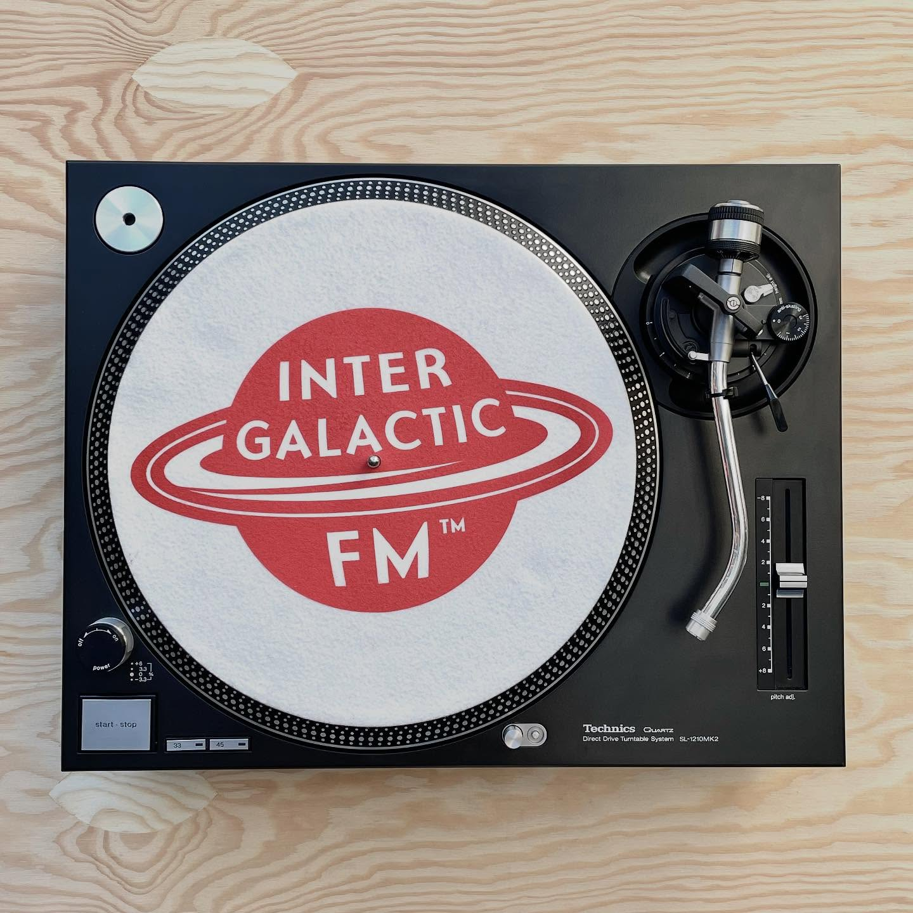
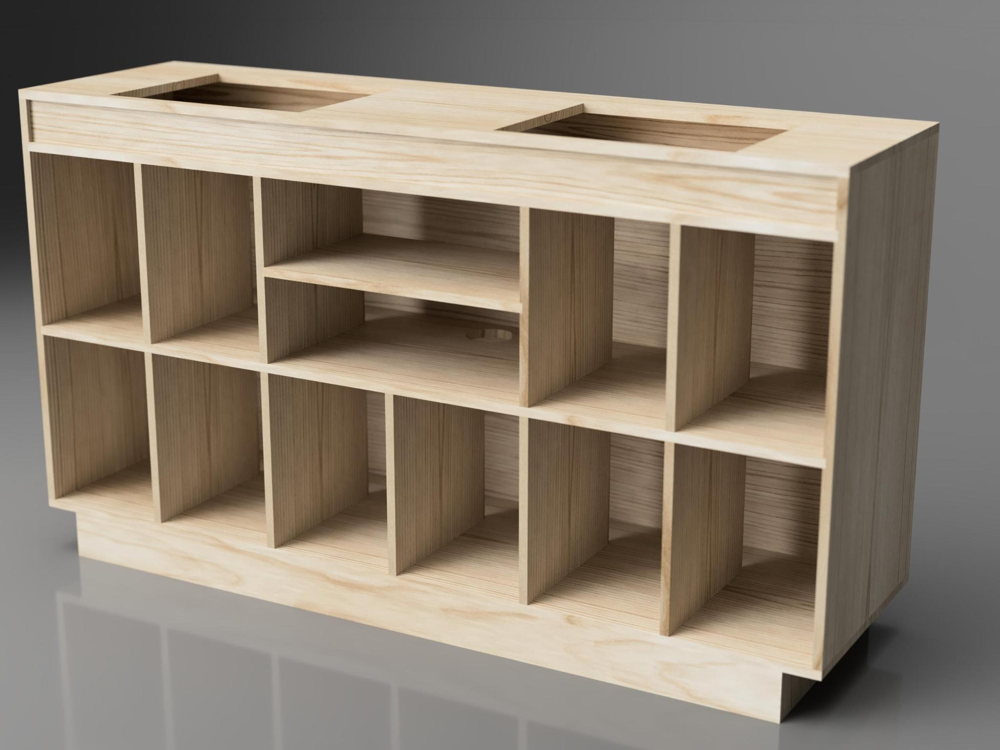
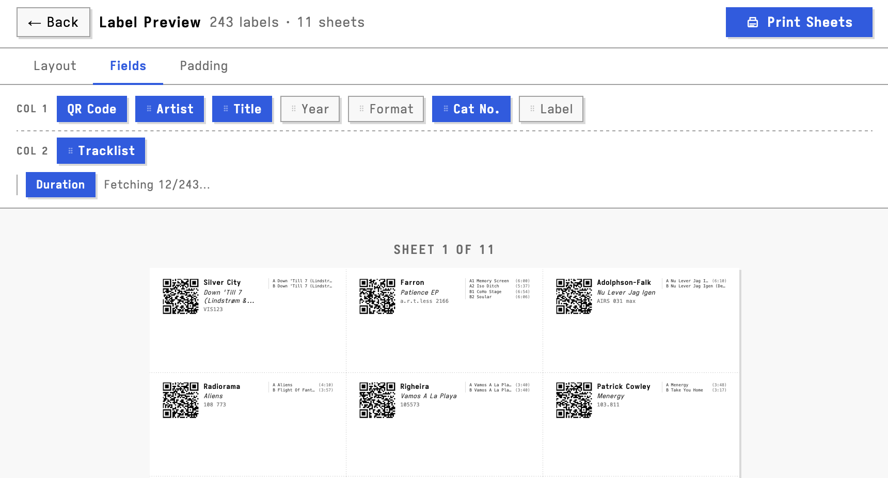
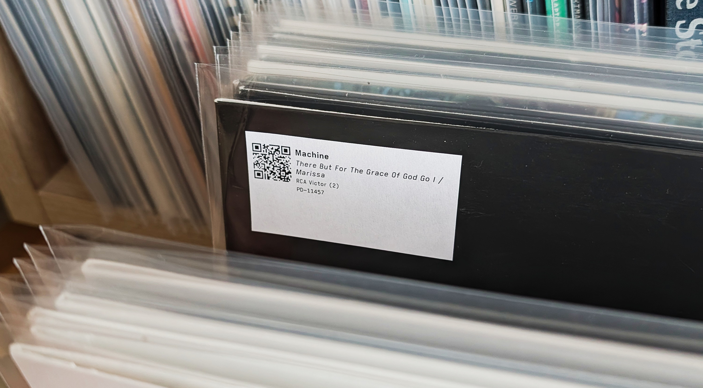

Lately I've come to realise that I'm fairly scatterbrained. I obsess over ideas monomaniacally, only to move on before finishing them. When the stars align, this focus leads to quick, tangible results. But usually I just end up with a mental backlog of half-finished projects.

This has gotten worse since becoming a parent. My free time is limited to an hour or two after my daughter's bedtime (when I'm exhausted) or during her weekend naps (when I'm also exhausted). Everything progresses slowly enough that I jump to new projects before anything is finished.

Over the last year one area I've been circling back to repeatedly is music, and it's felt like I've been getting nowhere.

## Turntables and so on and so on
I wanted to brush up on mixing vinyl, so I set out to find a second turntable again. I sold my first 1200s for rent at the end of my studies... I needed a Technics 1200 of course, what else? This led me down a rabbit hole of searching for used Japanese MK3 units on eBay, and research into how to [replace the power supply](https://ebay.us/m/MDCyq2) for European voltages. This was going on for a while, until I suddenly came across a pristine MK2 here in Norway for a decent price. I see them all the time at the moment, but last spring the market was dried up.

Pickups were another thing to read up on, I was pragmatic here and stuck to what I knew - Ortofon Concordes. MK II Clubs seemed like a nice choice, although I’m not entirely happy with their tracking at 3g. There are some other options. Perhaps Audio Technica XP5s or XP7s would have been a better choice? Those [Jico/Shure](https://www.jico-stylus.com/) pickups seems nice too or [Taruyas](https://taruyajapan.com/) or [100sounds](https://www.100sounds.net/en)? Or perhaps an unorthodox choice of a Nagaoka mp-110 for nice sound (I doubt it tracks well)?

I also needed to find a mixer. This was luckily a more straightforward affair, although I obviously spent way too much time on this too. I picked up a used DJM-250MK2 and another [ART DJPREII](https://www.audiosciencereview.com/forum/index.php?threads/review-and-measurements-of-u-turn-pluto-and-art-djpre-ii-phono-preamps.3457/) preamp. It is an excellent preamp for the money, that sounds way better than the one built into the DJM-250. 

The DJM-250 feels cheap, but it has a built in sound card that allows for rekordbox DVS (neat!). If I was buying today I’d rather bought the Allen & Heath Xone 24C, as the soundcard is supposed to be class compliant.

## Shelving and Fusion
I also needed to find some new piece of furniture or shelving to hold my record collection and turntables. What I have was filled to the limit, buckling under the weight and was never optimal (off-brand IKEA kallax).

This was a more time consuming goose chase... Sadly no pre-built solution looks nice, is affordable or fulfills my needs. I want it to hold most or all of my records as well as the amplifier, and it shouldn’t be excessively ugly. I got the idea that I should build a custom shelf by myself.

Of course, I know next to nothing about woodworking, so I figured I should plan it very thoroughly. After some paper drawing and maths, I realized I could probably autogenerate a bill of materials if I used some software for the job. This meant learning autodesk Fusion... Which I did. I even made a nice mockup, before getting cold-feet about the actual woodworking and abandoning the idea. Time not well spent, unless I need to mock up something else in Fusion at some point...

In the end though (this week), I decided on something else, that I’m more confident that I will be able to go through with. I’ve ordered some IKEA Ivar modules that I will “hack” slightly. It will fit all my stuff and even have some nice browsing sections! I'll add some pictures when it arrives.

## Labeling
With the physical setup (mostly) sorted, I also wanted to find some clean way of adding notes to my records. BPMs and the like. Surely someone had already made some tool to make labels based on Discogs collection data? I could not find anything useful. The sensible thing would be to just write them by hand. My collection is not that big. But why go down that route, when I could spend time making some weird custom solution myself? 

It was also a good opportunity to check whether the vibe coding agents had gotten any better since I last played with them. They had (it's also become abundantly clear that the companies making these tools are spineless bootlickers)!

## Result: Discogs labeler
Over a couple of late night sessions I had made a browser-based tool that lets you create printable labels based on the Avery 3448 template. It is fully vibe coded. I hope to add support for different labels, but the 3448 label sheets are the only label sheets [I could walk out and buy](https://www.clasohlson.com/no/Selvheftende-etiketter/p/32-2618) at a store in this godforsaken town. 

Currently the app allows you to:
  - Import your (public) collection via Discogs username (API) or CSV export
  - Browse, search, sort, and filter your records in a table
  - Select which records to make labels for
  - Configure label layout: font size, padding, field visibility and
  order, QR code, two-column mode
  - Preview labels before printing
  - Fetch tracklists from the Discogs API and include them on labels

I’m very happy with it and have started labelling my records. Now I have some space to jot down BPMs or other notes as I go along. If you already have that information in Discogs, you can print it out using the app!

The application can be found [here](/discogs-labeler) and the source code can be found [here](https://github.com/torbjornbp/discogs-labeler)

## Next obsession?
So why am I writing all this? Partly because I wanted to share the Discogs Labeler, maybe someone else will find it useful. But also to celebrate actually finishing something. It’s incredibly satisfying to finally see something through in a single burst of work! This site has been stale the last year, it has felt good to write something new.

Of course though, these obessions have not happened in an orderly succession and they have not been the only things I've been obsessing over. I’ve picked these project up and dropped them repeatedly over the past year, alongside other ventures (I restored an old La Pavoni espresso machine among other things.).

When I sat down to reflect on all of this though, I realised some of my other projects have come together too. It's just happened gradually, and less visibly, than this labeler. While this cycle of obsessions has been draining, the turntable setup works and sounds good, and the shelf is on order. Things are moving, just not in a straight line. 

Anyway, how does one set up a print server at home?
