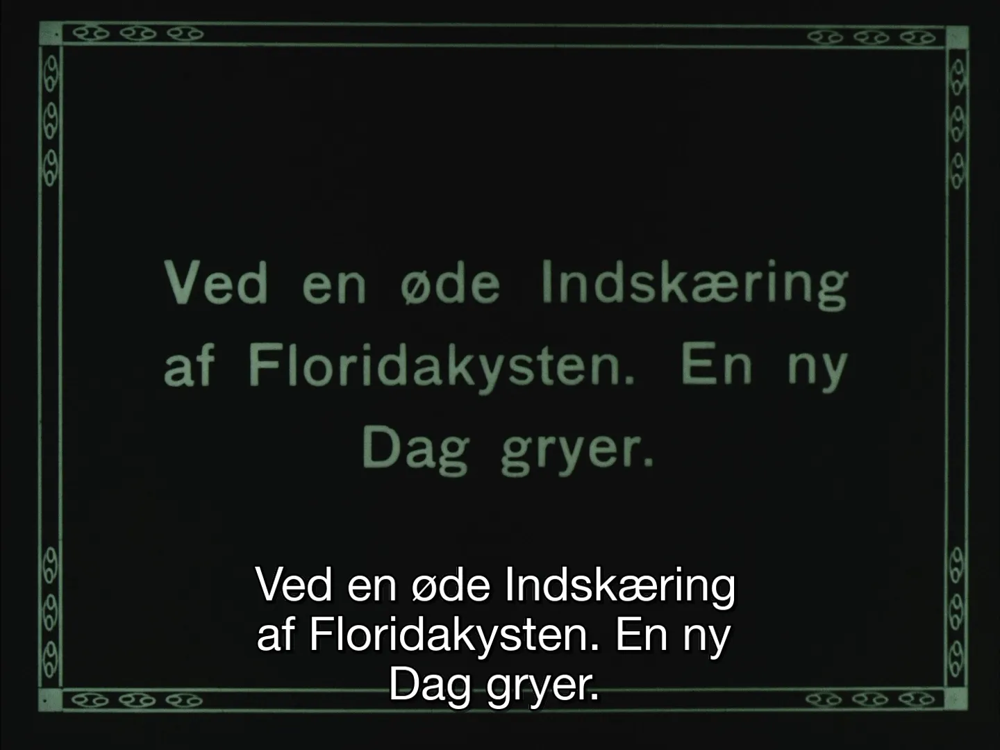

Over the last year or so, I've been dabbling with various scripts to manipulate video, metadata etc. 
I've been running a wide range of experiments, amongst others grading film scans using Python and Jupyter notebooks (with massive help from [Paul Duchesne](paulduchesne.github.io)) and trying use the [IFIscripts](https://github.com/kieranjol/IFIscripts) for digital preservation of the scans of my grandparent's Super8 home movies. 
I've been a light user of FFmpeg for years, but I think finally realised how low the bar for starting to use these tools in more advanced ways actually is. 

One of the applications I was trying to run was the [Deep-doLCE](https://www.researchgate.net/publication/358888176_Deep-doLCE_A_deep_learning_approach_for_the_color_reconstruction_of_digitized_lenticular_film) tool. 
It's a a tool that can be used to recreate the colours of a [Kodacolor](https://filmcolors.org/timeline-entry/1240/) film, which I hope to write more about at some point. 
It uses a trained AI model to detect the *lenticules* on the image frames, before performing its magic. 
A breath of fresh air considering all the bogus colourised black and white clips you'll see floating around these days...

---
{: data-content="KODACOLOR FILM PROCESSED BY DEEP-DOLCE"}

<video width="100%" autoplay muted loop playsinline>
	<source src="kodacolor.webm" type="video/webm">
	<source src="kodacolor.mp4" type="video/mp4">
	<p>Your browser does not support the video format/codec.</p>
</video>

---

## GPT and Python
While I've always liked to think of myself as tech savvy, I've sadly never learned to code. 
Running Python scripts has thus been an interesting learning experience. 
Simply getting the code to run and setting up the correct dependencies, has often been difficult in itself. 
After some months of trying and failing, all I've really learned is some basic syntax. 
Progress is slow, but at least Python strikes me as surprisingly readable. 
I think one of the more interesting aspects of learning code, is that you have to adjust the way you attack problems in order to solve them. 
You have to define your problems in a code-solvable manner.

In this same time period there was suddenly a lot of hype surrounding various AI tools. 
Chatbots etc. suddenly became widely available and of course I had to try them out (along with everyone else). 
Playing around with the GPT chatbots for example was tremendously fun, but I struggled to find any practical use of them in the day to day.

Working with these chatbots, the accurate *description* of a problem can be enough to solve it. 
This is in theory though, in practice, the chatbots tend to give you odd, inaccurate or, straight up false, answers to a lot of questions. 
The challenge seems to be to make the right *queries*, that is: to only ask about things included in the models' training dataset. 
While the training dataset is a problematic black box of unknowns, it appears Python code was included there!

As a Python novice I ended up feeding code snippets and error messages into these bots (primarily GPT-3.5 and 4). 
They seem to grasp Python fairly well, and can point out where errors stem from etc. 
I even fed the bots answers and solutions from Stackoverflow, so that the bots could dumb it down for me. 

This works remarkably well, even though you have to be patient and often rephrase the same questions again and again to get somewhere. 
It's a great learning tool, after a while I've started to get a better idea of when the bot feeds me faulty solutions (am I learning Python?). 
I'm sure my involuntary tech-support friends were glad to be pestered less with Python related questions as well.

---

<video width="100%" autoplay muted loop playsinline>
	<source  src="demo.webm" type="video/webm">
	<source  src="demo.mp4" type="video/mp4">
	<p>Your browser does not support the video format/codec.</p>
</video>


---

## OCR processing intertitles
This spring I had the chance to put all this to the test. 
An inquiry on the AMIA-L mailing list peaked my interest. 
I set out to create a small script that would OCR intertitles in silent film and output them in some manner along with timecodes. 
A friend of mine helped set up a skeleton of code using openCV and the EAST text detection model to detect whether a video frame contained text. 
From here on I started tweaking it by feeding chat-GPT with questions and demands for code change suggestions. 

After a few days of forcing GPT to write code and testing, several variables where added and functionality was expanded out. 
In the end the functions like this: it analyses every frame in a specified interval for text elements (every 20th frame for example). 
If text is detected in a frame, it performs OCR on the frame in question using the Tesseract OCR engine. 
The text is then output with timecodes in both a functional SRT file and a JSON file with additional metadata. 
OCR language can be specified, a character blacklist can be configured for improved results and a preview of the video with text detection can be toggled on off. 
The code is also commented.

*Keep in mind, I am barely able to write any Python code myself!*

```json
[
    {
        "filename": "testvideo.mp4",
        "date_processed": "2023-08-22-20-26",
        "ocr_language": "dan",
        "analysis_frame_interval": 20,
        "character_blacklist": "@^\u00a8#$\u00ab|{}_\u0131[]\u00b0<>\u00bb%=+\u00b4`\u00a7*"
    },
    {
        "frame_number": 1320,
        "timecode_ms": 54958.33333333333,
        "text_detection_confidence": 0.9985535667492793,
        "ocr_text": "Ved en \u00f8de Indsk\u00e6ring\n\naf Floridakysten. En ny\nDag gryer.\n\n",
        "ocr_confidence": 93.0909090909091
    }
]
```

All of this was done by querying GPT over and over. 
I fed it all of the code or parts of the code depending on what I wanted to tweak. 
Queries such as "can this code be simplified?", "suggest performance tweaks", "give me x alternatives to solving problem y?" and "are there redundant sections in the code?" actually allow you to produce and refine code with very limited knowledge about code. 

GPT *will* make a ton of errors, it *will* write redundant code, it *will* leave unused code snippets in your code, as well as a lot of other odd things, but you can easily fix this by asking a parallel GPT instance to look over it. 
Working on the script I managed to implement many different variations of the code, evaluating both different text detection and OCR methods etc. 
All of the comments in the code as it stands and most of the readme on github was actually written by GPT as well. 

Looking back at it, I'm amazed at what I managed to achieve with my limited experience, regardless of whether the script has a fairly limited scope of use. 

The script can be found here: [https://github.com/torbjornbp/video-ocr2srt](https://github.com/torbjornbp/video-ocr2srt)

---
{: data-content="FUNCTIONAL SRT"}


